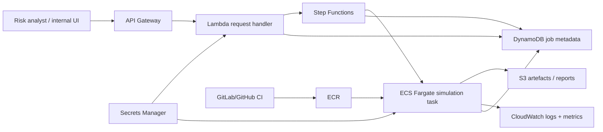

# AWS deployment design

## Goal

Allow a risk analyst to request an on-demand Brent scenario run, receive a job identifier immediately, and retrieve a versioned validation/report artefact when the computation completes.

## Invocation path

An authenticated internal application calls **Amazon API Gateway**. A small **Lambda** validates the request, creates a job record in **DynamoDB**, and starts an **AWS Step Functions** execution. Step Functions launches an **ECS Fargate** task containing the pinned Python environment and model code. Fargate is preferable to putting the simulation itself in Lambda because scientific Python dependencies, plotting, memory requirements, and run duration can grow beyond a comfortable serverless function envelope.

The API returns a `job_id` immediately. The analyst can poll a status endpoint or the internal UI can read job state from DynamoDB. Completed markdown/HTML reports, figures, fitted-parameter artefacts, and run manifests are written to versioned **S3** prefixes keyed by job/run ID.

## Code and artefacts

Source is reviewed in GitHub/GitLab. CI runs unit tests and builds an immutable container image pushed to **Amazon ECR**. Each run records the image digest, model configuration, seed, requested horizon, ticker/date cut-off, and output S3 URI. S3 versioning and lifecycle policies preserve auditability while controlling retention cost.

## Identity and secrets

Use **IAM roles**, not long-lived access keys. API callers authenticate through the organisation's identity layer; API Gateway/Lambda authorization can use IAM or an OIDC/Cognito integration. Lambda and Fargate receive least-privilege execution roles. Sensitive external credentials belong in **AWS Secrets Manager** and are encrypted with **KMS**. S3, ECR, DynamoDB, and log groups are encrypted and access-controlled.

## Observability

**CloudWatch Logs** receives structured logs containing `job_id`, model version, timings, and failure class. CloudWatch custom metrics cover job latency, failures, queue time, and compute usage. Step Functions provides execution-level tracing; alarms target elevated failure rate and abnormal runtime. A run manifest in S3 makes numerical results independently traceable to code/configuration.

## Cost

The workload is naturally bursty, so Fargate keeps idle cost low. S3/DynamoDB are inexpensive at this scale, Lambda/API Gateway handle lightweight control-plane work, and lifecycle policies expire non-essential intermediate artefacts. Model fits can be cached by immutable data/configuration hash rather than recomputed for identical requests.

## At 100× usage

I would decouple request arrival from compute with **SQS** and run a horizontally scaled Fargate or **AWS Batch** worker pool. Jobs become explicitly asynchronous and idempotent, with concurrency quotas and back-pressure. Frequently reused fitted models are cached/versioned in S3, while result caching avoids duplicate simulations for identical requests when appropriate. Autoscaling is driven by queue depth and runtime; non-urgent workloads can use Spot capacity through Batch. I would also partition S3 metadata more deliberately, introduce per-tenant/service quotas, load-test the API/control plane, and monitor numerical reproducibility across container/image changes.
