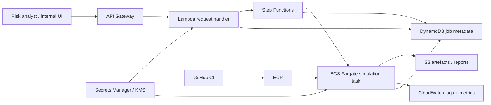

# AWS deployment design

## Goal

Allow a risk analyst to request an on-demand scenario run, receive a job identifier immediately, and retrieve a versioned report/artefact when computation completes. The production API separates **calibration mode** (historical-state mixture, used by this take-home validation) from **scenario mode** (normally condition on the latest fitted state or an explicitly requested stress state).

## Invocation

An authenticated internal application calls **API Gateway** with a small request such as `horizon`, `n_paths`, optional `seed`, `as_of_date`, and `initial_state_mode` (`latest`, `historical_mix`, or a governed stress-state identifier). A **Lambda** validates limits and permissions, assigns a `job_id`, writes initial metadata to **DynamoDB**, and starts **Step Functions**. The API returns `202 Accepted` plus the job ID; status/result endpoints remain lightweight.

Step Functions launches an **ECS Fargate** task containing the pinned Python environment and model code. Fargate is preferable to running the simulation in Lambda because scientific-Python dependencies, plotting, memory and runtime can grow beyond a comfortable function envelope. The same container supports offline validation and on-demand generation, reducing training/serving skew.

## Code, data and artefacts

Source is reviewed in GitHub; CI runs tests and builds an immutable image pushed to **ECR**. Each run records image digest, model/config version, data cut-off, fitted-parameter version, seed, horizon, path count, initialization mode and output URI, together with the full validation manifest: both gate families and the worst-observed-year exceedance results, so a reviewer can see which estimator a pass or fail came from. Fitted parameters and approved model artefacts are versioned in **S3**; generated reports/figures/manifests are written to run-specific S3 prefixes. For production market data I would replace the take-home Yahoo dependency with an approved, versioned market-data source.

## Identity, secrets and governance

Use **IAM roles**, never long-lived access keys. API callers authenticate through the organisation's identity layer (IAM/OIDC/Cognito as appropriate). Lambda and Fargate receive least-privilege roles. External credentials belong in **Secrets Manager**, encrypted with **KMS**. S3/ECR/DynamoDB/log groups are encrypted and access-controlled. Model promotion is a separate CI/CD approval from ad-hoc analyst execution.

## Observability and reproducibility

**CloudWatch Logs** receives structured events with `job_id`, model/image version, timings, seed and failure class. Custom metrics cover job latency, failures, queue time and compute use; alarms target abnormal failure rate/runtime. I would also emit the structural diagnostics this validation depends on — effective persistence, `E[A(z)^2]`, and the implied return tail index — and alarm when a refit crosses the finite-fourth-moment boundary, because that is what governs whether far-tail scenarios may be used at all, and a drift across it would otherwise surface only as unusable numbers downstream. Step Functions provides execution-level state. A run manifest in S3 makes every numerical result traceable to code, data cut-off, parameters and initialization state; idempotency keys prevent accidental duplicate work.

## Cost and 100× usage

At low volume the workload is bursty, so Fargate avoids idle compute; S3/DynamoDB/API Gateway/Lambda remain inexpensive control-plane services, and lifecycle policies expire non-essential intermediates. Identical approved fits can be cached by immutable data/config hash.

At **100× usage**, decouple arrival from compute with **SQS** and a horizontally scaled Fargate or **AWS Batch** worker pool. Add concurrency quotas, back-pressure, per-tenant limits, dead-letter handling, autoscaling on queue depth/runtime and result caching where requests are truly identical. Non-urgent Monte Carlo jobs can use Batch Spot capacity. I would load-test the control plane, monitor numerical reproducibility across image changes, and keep model/data versions immutable so scale never weakens auditability.
