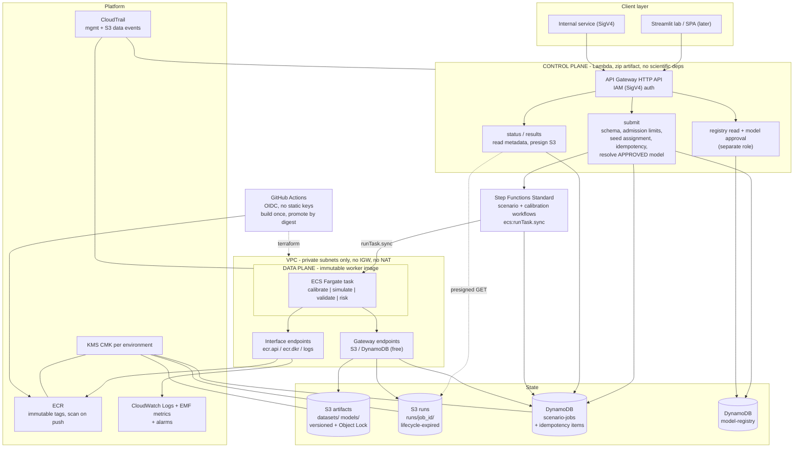

# Scenario platform: implementation plan

**Status:** Proposed — planning only. No AWS resources have been created, modified or deleted. No
Terraform has been written or applied. No application code has been written.

**Revision 2.** Revision 1 sized the architecture to the current 1.4-second benchmark and placed the
quantitative worker in Lambda. That was a category error: it let a *sizing* measurement dissolve an
*architectural* boundary. Revision 2 restored the control-plane / data-plane separation, made ECS
Fargate the quantitative execution boundary from the first AWS slice, and reinterpreted the
benchmarks as what they actually are — evidence for task sizing, concurrency limits and cost
control, not for where scientific compute belongs. Sections 2 and 3 (repository assessment and
statistical invariants) are preserved; no repository evidence has disproved them.

**Revision 3 — technical-correctness pass.** The macro architecture is unchanged and approved. Eight
mechanism-level defects were corrected, each of which would have made a claim in this document
stronger than the mechanism behind it:

1. **Account isolation vs KMS** (§19, §13.4, §11.2) — account separation is the primary boundary; the
   per-environment CMK is defence in depth, and its four specific benefits are named rather than
   credited with being the boundary.
2. **Egress language** (§14.1, §14.2, §27) — "no arbitrary Internet egress path", not "no exfiltration
   path". The AWS channels remain; the control is the four layers together.
3. **Idempotency** (§6.2) — `job_id` generated before persistence, `IDEM#` and `JOB#` written in one
   `TransactWriteItems`, and a defined `409` for key reuse with a different request. Two sequential
   conditional writes were not atomic.
4. **Model approval** (§8.4, §8.4a) — an IAM condition **cannot** forbid writing `status = "APPROVED"`.
   Replaced with separate key spaces (`VERSION#` / `APPROVAL#` / `POINTER#`) carrying different write
   permissions, and an explicit decision about which principal performs the approval write.
5. **IAM wildcards** (§13.1, §17) — the blanket "no `Resource: "*"`" rule was unachievable for
   deployment identities and several AWS APIs. Replaced with an enforceable policy plus an enumerated
   allow-list.
6. **Step Functions retry** (§6.3) — ASL `Retry` matches error *names*, not `Cause` text. Replaced with
   narrow declarative retry plus `Catch` → classify → `Choice` → bounded loop.
7. **Cross-account image promotion** (§18.3) — DEV and PROD have separate ECR repositories; the plan
   now specifies a manifest-preserving OCI copy and a hard `PROD_DIGEST == SOURCE_DIGEST` gate.
8. **SQS cost** (§21.2, §27) — SQS is consumption-priced; the idle floor comes from the warm ECS
   service that consumes it.

Everything else — Fargate as the compute boundary, the thin Lambda control plane, Step Functions
Standard, private networking with no arbitrary egress, fitted state arrays in the artifact, canonical
artifact identity, fail-closed verification, the statistical-property / governance-policy separation,
`validate(real, artifact, config)`, the CI invariant and negative-control lanes, the three-tier
reproducibility contract, multi-account separation, OIDC, Terraform, build-once/promote-by-digest,
independent model promotion and the prohibition on automatic approval — is preserved unchanged.

**Revision 4 — implementation-correctness pass.** Four mechanism defects in revision 3, each found by
checking a control against what the service actually provides:

1. **Registry key space** (§8.4, §12.3, §13.1) — `dynamodb:LeadingKeys` conditions the **partition**
   key, not the sort key, so separating candidate / approval / pointer records by sort-key prefix was
   as unenforceable as the attribute condition it replaced. Redesigned onto disjoint partition-key
   namespaces: `CANDIDATE#{family}#{version}`, `APPROVAL#{family}#{version}`, `POINTER#{family}`,
   `INDEX#{family}`.
2. **Idempotency hash** (§6.2) — hashing the *resolved* request meant a server-assigned seed, or a
   `"current"` pointer that moved between the call and the retry, would turn a legitimate retry into a
   `409`. The hash now covers caller-provided fields only; the resolutions are frozen in the `IDEM#`
   record and replayed verbatim.
3. **The DynamoDB → S3 → `StartExecution` orphan window** (§6.2a) — the small resolved request now
   lives in the `JOB#` item, written in the same transaction, so nothing on the submit path touches
   S3. The residual transaction → `StartExecution` gap is healed by the replay path, with the rare
   ARN-persist failure alarmed and reconciled rather than ignored.
4. **Speculative ECS error names** (§6.3) — `Retry` blocks listing `ECS.ServerException` and similar
   were guesses about an integration that surfaces much of its detail as `AmazonECS.Unknown` plus task
   stop details. The first implementation carries **no `Retry` block**; classification is done in code
   and verified names may be promoted into `Retry` later, on evidence.

**Repository:** `PCGstudent/scenario-core`
**Branch:** `feat/aws-platform` (working tree clean at `b632c63`)
**Environment verified:** `AWS_PROFILE=4xtra-dev`, `AWS_REGION=eu-west-1`,
`sts:GetCallerIdentity` → account `758895552145` (DEV). The PROD account `488182246436` and the
`4xtra-prod` profile were not contacted, and remain out of bounds until explicit future approval.
**Local toolchain:** Python 3.13.14, Terraform 1.15.8, Docker 29.7.2.

> **Pricing note.** All monetary figures are approximate `eu-west-1` list prices as understood at
> the time of writing and are used for *relative* comparison and order-of-magnitude budgeting. Every
> figure must be re-checked against the AWS pricing pages before any budget is committed.

---

## 1. Executive summary

`scenario-core` is a small, unusually disciplined quantitative research repository: a
GJR-GARCH(1,1,1) generator with Hansen skewed-t innovations, validated under three separate
estimator families whose failure modes are documented rather than tuned away. Roughly 8,000 lines of
Python, 117 tests, zero infrastructure.

The objective is not the cheapest architecture that can run today's workload. It is a production
platform of the shape a strong ML-platform team would build, sized honestly to current demand. Those
are different questions, and conflating them is what revision 1 got wrong.

**The architectural principle.** Lambda is the control plane. ECS Fargate is the quantitative
execution boundary. Step Functions Standard is the durable orchestrator between them. This
separation is architectural and does not depend on whether a particular calculation happens to fit
inside a 15-minute Lambda today. A GARCH fit, a Monte Carlo simulation, a validation suite, a risk
computation and a plot are all *data-plane* work; request validation, admission control, job
identity, metadata and presigned URLs are *control-plane* work. The boundary stays fixed as the
platform grows to many commodities, multiple models, EVT extensions, regime models, portfolio
scenarios and millions of paths.

**What the benchmarks actually tell us.** Fit 0.70 s; simulation 1.39 s / 13.9 s / 69.7 s at 1k /
10k / 50k paths × 252 days (1.39 ms and ~2 KB per path-year, linear); full validation 26.1 s
(§2.6). These say: **start with small tasks** (0.5 vCPU / 1 GB), **low concurrency**, conservative
autoscaling, and a modest compute bill. They say nothing about where the compute belongs.

**Three quantitative findings from revision 1 survive unchanged and continue to shape the design:**

1. **The model artifact must carry the fitted state arrays.** The default initialisation
   (`historical_mix`) samples from 4,158 fitted `(residual, variance)` pairs held only in memory —
   66,528 bytes. The seven parameters pickle to 177 bytes. A params-only artifact silently changes
   the initialisation law and breaks comparability with the committed validation. (§8.)
2. **`validate` must take the artifact, not a simulated array.** `matched_sample_reference` and
   `acf_monte_carlo_floor` re-simulate from the generator; the suggested
   `validate(real, simulated, config)` signature cannot express them, and dropping them removes the
   evidence that three pooled FAILs are finite-record variability plus the noise floor that makes
   the one genuine failure readable. (§7.2.)
3. **The fitted process has no finite unconditional fourth moment.** `E[A(z)²] = 1.0457 ≥ 1`.

**Three findings are new or corrected in this revision:**

4. **`sha256(artifact.json ‖ state.npz)` is not a content identity.** NPZ is a ZIP container carrying
   timestamps, ordering and compression choices; JSON float and key serialisation is not canonical.
   Identity must be defined over a canonical *binary encoding of the decoded values*, separate from
   the transport format. (§8.2.)
5. **`far_tail_usable: bool` conflates a statistical fact with a governance decision, and would
   over-restrict.** The implied stationary tail index is 2.696, so moments of order p < 2.696 exist:
   the variance is finite, and **VaR and ES are finite, well-defined and validated**. What does not
   exist is any moment of order ≥ 3 — so skewness and kurtosis have no finite population value, and
   extrapolation beyond the validated region is ungoverned. The artifact stores facts
   (`finite_fourth_moment: false`); a separately versioned policy set decides what may be served.
   (§8.5.)
6. **The industrial architecture costs about $50/month in DEV, and ~90 % of that is PrivateLink.**
   Revision 1's ~$2/month figure was achievable only through the simplification being corrected
   here. The honest levers that reduce this cost without destroying the architecture are AZ count,
   log retention and image lifecycle — never moving scientific compute into Lambda. (§20.)

**The acceptance criterion that proves the architecture** remains one sentence, now with a
rigorously defined reproducibility contract behind it (§16):

> The same worker image digest, the same canonical artifact id, the same `ScenarioRequest` and the
> same RNG seed produce a **byte-identical** scenario array, whether run on a laptop or on Fargate —
> and where a runtime makes bit identity non-portable, that is **detected and evidenced**, never
> silently weakened.

---

## 2. Current repository assessment

*(Preserved from revision 1. No repository evidence has disproved any of it. The only change is
§2.6's closing paragraph, which reinterprets the benchmarks.)*

### 2.1 What was inspected

`AGENTS.md`, `README.md`, `AWS_DESIGN.md`, `AIUSAGE.md`, `pyproject.toml`, `.gitignore`, `run.sh`,
`run.ps1`; every module under `src/xtra_takehome/` (`config`, `data`, `diagnostics`, `model`,
`challenger`, `metrics`, `windows`, `validation`, `compare_models`, `robustness`, `plots`, `report`,
`__main__`) and under `src/xtra_takehome/app/` (`services`, `risk`, `stress`, `charts`, `llm`,
`state`); `app.py`; the test-name inventory of all 117 tests across 12 files and the body of
`test_end_to_end.py`; the generated artefacts in `reports/`, including `run_manifest.json`. Runtime
behaviour was measured directly (§2.6) rather than estimated.

### 2.2 Code structure

```text
src/xtra_takehome/
  config.py        14 lines   frozen Config: ticker, start, end, seed, horizon, n_paths, output_dir
  data.py         109 lines   yfinance fetch + gitignored CSV cache + validation guard
  diagnostics.py  144 lines   moments, ACF, Student-t QQ, Hill profile, mean excess
  model.py        190 lines   GARCH(1,1)-t development baseline (retained as comparison)
  challenger.py   320 lines   SUBMITTED GJR-GARCH(1,1,1)-skew-t generator + structural diagnostics
  metrics.py       56 lines   VaR/ES, drawdowns, per-path squared-return ACF
  windows.py      174 lines   block construction + WindowStats (the horizon-matched estimator)
  validation.py   573 lines   thresholds, three gate families, matched-length reference
  compare_models  173 lines   baseline vs challenger, same seed, never auto-selects
  robustness.py   269 lines   10-seed stability of both families
  plots.py        271 lines   deterministic figures, Agg backend
  report.py       446 lines   markdown validation report
  __main__.py     270 lines   end-to-end orchestration + run_manifest.json
  app/           ~1,300       lab layer: services, risk, stress, charts, llm, state
app.py            993 lines   Streamlit entry point (8 pages)
tests/           ~1,500       117 tests
```

The dependency direction is clean and one-way: `app/` → core, never the reverse. `app/services.py`
carries an explicit design note — *"Everything here is a plain function over plain data, with no
Streamlit import, so the same layer can sit behind a FastAPI route later"* — which is precisely the
seam the platform needs. That module is the single most valuable asset for this project.

### 2.3 Modelling architecture and data flow

```text
fetch_close(ticker, start, end)          data.py       -> pd.Series close, guarded (>=2,520 obs, >0)
  |- log_returns_pct                     data.py       -> 100*ln(P_t/P_{t-1}), 4,158 observations
      |- summarize                       diagnostics   -> moments, ACF, Hill tail index ~ 2.94
      |- GjrSkewTGenerator().fit         challenger    -> 7 params + 4,158 fitted (resid, var) states
          |- structural diagnostics      challenger    -> persistence 0.99345, E[A^2] 1.0457,
          |                                              implied return tail index 2.696
          |- simulate(h, n, seed, mode)  challenger    -> (n_paths, horizon) float64
          |- validation                  validation    -> three families (Section 3)
              |- F1 pooled marginal                    -> 9/14 gates pass
              |- F2 horizon-matched (252-day blocks)   -> 12/13 gates pass
              |- F3 stressed region (reported, ungated)
                  + matched-length reference (re-simulates whole 4,158-day records)
                  + ACF Monte Carlo floor (re-simulates 8 x 1,000 paths)
      -> plots.py (7 figures) + report.py (validation_report.md) + run_manifest.json
```

Three initialisation modes are load-bearing and are *not* interchangeable, which `_initial_states`
says explicitly. All three must survive into production as distinct, recorded request options:

* `historical_mix` — each path starts from a randomly sampled fitted state, so the synthetic
  distribution is comparable with the **whole record**. This is what the validation suite uses, and
  it is the default.
* `latest` — every path starts from the final fitted state, conditioning on **where the market is
  now**, which is what a forward-looking scenario request wants.
* explicit `(residual, variance)` — a stated starting point for stress experiments. It carries no
  probability of its own and must never be presented as though it did (invariant 25).

### 2.4 Strengths

* **Statistical invariants are executable, not aspirational.** 26 numbered rules in `AGENTS.md`, and
  the test names read as a checklist against them:
  `horizon_matched_acf_gate_rejects_a_generator_with_no_clustering`,
  `consecutive_seeds_do_not_share_a_generator_stream`,
  `window_stats_acf_is_averaged_not_concatenated`,
  `leave_out_table_includes_the_historical_comparator`,
  `matched_reference_simulates_whole_records_not_stitched_years`. Several are **negative controls** —
  tests that a gate *rejects* something — which is rare and exactly what a production regression
  suite needs.
* **Determinism is designed, not incidental.** `SeedSequence(seed).spawn(2)` gives independent state
  and innovation streams, and a test asserts consecutive seeds do not share a stream.
* **Provenance already exists in embryo.** `run_manifest.json` records the data window, the fitted
  parameters, structural diagnostics, the RNG scheme, and all three validation families' results.
  It is a model registry entry missing four fields (§16).
* **Separation of concerns is already correct.** The core imports no UI, no I/O beyond `data.py`, and
  no environment variables. `plots.py` selects a non-interactive backend. Report generation is a pure
  function over dataclasses.
* **Honest failure reporting.** 9/14 and 12/13 gates pass, and the report explains *why* each failure
  is or is not evidence of miscalibration. This is the property most at risk from productionisation
  and the one the design must protect hardest.
* **`app/services.py` is a ready-made service layer.** Plain functions over plain data, no framework
  import, deterministic given arguments, with the caching contract stated.

### 2.5 Technical debt and gaps (relative to production, not to the take-home)

| # | Issue | Evidence | Impact |
|---|---|---|---|
| D1 | **No serialisable model artifact.** `GjrSkewTGenerator` holds `_residuals`/`_variances` in memory; there is no `to_dict`/`from_dict`/`save`/`load`. | `challenger.py` fit/simulate; params pickle = 177 B, fitted states = 66,528 B | Blocks any registry. Naive params-only serialisation is a **silent statistical change** (§8.1). |
| D2 | **`validate()` is not a pure function of (real, simulated).** | `validation.matched_sample_reference(generator, ...)`, `acf_monte_carlo_floor(generator, ...)` | The suggested domain signature would drop two check families (§7.2). |
| D3 | **`Config` is frozen with hard-coded `ticker`/`start`/`end`/`output_dir=Path("reports")`.** | `config.py` | The relative output path assumes a writable CWD; `end` is pinned, so production recalibration cannot move the window without a code change. |
| D4 | **The data source is unauthenticated, unversioned and retroactively mutable.** `yfinance` scrape of `BZ=F`; the cache is keyed on `(ticker, start, end)` only — **not on content**. | `data.py` `_cache_path`, `fetch_close` | "Reproducible" is currently unverifiable: the same key can return different bytes. Also a licensing question for commercial use. |
| D5 | **`implied_return_tail_index` is an uncached property costing 4.58 s per access;** `innovation_moments()` is recomputed on every `effective_persistence` read. | measured; `challenger.py`; accessed twice in `__main__.py` | Harmless in a batch script; a latency and cost bug the moment a status endpoint renders it. |
| D5b | **Fit reproducibility is BLAS-thread dependent.** Documented in the README: parameters drift in the fifth significant figure across differently built environments. | `README.md`, reproducibility section | Refits are not bit-reproducible across images. Mitigated by pinning threads *and* by making the **artifact**, not the fit, the reproducible object (§16). |
| D6 | **Validation tolerances are unversioned module constants:** `THRESHOLDS`, `ACF_TOLERANCE_FRACTION`, `MEAN_TOLERANCE_STANDARD_ERRORS`. | `validation.py` | Changing a constant silently rewrites the meaning of every historical PASS/FAIL. Invariant 12 forbids tuning; nothing *records* which tolerance set produced a verdict. |
| D7 | **No CI, no lint config, no type checking, no lockfile, no Dockerfile.** | `git ls-files` — no `.github/`, no `[tool.ruff]`, no lock | Direct dependencies are `==` pinned; **transitive dependencies are not.** An image rebuild can change numerics. |
| D8 | **`reports/` is a committed generated directory.** | `reports/*.md`, `*.png`, `run_manifest.json` tracked | Correct for a take-home submission; in a service it becomes a merge-conflict generator and an audit ambiguity. |
| D9 | **`app.py` is a 993-line stateful Streamlit monolith.** | `app.py` | Streamlit is long-lived and session-stateful; it does not fit the thin-Lambda + async-job model. Its future is an open question (§26), not a silent rewrite. |
| D10 | **The optional AI page egresses computed risk numbers to OpenAI.** | `app/llm.py`, `OPENAI_API_KEY` from env | A data-governance decision, not a config flag. Must be an explicit, approved, per-environment capability — and note that in the no-egress network design of §14 it would require a deliberate new egress path. |

### 2.6 Measured runtime characteristics

Measured in this session on this machine, against the cached price series, using the repository's own
virtual environment.

| Operation | Wall time | Output size |
|---|---|---|
| `import arch, numpy, pandas, scipy, statsmodels, matplotlib(Agg)` | **2.36 s** | — |
| `fetch_close` from local cache (4,159 closes) | 0.02 s | — |
| `GjrSkewTGenerator().fit(4,158 returns)` | **0.70 s** | 7 params + 66,528 B of state |
| `simulate(252, 1_000, seed)` | **1.39 s** | 2.0 MB float64 |
| `simulate(252, 10_000, seed)` | **13.91 s** | 20.2 MB |
| `simulate(252, 50_000, seed)` | **69.73 s** | 100.8 MB |
| `params.implied_return_tail_index` (quadrature + `brentq`) | **4.58 s** | scalar |
| `params.fourth_moment_coefficient` | < 0.01 s | scalar |
| `run_validation` (all three families, canonical config) | **26.1 s** | report objects |
| `pytest` (117 tests) | > 120 s, exit code **0** | — |
| `site-packages` closure (incl. Streamlit/Plotly/PyArrow) | — | 778 MB; core-only ≈ 480 MB |

Derived: **1.39 ms and ~2 KB per path-year**, exactly linear across a 50× range. Scaling is in the
path dimension only — `simulate` is vectorised across paths and loops over time in Python.

**Two verified properties of the RNG scheme**, checked directly rather than assumed:

* **Path sets are nested in `n_paths`.** `simulate(252, 500, 42)` is bit-identical to the first 500
  rows of `simulate(252, 1000, 42)` (maximum absolute difference 0.0).
* **Path sets are *not* nested in `horizon`.** `simulate(100, 200, 7)` differs from the first 100
  columns of `simulate(252, 200, 7)`, because the innovation draw is a single `(n_paths, n_steps)`
  array.

The nesting property is an **implementation detail of the current `arch` SkewStudent draw order**,
not a stated invariant. If the architecture is going to depend on it (and §21.3 proposes that it
should, for result caching), a regression test must pin it first.

**How these numbers are used, and how they are not.** They determine *sizing*: a 0.5 vCPU / 1 GB
Fargate task comfortably covers a 1,000-path job; a 10,000-path job at ~14 s still fits; concurrency
limits and admission budgets follow from ms-per-path-year arithmetic; the compute line of the bill
is a rounding error. They do **not** determine *placement*. The fact that a 1.39-second calculation
would fit inside a Lambda is not an argument for putting the scientific engine there, any more than
the fact that a query fits in a spreadsheet is an argument against a database. Placement is decided
by the control-plane / data-plane boundary in §4, which must hold when the same code is running a
250,000-path portfolio scenario across eight commodities with an EVT tail layer.

### 2.7 Risks in the current state

* **R-A: artifact semantics.** D1. The most likely way to break this model in production is to "just
  store the parameters".
* **R-B: validation amputation.** D2. The most likely way to break the *argument* is to adopt a
  clean-looking interface that cannot express two of its three families.
* **R-C: unpinned data.** D4. Without a content digest, reproducibility claims are not checkable.
* **R-D: ungoverned extrapolation.** `E[A(z)²] = 1.0457 ≥ 1` and the implied return tail index is
  2.696, so no moment of order ≥ 3 exists. This constrains *which* risk uses are defensible — see
  §8.5, which also corrects the over-broad reading.
* **R-E: environment-dependent fits.** D5b. Two images can produce two different "same" models.

---

## 3. Statistical invariants that must be preserved

All 26 rules in `AGENTS.md` are treated as contractual. The subset that **infrastructure can break**,
with the mechanism by which it would break them:

| Invariant | How the platform could violate it | Control |
|---|---|---|
| 1–2. Model returns, `100·ln(P_t/P_{t-1})` | A data adapter delivering prices or simple returns | The dataset record declares `return_definition`; the worker asserts it before fitting |
| 3. Never winsorize or drop extremes | A "data quality" step that clips outliers before fitting | DQ checks **reject a dataset**, never modify one (§10) |
| 4. VaR/ES are positive loss magnitudes, `L = −return` | A response layer re-signing for a chart | `MetricKind` travels with every metric; a contract test on sign |
| 5. Never concatenate independent paths before ACF | A worker that shards a job and concatenates shards | Sharding is a **versioned RNG mode**; ACF is always per-path (§21.4) |
| 6. Drawdowns on equal 252-day horizons | A results endpoint comparing a 30-day job against a 252-day gate | Validation runs only at the canonical config (invariant 26) |
| 7. Fixed data end date for reproducibility | Production recalibration must move the window | Every artifact **pins its own window**; the committed submission stays at `2026-09-01` (§10) |
| 8. Every stochastic operation seed-controlled | An API that omits `seed` and lets the worker default | The control plane **assigns and records** a seed when the caller omits one; never implicit |
| 9. A FAIL is evidence, not a defect | A promotion pipeline that only ships green | Approval requires a human to acknowledge failures, not their absence (§8.4) |
| 10. Never select on PASS count alone | An auto-promotion rule keyed on gate counts | Promotion is a manual, separately-authorised action; no automatic winner selection |
| 11. Use the lower partial second moment, not `γ/2` | A reimplementation in a "fast path" | One quantitative implementation only; no reimplementation outside the core |
| 12. Never tune a tolerance to pass | A per-environment threshold override | Thresholds are **code**, versioned as `threshold_set_version`; not configuration |
| 13. Equal-length blocks on both sides | Comparing a stored `ScenarioSet` against pooled history | `validate()` takes the artifact, not just arrays (§7.2) |
| 14. A gate nothing can fail is not a gate | Dropping negative-control tests from a "fast" CI lane | Negative controls sit in the **required, separately-named** CI lane (§18.1) |
| 15. Scale-derived tolerances re-derived per estimator | Caching a threshold value across estimators | `ThresholdContext` stays computed at run time, never persisted |
| 17. Never compare maxima across sample sizes | A dashboard showing `max(simulated)` vs `max(observed)` | The matched-length reference is part of the stored report and is what any UI reads |
| 20. No point estimate for statistics with no finite population value | An API returning pooled skewness/kurtosis as a scalar | `moment_reporting_policy` (§8.5); the response carries a cross-seed median and the non-existence flag |
| 21. `SeedSequence(seed).spawn(...)`, never `seed + 1` | A shard scheduler doing `seed + shard_index` | Shard streams via `spawn(n_shards)`; the mode is recorded (§21.4) |
| 22. Figures written, never displayed | A worker inheriting an interactive backend | `MPLBACKEND=Agg` in the image; the existing `plots.py` guard retained |
| 23–25. Never present a scenario as a prediction; horizons labelled; model stress ≠ assumed shock | An API response dropping the labels the lab carries | The response schema carries `MetricKind` and horizon on every metric; assumed-shock results carry no probability field |
| 26. Validation runs at the canonical configuration | A validation endpoint honouring caller parameters | Validation ignores request parameters by construction; documented in the API |

**Three additional invariants this project should adopt**, proposed here and justified by the
analysis below:

> **27. The model artifact must carry the fitted state arrays.** `historical_mix` initialisation
> samples from the fitted `(residual, variance)` pairs. An artifact storing only the seven parameters
> silently changes the initialisation law.
>
> **28. Neither `src/xtra_takehome/**` nor `scenario_platform/domain/**` may import
> `boto3`/`botocore`, nor read an environment variable for infrastructure configuration.** Enforced
> by a test and a lint rule. Additionally, the control-plane dependency lock must contain no
> `numpy`, `scipy`, `pandas`, `statsmodels`, `arch` or `matplotlib` — an executable guard that
> scientific compute has not leaked into Lambda (§18.1).
>
> **29. Artifact identity is defined over a canonical binary encoding of decoded values, never over
> the storage bytes.** A `save → load → save` cycle must yield an identical `artifact_id` even when
> the container bytes differ (§8.2).

---

## 4. Proposed target architecture

### 4.1 The control-plane / data-plane boundary

```text
                Analyst / internal client / UI
                              |
                              v
                    API Gateway (HTTP API)
                              |
                              v
        +----------------------------------------------+
        |  CONTROL PLANE - thin Lambda, no numerics     |
        |  authn/authz context, schema validation,      |
        |  admission limits, job id + seed assignment,  |
        |  idempotency, lightweight metadata, model     |
        |  version resolution, workflow start, status,  |
        |  presigned URL issuance                       |
        +----------------------------------------------+
                              |
                              v
              Step Functions Standard (durable)
                              |
                              v
        +----------------------------------------------+
        |  DATA PLANE - immutable container on Fargate  |
        |  calibration, Monte Carlo simulation,         |
        |  validation suites, risk computation,         |
        |  diagnostics, plotting, report generation     |
        +----------------------------------------------+
                     |            |            |
                     v            v            v
                    S3        DynamoDB      CloudWatch
```

**The rule, stated so it can be enforced.** A function in the control plane may not import numpy,
scipy, pandas, statsmodels, arch or matplotlib, and its dependency lock is checked for this in CI
(invariant 28). If a request needs a number that is not already stored, the answer is a job, not a
computation in the handler. This is what keeps the boundary from eroding one convenience at a time.

**Why this boundary and not a runtime-limit boundary.** A boundary drawn at "whatever currently fits
in 15 minutes" is a boundary that moves every time the model changes. This one does not. It survives
multi-commodity portfolios, EVT tail layers, regime-switching specifications, larger validation
suites, parallel experiment sweeps and million-path runs — none of which require redesigning the
application architecture, only re-sizing tasks and adjusting concurrency. It also gives the platform
one place where scientific dependencies live, one lock file governing them, and one immutable digest
identifying them, which is what makes the reproducibility contract in §16 possible at all.

### 4.2 Other load-bearing decisions

* **One quantitative implementation, one dependency lock, one immutable worker image.** The image
  that runs in CI, on a developer laptop and on Fargate is the same digest. The control-plane Lambdas
  have their own much smaller artifact — see §7.4 for why forcing a single binary would be a mistake.
* **Asynchronous job API from day one.** Job sizes are unbounded from the API's point of view, and
  retrofitting async onto a synchronous contract is a breaking change. It also means Fargate task
  startup is a latency line item, not a correctness problem (§11.3).
* **Large arrays never touch DynamoDB.** DynamoDB holds job and registry metadata (< 4 KB items); S3
  holds returns arrays, artifacts, datasets, reports and figures.
* **Content-addressed everything, with identity defined separately from storage format.** Datasets,
  artifacts and run outputs carry canonical digests, so "reproducible" is checkable (§8.2, §16).
* **No internet egress from the data plane.** The VPC has no internet gateway and no NAT gateway; the
  worker reaches AWS services through gateway and interface endpoints only (§14).
* **Calibration and serving are separate workflows,** and **model promotion is separate from code
  deployment** (§10, §18.2).

---

## 5. Architecture diagram



**This diagram shows one environment.** The stack is instantiated identically in the DEV and PROD
accounts, each with its own VPC, CMK, buckets, tables, state machines and **its own ECR repository**.
The only edge that crosses accounts is the image-promotion copy of §18.3 — a manifest-preserving OCI
copy from the DEV repository to the PROD repository after the protected gate, followed by a hard
digest-equality check. No runtime path crosses the account boundary.

Note what is absent and deliberately so: no internet gateway, no NAT gateway, no load balancer, no
public subnet, no queue, no relational database, no Kubernetes, no SageMaker, no service mesh, no
tracing backend. Each would need a stated problem to solve (§27).

---

## 6. End-to-end request flow

### 6.1 Scenario job

```text
 1  POST /scenario-jobs                                   [control plane]
    { model_version | "current", horizon, n_paths, seed?, initial_state,
      metrics: [...], include_variance?, governance?: {cap, approver} }
    headers: Idempotency-Key (optional), SigV4

 2  Lambda: submit  -- no numpy in this artifact, enforced in CI
    a  authn/authz context from the API Gateway IAM authorizer
    b  schema validation (pydantic)
    c  client_request_hash = sha256(canonical JSON of the CALLER-PROVIDED semantic
       request ONLY -- model_version as the caller wrote it ("current" stays the
       literal string "current"), horizon, n_paths, initial_state, metrics,
       rng_scheme, include_variance, governance, and seed ONLY IF the caller
       supplied one.  It EXCLUDES every server-generated value: assigned_seed,
       resolved model_version, resolved artifact_id, job_id, timestamps.
       (Section 6.2 -- this is what keeps a retry idempotent across a pointer move)
    d  IDEMPOTENCY FAST PATH: if an Idempotency-Key was supplied, GetItem
       IDEM#{principal}#{key} (strongly consistent).  If it exists:
            client_request_hash equal    -> REPLAY (step 2j); no re-resolution,
                                            no new seed, no new job
            client_request_hash differs  -> 409 Conflict; nothing created
    e  ADMISSION: reject if n_paths * horizon > MAX_PATH_YEARS[env];
       reject horizon outside [1, MAX_HORIZON]; reject n_paths <= 0
    f  resolve model_version ("current" -> POINTER#{family}/CURRENT), then evaluate
       the APPROVAL PREDICATE (Section 8.4): GetItem CANDIDATE#{family}#{v}/META and
       APPROVAL#{family}#{v}/META and require both to exist with matching
       artifact_id; otherwise reject.  Approval is derived from record existence,
       never from a status attribute
    g  POLICY: check requested metrics against the artifact's policy set (Section 8.5);
       a restricted metric without governance.{cap,approver} -> 422 naming the policy
    h  if seed is absent, ASSIGN a seed                          (invariant 8)
       job_id = uuid4()                       <- generated BEFORE any persistence
       build the CANONICAL RESOLVED REQUEST (a few hundred bytes)
    i  PERSIST ATOMICALLY (Section 6.2, Section 6.2a)
       with an Idempotency-Key -> ONE TransactWriteItems containing both:
            Put  pk="IDEM#{principal}#{idempotency_key}"  sk="META"
                 { job_id, client_request_hash, assigned_seed,
                   resolved_artifact_id, resolved_model_version,
                   created_at, expires_at }
                 ConditionExpression: attribute_not_exists(pk)
            Put  pk="JOB#{job_id}"  sk="META"
                 { status="SUBMITTED", request={...canonical resolved request...},
                   provenance={...}, execution_arn ABSENT }
                 ConditionExpression: attribute_not_exists(pk)
       without an Idempotency-Key -> single conditional Put of JOB#{job_id} only
       on TransactionCanceledException (the IDEM condition lost a race):
            re-read the IDEM item and behave exactly as step 2d
       -- NOTE: the request document lives IN the JOB item.  Nothing is written to
          S3 on the submit path, so there is no DDB-succeeded / S3-missing window
    j  states:StartExecution(name=job_id, input={"job_id": job_id})
       then UpdateItem JOB#{job_id} SET execution_arn, status="QUEUED"
       (recovery for a failure between these two steps: Section 6.2a)
    k  202 Accepted { job_id, status, poll: "/scenario-jobs/{job_id}" }
       budget: p95 < 300 ms, cold start < 400 ms (small zip artifact)

 3  Step Functions Standard: scenario workflow          (retry model: Section 6.3)
    RecordQueued        DynamoDB UpdateItem via the native SDK integration (no Lambda)
    RunSimulation       ecs:runTask.sync
                          LaunchType FARGATE, platformVersion 1.4.0
                          networkConfiguration: private subnets, assignPublicIp DISABLED
                          overrides: command ["simulate","--job-id", "{job_id}"]
                                     (the request itself lives in the JOB item -- 6.2a)
                          TimeoutSeconds: admission-derived, hard-capped
                          Retry:  NONE in the first implementation.  No speculative
                                  ECS error names are hard-coded (Section 6.3)
                          Catch:  States.ALL -> ClassifyFailure
    ClassifyFailure     Lambda: parse $.Error and $.Cause, and where the cause does
                          not carry enough detail, ecs:DescribeTasks on the task ARN
                          -> { error_class, stop_code, stopped_reason, exit_code, attempt }
                          -- classification lives HERE, in code, because Retry
                             cannot inspect Cause text (Section 6.3)
    RetryDecision       Choice on error_class:
                          TRANSIENT_INFRA and attempt < MAX_ATTEMPTS -> Wait -> RunSimulation
                          anything else                              -> RecordFailed
    RecordFailed        DynamoDB UpdateItem: status=FAILED, error_class,
                          stopped_reason, attempts[]  (persisted in provenance)
    RecordSucceeded     DynamoDB UpdateItem: outputs, digests, timings, attempts[]

 4  Fargate task (the immutable worker image)                    [data plane]
    a  GetItem JOB#{job_id} from DynamoDB -> the canonical resolved request
       (Section 6.2a); then read the artifact from S3 (both via gateway endpoints)
    b  VERIFY: recompute the artifact's canonical id and compare with the requested
       artifact_id; FAIL CLOSED on mismatch (integrity check, Section 8.3)
    c  reconstruct the generator from params + fitted state arrays - never refit
    d  simulate(horizon, n_paths, seed, initial_state)
    e  compute the risk report; every metric carries its MetricKind and horizon
    f  write returns.npy (float64, unmodified), risk_report.json, manifest.json
    g  emit EMF metrics and structured logs keyed on job_id; exit 0
       non-zero exit codes are a small, documented enumeration mapped to error_class

 5  GET /scenario-jobs/{job_id}           -> status, provenance, timings
 6  GET /scenario-jobs/{job_id}/results   -> risk report inline
                                          + presigned GET for returns.npy (15 min TTL)
 7  DELETE /scenario-jobs/{job_id}        -> StopExecution; status=CANCELLED
```

`SUBMITTED → QUEUED → RUNNING → SUCCEEDED | FAILED | CANCELLED`. `QUEUED` is momentary while there is
no queue; it exists in the contract from day one so that introducing SQS later (§21.2) is an
infrastructure change and **not** an API change.

### 6.2 Idempotency: one atomic transaction, not two writes

**Why not a GSI.** A GSI on `idempotency_key` is the obvious design and it is **wrong**: global
secondary indexes are eventually consistent, so two duplicate `POST`s arriving inside the propagation
window can both miss the index and create two executions.

**Why not two sequential conditional writes.** Writing the `IDEM#` item and then the `JOB#` item as
two separate conditional `PutItem` calls leaves a window in which the first succeeds and the second
fails — a Lambda timeout, a throttle, a crash. The idempotency key would then point at a `job_id`
that does not exist, and every retry of that key would return a dangling reference. Two conditional
writes are not the same thing as an atomic one.

**The hash must exclude server-generated values.** This is the subtle part, and getting it wrong
makes every retry fail. Two values are produced by the *server*, not the caller:

* **`assigned_seed`** — when the caller omits `seed`, the platform assigns one (invariant 8). A hash
  taken after assignment differs on every call, so a retry would never match its own original.
* **`resolved_artifact_id`** — when the caller says `"current"`, the platform resolves the pointer. If
  a model is promoted between the original call and the retry, `"current"` resolves to a *different*
  artifact, and a hash over the resolved value would turn a legitimate retry into a spurious `409`.

The hash is therefore taken over the **caller-provided semantic request only**:

```text
client_request_hash = sha256(canonical_json({
    model_version,          # verbatim as sent - "current" stays the literal string
    horizon, n_paths,
    initial_state, metrics, rng_scheme, include_variance, governance,
    seed                    # present ONLY if the caller supplied one
}))
# EXCLUDED: assigned_seed, resolved model_version, resolved artifact_id,
#           job_id, timestamps, principal (the principal is in the key, not the hash)
```

The *resolutions* are then **stored in the idempotency record** and replayed verbatim, so the
original decisions are frozen at first-submission time:

```text
TransactWriteItems([
  Put { TableName: scenario-jobs,
        Item: { pk: "IDEM#{principal_arn}#{idempotency_key}", sk: "META",
                job_id,
                client_request_hash,
                assigned_seed,                 # frozen
                resolved_model_version,        # frozen
                resolved_artifact_id,          # frozen
                created_at, expires_at }       # TTL attribute, 24 h
        ConditionExpression: "attribute_not_exists(pk)" },
  Put { TableName: scenario-jobs,
        Item: { pk: "JOB#{job_id}", sk: "META", job_id, status: "SUBMITTED",
                request: { ...canonical resolved request... },   # Section 6.2a
                provenance: { ... },
                # execution_arn deliberately ABSENT until StartExecution succeeds
              }
        ConditionExpression: "attribute_not_exists(pk)" },
])
```

**The algorithm.**

*First request:* validate caller intent → check the idempotency record (absent) → admission → resolve
`"current"` → evaluate the approval predicate → assign a seed if absent → generate `job_id` → write
both items atomically → `StartExecution` → persist `execution_arn` → `202`.

*Retry with the same key:* read the `IDEM#` item first, **before** resolving anything.

| Situation | Result |
|---|---|
| `IDEM#` exists, `client_request_hash` **matches** | **`200 OK`** returning the **original** `job_id`, `assigned_seed` and `resolved_artifact_id` from the stored record. **`"current"` is not resolved again. No new seed is assigned. No second job is created.** Correct even if the pointer moved in between — the retry reproduces the original decision rather than a new one |
| `IDEM#` exists, `client_request_hash` **differs** | **`409 Conflict`**, naming the key. Nothing is created, nothing is started. Silently returning the old job would answer a question the caller did not ask; silently starting a new one would defeat the key |
| `IDEM#` absent, transaction succeeds | New job, as above |
| `TransactionCanceledException` on the `IDEM#` condition (a concurrent duplicate won the race) | Re-read the `IDEM#` item and apply the two rows above. The just-generated `job_id` and seed are discarded, unused — nothing was persisted |
| `TransactionCanceledException` on the `JOB#` condition | A UUIDv4 collision. Regenerate `job_id`, retry once, alarm if it recurs — it indicates an id-generation defect |

**When no `Idempotency-Key` is supplied**, the behaviour is defined rather than implicit: **the
request is treated as unique.** A single conditional `PutItem` of `JOB#{job_id}` is performed, no
`IDEM#` item is written, and a retried `POST` creates a *second* job with a different `job_id` and
possibly a different resolved artifact. This is stated in the API documentation, so callers
understand that supplying the header is what buys de-duplication.

**Execution-name uniqueness is a second line of defence, with a stated limit.** `StartExecution` with
`name = job_id` causes Step Functions to reject a duplicate start for an execution that is *currently
running*, and — for Standard workflows — for a recently closed execution with the same name and the
same input, within the service's retention window. It is **not** a durable idempotency guarantee for
an execution that closed long ago or whose history has aged out, and this document does not rely on
it as one. It backs up the transaction; the transaction is the mechanism.

`IDEM#` items carry a 24-hour TTL — they are a de-duplication mechanism, not an audit record. `JOB#`
items have no TTL. This design also removes one of the three GSIs revision 1 proposed (§12.3).

### 6.2a No orphan window: the request lives in the job item

Revision 3 wrote the resolved request to `s3://runs/{job_id}/request.json` *after* the transaction,
which created a failure window: DynamoDB commits, the Lambda dies, and the job exists pointing at an
object that was never written. The worker would then fail on a job the API reports as valid.

**The request document is small** — a model version, a horizon, a path count, a seed, an
initialisation mode, a metric list, a few provenance fields: a few hundred bytes, far inside
DynamoDB's 400 KB item limit and inside the 4 KB target for these items. It is **operational
metadata, not scientific data**, so it belongs with the job record:

* The canonical resolved request is an attribute of the `JOB#{job_id}` item, written **inside the same
  `TransactWriteItems`**. There is no second write to fail.
* The Fargate task receives only `job_id` in its container override and reads the job document from
  DynamoDB through the gateway endpoint. Container overrides stay tiny, which was the original reason
  for putting the request in S3 in the first place — and DynamoDB serves that purpose better.
* **S3 keeps what S3 is for:** datasets, model artifacts, scenario arrays, reports, figures and
  manifests. Nothing on the submit path writes to S3 at all.

**The remaining boundary is the transaction → `StartExecution` gap**, and it is healed rather than
ignored:

```text
INVARIANT: a JOB item with status=SUBMITTED and NO execution_arn attribute is
           a job that has been recorded but not yet started.

submit:   TransactWriteItems  (JOB written with execution_arn ABSENT)
          StartExecution(name=job_id, input={"job_id": job_id})
          UpdateItem JOB SET execution_arn=..., status="QUEUED"
                     ConditionExpression: attribute_not_exists(execution_arn)

replay (idempotent retry finds the original JOB):
    status == SUBMITTED and execution_arn absent
        -> re-attempt StartExecution with the SAME name (job_id) and the SAME
           input ({"job_id": job_id}).  The input is identical because it is just
           the id -- the request itself is already durable in the JOB item.
        -> ExecutionAlreadyExists  => the first call did start it; recover the ARN
                                      via DescribeExecution / ListExecutions and
                                      persist it, then return 200
        -> success                 => persist execution_arn, return 200
        -> NEVER create a second JOB item
    status == SUBMITTED and execution_arn present  -> return 200, nothing to do
    status in {QUEUED, RUNNING, SUCCEEDED, FAILED, CANCELLED} -> return 200 as-is
```

Passing only `{"job_id": ...}` as the execution input is deliberate: it makes the re-attempt's input
**byte-identical by construction**, so the name/input duplicate-detection path is exercised on
identical bytes rather than on a document that might be re-serialised differently.

**The rare residual case, documented rather than hidden:** `StartExecution` succeeded but persisting
`execution_arn` failed *and* no retry ever arrives (the caller gave up, or sent no idempotency key).
The job then sits at `SUBMITTED` with no ARN while an execution runs and updates it — the workflow's
own `RecordQueued`/`RecordRunning` states write `status` from inside the state machine, so the record
self-corrects on the next transition, and the ARN is recovered by a **reconciler**: a scheduled sweep
(Phase 6) that lists jobs older than 15 minutes still at `SUBMITTED` with no `execution_arn`, calls
`DescribeExecution` on `name = job_id`, and either attaches the ARN or marks the job `FAILED` with
`error_class = ORPHANED`. Until that reconciler exists, the condition is alarmed on
(`OrphanedSubmissions`) and handled manually. It is a narrow window measured in the milliseconds
between two calls, and it now has a defined owner rather than being invisible.

### 6.3 Failure, retry and timeout semantics

Made explicit because getting this wrong either loses work or silently re-runs deterministic
failures.

**What a `Retry` block can and cannot do.** A Step Functions `Retry` matches on **error names** in
`ErrorEquals` — service error names such as `ECS.ServerException`, or the `States.*` predefined
errors. It **cannot** match on the free text inside `Cause`, and it cannot distinguish one
`States.TaskFailed` from another. Any design that says "retry `States.TaskFailed` only when the cause
looks like a capacity problem" is not expressible in ASL and would, in practice, retry *every* task
failure — including a deterministic quant error, an artifact-integrity failure and an out-of-memory
kill. Revision 2 contained exactly that error; it is corrected here.

**And error names must not be guessed either.** The optimized ECS integration does not surface a rich
set of per-condition error names: a `RunTask` call that returns a non-empty `Failures` array is
documented to surface as `AmazonECS.Unknown`, and much of the diagnostic detail lives in the task's
`stopCode` / `stoppedReason` / container `exitCode` rather than in the Step Functions error name.
Hard-coding a speculative list such as `ECS.ServerException` or `ECS.ThrottlingException` into a
`Retry` block would produce entries that may never match — retry logic that looks careful and does
nothing.

**The model for the first implementation: no declarative `Retry` at all; classify, then decide.**

1. **`RunSimulation` carries no `Retry` block.** Nothing is retried declaratively, because no error
   name has yet been verified against this integration's real behaviour.
2. **`Catch: States.ALL` → `ClassifyFailure`.** Every failure — `States.TaskFailed`,
   `States.Timeout`, `AmazonECS.Unknown`, anything else — is caught. `ClassifyFailure` is a small
   control-plane Lambda that parses `$.Error` and `$.Cause` and, where the cause lacks detail, calls
   `ecs:DescribeTasks` on the task ARN to read `stopCode`, `stoppedReason` and the container
   `exitCode`. This is the only place free-text inspection happens, and it is code, where inspecting
   text is legitimate.
3. **`RetryDecision`, a `Choice` state**, re-enters `RunSimulation` **only** when the classifier
   returns `TRANSIENT_INFRA` *and* `attempt < MAX_ATTEMPTS` (2). Everything else goes to
   `RecordFailed`. Conditional re-execution is modelled explicitly as
   `Catch → classify → Choice → bounded loop` — never smuggled into a `Retry` predicate that cannot
   express it.
4. **Declarative `Retry` entries are added later, and only on evidence.** Once the integration's
   actual error names are confirmed from AWS documentation or from observed production behaviour,
   verified-transient names may be moved into a `Retry` block as a cheap fast path. Until then the
   classifier is the single source of truth. Any such addition is a reviewed change with the
   observation recorded in the ADR — never a guess.
5. **Every attempt is persisted.** The job record carries an `attempts[]` array
   (`{n, started_at, finished_at, error_class, stop_code, stopped_reason, exit_code, task_arn}`), so
   retry history is provenance rather than something visible only in an execution history that ages
   out. It is also the evidence base for step 4.

| Condition | How the classifier detects it | Handling |
|---|---|---|
| Container exits non-zero (deterministic quant failure: bad request, artifact mismatch, numerical error) | container `exitCode` mapped through the documented enumeration | **No retry.** `FAILED` with the mapped `error_class`. Re-running reproduces the failure |
| Artifact integrity mismatch | exit code `ARTIFACT_INTEGRITY` (§8.3) | **No retry.** `FAILED`; alarm — indicates storage mutation or a wrong-object read |
| Bad or unresolvable input | exit code `INPUT` | **No retry.** `FAILED` |
| ECS API fault around placement (throttling, service error, non-empty `Failures`) | error name plus `Cause`; typically `AmazonECS.Unknown` with the failure reason in the cause | Classified `TRANSIENT_INFRA`; `RetryDecision` loops, bounded at 2 attempts |
| Task cannot be placed (capacity, ENI exhaustion) | `stopCode = TaskFailedToStart` with a capacity/ENI `stoppedReason` | Classified `TRANSIENT_INFRA`; bounded loop |
| Image pull failure | `CannotPullContainerError` in `stoppedReason` | `TRANSIENT_INFRA` **once**; on the second occurrence classified `CONFIG` and failed, because a persistent pull failure means the digest or endpoint configuration is wrong. Alarm either way |
| Out of memory | `OutOfMemoryError` in `stoppedReason`, or `exitCode = 137` | **No retry.** `error_class = RESOURCE`; alarm — task sizing is wrong for the admitted job size |
| Task exceeds its state timeout | `States.Timeout` on `RunSimulation` | **No retry** — a deterministic job that overran will overrun again. `error_class = TIMEOUT`; alarm that admission limits are mis-calibrated |
| Anything the classifier cannot place | no rule matches | `error_class = UNCLASSIFIED`; **no retry**; alarm. Unknown failures fail closed and are investigated, never retried on the assumption that they might be transient |
| Step Functions execution itself fails | execution history + `ExecutionsFailed` metric | Alarm; the job record sits at its last recorded state and is reconciled by an operator |
| Caller cancels | `DELETE` → `StopExecution` | `CANCELLED`; the in-flight task gets SIGTERM with `stopTimeout` 30 s. Partial writes under `runs/{job_id}/` are ignored because the job never reaches SUCCEEDED |

**Retries are safe here** because a re-run is deterministic given the same artifact, request and seed:
it rewrites identical bytes to the same keys. That is a property of the reproducibility design (§16),
not an assumption.

Task timeouts are derived from admission: `timeout_s = ceil(path_years × ms_per_path_year × safety) +
startup_budget`, with a hard per-environment ceiling. This makes the timeout a function of the same
arithmetic that admitted the job, so the two cannot drift apart.

### 6.4 What the caller cannot do, on purpose

* **Cannot request validation at custom parameters.** `POST /validation-runs` accepts a
  `model_version` and nothing else. Tolerances were derived for the canonical 252-day, 1,000-path,
  seed-42 configuration (invariant 26); a 30-day acceptance test would produce marks with no meaning.
* **Cannot extend an existing job's path count.** A larger request is a new job (whose cache lookup
  may reuse the earlier array once §21.3 exists). Nesting is a cache optimisation, never a mutation.
* **Cannot obtain a restricted extrapolation metric** without an explicit, recorded governance cap
  and approver (§8.5).
* **Cannot promote a model.** That is a different endpoint, a different role, and a different
  approval path (§10).

---

## 7. Proposed domain and service boundaries

### 7.1 The domain interface

```python
# scenario_platform/domain/  - pure Python; no boto3, no I/O, importable in a notebook

@dataclass(frozen=True)
class DatasetRef:
    ticker: str; start: str; end: str            # end exclusive, as today
    dataset_id: str                              # canonical digest of decoded values (Section 8.2)
    uri: str
    return_definition: str = "100 * log(P_t / P_{t-1})"
    n_observations: int

@dataclass(frozen=True)
class StructuralDiagnostics:                     # computed ONCE at calibration
    effective_persistence: float                 # 0.99345
    fourth_moment_coefficient: float             # E[A(z)^2] = 1.0457
    implied_unconditional_variance: float
    implied_return_tail_index: float             # 2.696
    hill_tail_index: float                       # 2.94, for the non-circular comparison
    finite_second_moment: bool                   # True
    finite_third_moment: bool                    # False  (tail index 2.696 < 3)
    finite_fourth_moment: bool                   # False  (E[A^2] >= 1, and tail index < 4)

@dataclass(frozen=True)
class ModelArtifact:
    model_version: str
    artifact_id: str                             # canonical content identity (Section 8.2)
    family: Literal["gjr-skewt"]
    params: GjrSkewTParams                       # the existing frozen dataclass, verbatim
    fitted_residuals: np.ndarray                 # REQUIRED - 4,158 float64  (invariant 27)
    fitted_variances: np.ndarray                 # REQUIRED - 4,158 float64
    diagnostics: StructuralDiagnostics
    provenance: Provenance                       # Section 16
    threshold_set_version: str
    policy_set_version: str                      # Section 8.5

@dataclass(frozen=True)
class ScenarioRequest:
    model_version: str; horizon: int; n_paths: int; seed: int   # seed never optional here
    initial_state: Literal["historical_mix", "latest"] | tuple[float, float]
    rng_scheme: Literal["single", "sharded-v1"] = "single"
    return_variance: bool = False

def fit(returns: pd.Series, config: FitConfig) -> ModelArtifact: ...
def simulate(artifact: ModelArtifact, request: ScenarioRequest) -> ScenarioSet: ...
def risk(scenarios: ScenarioSet, config: RiskConfig) -> RiskReport: ...
def validate(real_returns: pd.Series,
             artifact: ModelArtifact,
             config: ValidationConfig) -> ValidationReport: ...
```

### 7.2 Why `validate` takes the artifact, not the simulated array

This is a substantive disagreement with the originally suggested signature, and it is not a matter of
taste.

`validation.py` contains three families. Family 1 (pooled) and family 2 (horizon-matched) *are*
functions of `(real, simulated)`. But:

* `matched_sample_reference(generator, real_returns, ...)` simulates **300 fresh continuous records
  of 4,158 days each**. That is the evidence establishing that the three pooled moment FAILs are
  finite-record variability rather than miscalibration. It cannot be computed from a 252-day path set.
* `acf_monte_carlo_floor(generator, ...)` runs **eight further 1,000-path simulations** to establish
  the irreducible MAE between two runs of the same model (0.00315 in the committed manifest). That
  floor is what makes the one genuine failure readable: 0.0191 against a 0.0180 tolerance is
  meaningful only because the noise floor is roughly six times smaller.

Adopting `validate(real, simulated, config)` would force these two to be dropped or bolted on outside
the interface. Either outcome makes it possible to ship a "validated" model whose validation is
missing the parts that make its failures honest.

`ValidationConfig` carries `records_per_seed`, `reference_seeds`, `acf_floor_seeds` and
`threshold_set_version`, so the extra simulation budget is explicit and tunable for a cheap CI lane —
but the *shape* of the check never changes.

### 7.3 Module boundaries and the import rule

| Layer | Package | May import | May NOT import |
|---|---|---|---|
| Quant core | `xtra_takehome.*` | numpy, pandas, scipy, statsmodels, arch, matplotlib | boto3, `os.environ` for infra config, any platform module |
| Domain | `scenario_platform.domain` | `xtra_takehome`, numpy | boto3, any adapter, any AWS concept |
| Adapters | `scenario_platform.adapters` | boto3, domain | Streamlit, the control plane |
| Worker | `scenario_platform.worker` | domain, adapters | Streamlit |
| Control plane | `scenario_platform.control` | boto3, pydantic | **numpy, scipy, pandas, statsmodels, arch, matplotlib, `xtra_takehome`, `scenario_platform.domain`** |
| Lab | `app.py`, `xtra_takehome.app` | domain, Streamlit, plotly (or the HTTP API later) | adapters |

The control plane's exclusion list is enforced twice: by a ruff banned-import rule and by a CI check
over the control-plane lock file (invariant 28). This is the executable guard that scientific compute
has not leaked into Lambda.

### 7.4 Container and execution model

**The invariant is one source implementation, one dependency lock, one reproducible container build —
not one binary for every runtime.**

* **Quantitative worker.** One Dockerfile, one lock, one image, one digest. It carries a CLI:
  `calibrate | simulate | validate | risk`, each taking a job URI or local paths. **The same digest
  runs in CI, on a developer laptop, and on Fargate.** That identity is the spine of the
  reproducibility contract in §16.
* **Control-plane functions.** A separate, much smaller zip artifact: pydantic + the AWS SDK, a few
  megabytes, sub-400 ms cold start. It shares no runtime code with the worker and imports none of the
  scientific stack.

**Why not one image for both.** Forcing the worker image to also serve Lambda would (a) drag a ~1 GB
scientific closure into every control-plane cold start, for handlers that do schema validation and a
`PutItem`; (b) require the Lambda Runtime Interface Client and a handler-shaped entrypoint inside the
quantitative image, coupling its structure to a runtime it does not target; (c) tie two very
different release cadences together — the control plane changes when the API changes, the worker when
the science changes. None of that buys anything, because the property that matters is *one
quantitative implementation*, and that is already guaranteed by there being exactly one worker image
and no second copy of the modelling code anywhere.

**Shared contract without shared runtime.** The request/response schemas are defined once in
`scenario_platform/domain` as plain dataclasses and exported to a JSON Schema document at build time.
The control plane validates against the generated schema; the worker validates against the same
schema. A CI check asserts the committed schema matches what the domain generates, so the two
artifacts cannot drift.

**Image contents and build.**

* Digest-pinned base (`python:3.13-slim@sha256:...`), non-root user, no shell tools beyond what the
  runtime needs.
* Dependencies installed from a hash-pinned lock (`--require-hashes`), never from a range.
* `OMP_NUM_THREADS=1`, `OPENBLAS_NUM_THREADS=1`, `MKL_NUM_THREADS=1`, `PYTHONHASHSEED=0`,
  `MPLBACKEND=Agg`, `MPLCONFIGDIR=/tmp/mpl`.
* **CPU architecture is part of the image identity and therefore part of the reproducibility
  contract.** `linux/amd64` initially. Moving to `arm64`/Graviton (≈20 % cheaper, often faster for
  this workload) would change SIMD kernels and possibly the last bits of floating-point results, so
  it is a deliberate, evidenced migration with its own replay measurement — never a silent
  multi-arch build. Recorded as ADR-017.

### 7.5 What must NOT move into the core or the domain

* Writing results to S3 from `plots.py` / `report.py`. The core writes to a local directory; the
  adapter syncs it.
* Fetching data from inside the worker at simulate time. `data.fetch_close` already accepts
  `cache_dir`; production passes a materialised local file. This is also what makes the no-egress
  network design possible (§14).
* Passing `job_id` into core functions for logging. The core uses stdlib `logging`; the adapter
  installs a JSON formatter that injects `job_id` contextually.
* Streaming large arrays to S3 from inside `simulate`. `simulate` returns an array; chunking and
  multipart upload belong in the adapter.
* Reading `OPENAI_API_KEY` anywhere but `app/llm.py`.

---

## 8. Model artifact lifecycle

### 8.1 Contents

`s3://4xtra-{env}-artifacts/models/{family}/{model_version}/`

```text
artifact.json      metadata: family, params, calibration_timestamp, calibration window,
                   dataset_id + dataset_uri, git SHA, image digest, lock hash,
                   threshold_set_version, policy_set_version, model_version,
                   structural diagnostics, statistical property flags, artifact_id
state.npz          fitted_residuals, fitted_variances  (float64, 66,528 B today)   <- REQUIRED
fit_summary.txt    the arch optimiser summary, verbatim
validation.json    the full ValidationReport (all three families) as structured data
validation.md      the human-readable report (report.py output, unchanged)
figures/           the seven deterministic figures
```

`state.npz` is not optional and not an implementation detail (invariant 27). The default
`initial_state="historical_mix"` draws `rng.integers(0, residuals.size, n_paths)` and indexes the
fitted state arrays. Reconstructing them requires re-running the fit, which is BLAS-thread dependent
(D5b) and therefore not guaranteed to reproduce them. Storing the arrays makes `simulate` exactly
reproducible from the artifact regardless of the environment that produced the fit — 66 KB against a
0.7 s refit that may differ in the fifth significant figure.

### 8.2 Canonical content identity

**The transport format and the semantic identity are separate concepts.** Hashing the stored files
would be wrong: `.npz` is a ZIP container whose bytes carry per-entry timestamps, entry ordering,
compression method and — depending on the writer — padding, so two saves of identical arrays produce
different bytes; and JSON serialisation of floats and key order is not canonical across
implementations.

`artifact_id = "sha256:" + hex(SHA256(canonical_encoding))`, where `canonical_encoding` is a byte
stream built as follows:

```text
b"scenario-core/artifact/v1\n"
||  varint-length-prefixed UTF-8  family
||  varint-length-prefixed UTF-8  threshold_set_version
||  varint-length-prefixed UTF-8  policy_set_version
||  varint-length-prefixed UTF-8  dataset_id
||  varint-length-prefixed UTF-8  calibration_start  ||  calibration_end
||  for each parameter in the FIXED order (mu, omega, alpha, gamma, beta, eta, lam):
        the IEEE-754 binary64 big-endian bytes of the value        <- not a decimal string
||  for each array in the FIXED order (fitted_residuals, fitted_variances):
        varint-length-prefixed UTF-8 name
     || ASCII dtype string, asserted == "float64"
     || uint64 big-endian ndim  ||  uint64 big-endian each dimension
     || the array's C-contiguous raw bytes, byte order normalised to big-endian
```

Properties this gives, each of which becomes a test:

* **Stable under re-serialisation.** `save → load → save` yields the same `artifact_id` even when the
  two `.npz` files differ byte-for-byte.
* **Sensitive to every semantic bit.** A one-ULP change in any parameter or any array element changes
  the id. Parameters are hashed as raw binary64, so no decimal rounding can hide a difference.
* **Language- and platform-independent.** No dependence on Python's float `repr`, dict ordering,
  pickle protocol, or NumPy's save format version.
* **Order- and shape-sensitive.** Names, dtypes and shapes are inside the hash, so a transposed or
  truncated array cannot collide with the original.
* **Domain-versioned.** The leading `v1` tag means a future encoding change is explicit, not silent.

`dataset_id` uses the same scheme over `(ticker, return_definition, index as int64 epoch-nanoseconds,
close as float64)` — again, not over the CSV or Parquet bytes, so a re-encode of the same series is
the same dataset.

`model_version` remains the human-readable registry handle (`"{family}-{YYYYMMDD}-{n}"`);
`artifact_id` is the machine identity. Both appear in every manifest.

### 8.3 Integrity: fail closed

The worker recomputes `artifact_id` from the artifact it loaded and compares it with the id named in
the job request. On mismatch it exits non-zero with `error_class = ARTIFACT_INTEGRITY` and writes
nothing. This single check catches: object mutation in storage, truncated downloads, a registry
pointer that names one version while the prefix holds another, and a mis-scoped read that fetched the
wrong object. It costs microseconds and it turns "artifacts are immutable" from a policy claim into
an end-to-end verified property.

Storage-side immutability reinforces it: S3 versioning on the artifacts bucket, Object Lock in
governance mode with a retention period in PROD, a bucket policy denying `s3:DeleteObjectVersion` to
all but a named break-glass role, and write access to `models/*` limited to the calibrator role.

### 8.4 Registry states

```text
CANDIDATE  -- validation attached -->  REVIEWED  -- explicit approval -->  APPROVED
    |                                     |                                   |
    +----------- rejected ----------------+                                   v
                                                                           RETIRED
```

**The state is not an attribute the calibrator can set.** Revision 2 proposed granting the calibrator
`dynamodb:PutItem` "with a condition forbidding `status = "APPROVED"`". **That is not enforceable.**
IAM conditions for DynamoDB operate on request context — the table, the index, the key attributes
(`dynamodb:LeadingKeys`), the attribute *names* touched (`dynamodb:Attributes`), the return values —
**not on the semantic value a caller writes into an arbitrary attribute.** A policy cannot inspect
`status` and reject the string `"APPROVED"`. Relying on it would have made the strongest governance
claim in this document an application convention dressed up as a security control.

**The corrected design puts each record class in a disjoint *partition-key* namespace, because that
is the thing IAM can actually constrain.** `dynamodb:LeadingKeys` conditions the **partition key**,
not the sort key; a design that separated the three record classes by sort-key prefix under one
shared partition key (`pk = "MODEL#{family}"`) would have been no more enforceable than the attribute
condition it replaced. The key space is therefore:

| Record | Partition key | Sort key | Written by | Contents |
|---|---|---|---|---|
| **Candidate / artifact record** | `CANDIDATE#{family}#{model_version}` | `META` | calibrator role | Immutable artifact metadata: `artifact_id`, `dataset_id`, diagnostics, statistical property flags, gate outcomes, `threshold_set_version`, `policy_set_version`, `created_at`. **No status attribute at all** |
| **Approval record** | `APPROVAL#{family}#{model_version}` | `META` | **approver role only** | `approved_by`, `approved_at`, `artifact_id` (must equal the candidate's), `acknowledged_failures[]`, `justification` |
| **Current pointer** | `POINTER#{family}` | `CURRENT` | **approver role only** | `model_version`, `artifact_id`, `updated_by`, `updated_at`, `previous_model_version` |
| **Family index** | `INDEX#{family}` | `VERSION#{model_version}` | calibrator role | A thin listing row (`model_version`, `artifact_id`, `created_at`) so `ListVersions` is one query without a GSI. Carries no approval semantics |

The security property derives from **partition-key namespace separation, expressed with
`dynamodb:LeadingKeys`**:

```json
// calibrator: may write candidates and listing rows, nothing else
{ "Effect": "Allow",
  "Action": ["dynamodb:PutItem"],
  "Resource": "arn:aws:dynamodb:...:table/{env}-model-registry",
  "Condition": { "ForAllValues:StringLike": {
      "dynamodb:LeadingKeys": ["CANDIDATE#*", "INDEX#*"] } } }

// approver: may write approvals and the pointer, nothing else
{ "Effect": "Allow",
  "Action": ["dynamodb:PutItem", "dynamodb:UpdateItem"],
  "Resource": "arn:aws:dynamodb:...:table/{env}-model-registry",
  "Condition": { "ForAllValues:StringLike": {
      "dynamodb:LeadingKeys": ["APPROVAL#*", "POINTER#*"] } } }
```

* The calibrator role has **zero** write permission — no `PutItem`, no `UpdateItem`, no
  `DeleteItem` — on any item whose **partition key** begins with `APPROVAL#` or `POINTER#`. It cannot
  approve a model because it cannot address the partitions that constitute approval.
* The approver role has **zero** write permission on `CANDIDATE#` or `INDEX#` partitions, so it cannot
  forge or alter a candidate's evidence.
* Candidate and approval records are write-once: `ConditionExpression: attribute_not_exists(pk)`. A
  candidate's `artifact_id` cannot be swapped after the fact, and there is no mutable `status`
  attribute to race.
* **"Approved" is a derived predicate, not a stored flag.** A model version is approved *if and only
  if* `APPROVAL#{family}#{model_version}` exists and its `artifact_id` equals the corresponding
  `CANDIDATE#{family}#{model_version}` record's. Scenario admission (§6.1 step 2d) evaluates exactly
  that with two `GetItem` calls. A missing approval record, or one naming a different `artifact_id`,
  means not approved.
* `POINTER#{family}` / `CURRENT` is what `"current"` resolves to. Updating it is conditioned on the
  matching approval record existing, so the pointer can never name an unapproved version.

The cost of this layout is that a version's records live in different partitions and are fetched with
separate `GetItem` calls rather than one `Query`. At two reads per admission on items of a few hundred
bytes that is irrelevant, and it buys a boundary IAM can actually enforce.

The `CANDIDATE / REVIEWED / APPROVED / RETIRED` vocabulary above remains the human-facing lifecycle
language, but each state is now the *presence or absence of records in separate, separately
authorised partition-key namespaces* rather than a mutable string. Retirement is likewise a
`RETIREMENT#{family}#{model_version}` record written by the approver — covered by the same
`APPROVAL#*`/`POINTER#*` grant pattern, extended to `RETIREMENT#*`. RETIRED versions are never
deleted, because existing runs reference them and audit requires them.

Promotion still records actor, timestamp, `artifact_id` and an **explicit acknowledgement of the
failing gates** — not a green-only gate. The current model passes 9/14 and 12/13; a pipeline
requiring all-green would reject the submitted model, which is precisely the outcome invariants 9 and
10 exist to prevent.

### 8.4a Who executes the approval write

A second correctness point revision 2 glossed over: **if approval is exposed as an API Gateway route
backed by Lambda, the DynamoDB write is performed by the Lambda's execution role, not by the
caller's.** IAM authorisation on the route establishes *who may invoke*; it does not propagate the
caller's identity into the downstream write. Saying "only the approver role may write the pointer" is
therefore meaningless unless the path is designed for it.

Two designs are viable; **this plan chooses (A)**, with (B) documented as the fallback.

**(A) Chosen — direct write by the approver principal, no Lambda in the path.** Approval is performed
by assuming `{env}-model-approver` and calling DynamoDB directly, through either:

* the protected GitHub environment `promote-model.yml` workflow, which assumes the approver role via
  OIDC after required-reviewer sign-off; or
* a named human break-glass assumption of the same role with MFA, for out-of-band approval.

The principal that performs the write **is** the approver principal, so the IAM key-space separation
above is the whole control and CloudTrail records the human or workflow identity directly. There is
no confused-deputy step, no execution role to over-grant, and no Lambda that could be invoked by some
other route. The cost is that approval is not a REST call — which is appropriate, because approval is
a governance event, not an API operation.

**(B) Fallback if an in-product approval UI is later required.** A dedicated route
`POST /model-versions/{v}/approve`, on its **own** Lambda function with its **own** execution role
holding *only* `dynamodb:PutItem`/`UpdateItem` on the registry table conditioned by
`dynamodb:LeadingKeys` to `APPROVAL#*` and `POINTER#*` — and nothing else, in particular no
`CANDIDATE#` write and no S3 access. The route is restricted by an
API Gateway resource policy plus IAM auth to the approver principal ARNs only, the function records
the *caller's* ARN (from the request context) alongside its own, and both appear in the approval
record. Every other control-plane function keeps its existing role and gains no approval permission.
The residual risk — that anyone able to invoke that one function can approve — is why the route's
invoke permission, not merely the function's execution permission, is the control that must be
reviewed.

Whichever is in force, the calibrator's permissions are unchanged: **zero** writes to `APPROVAL#` or
`POINTER#`.

### 8.5 Statistical properties versus governance policy

Revision 1 stored a single `far_tail_usable: bool`. That conflates a fact with a decision, and read
naively it would suppress metrics that are perfectly well-defined. This section replaces it.

**The facts (computed, stored on the artifact, not negotiable):**

| Property | Value today | Meaning |
|---|---|---|
| `effective_persistence` | 0.99345 | < 1, so the variance recursion is stationary |
| `fourth_moment_coefficient` (`E[A(z)²]`) | **1.0457** | ≥ 1, so the stated finite-fourth-moment condition fails |
| `implied_return_tail_index` | 2.696 | The stationary return law satisfies `E|r|^p < ∞` for `p < 2.696` |
| `hill_tail_index` (empirical, never fitted) | 2.94 | The non-circular comparator; agreement to ~8 % |
| `finite_second_moment` | **true** | 2 < 2.696 — the variance exists |
| `finite_third_moment` | **false** | 3 > 2.696 — skewness has no finite population value |
| `finite_fourth_moment` | **false** | 4 > 2.696, and `E[A(z)²] ≥ 1` — kurtosis has no finite population value |

Two consequences that a boolean flag would have obscured:

1. **VaR and ES remain finite, well-defined and validated.** Expected Shortfall is a conditional
   *first* moment of the loss tail, and `E|r| < ∞` since 1 < 2.696. Both `ES 95%` and `ES 99%` pass
   their gates in both estimator families. Treating "no finite fourth moment" as "tail-risk metrics
   are invalid" would be a statistical error and would throw away the platform's primary output.
2. **`finite_third_moment: false` explains and formalises `AGENTS.md` invariant 20.** The repository
   already requires pooled skewness and kurtosis to be quoted as cross-seed medians rather than point
   estimates; the tail index says *why*, and the artifact now carries that reason as data.

**The policies (versioned as `policy_set_version`, stored with the artifact, enforced at admission):**

```yaml
policy_set_version: "v1"

tail_metric_policy:
  allowed_unrestricted:            # validated, finite, gated in both families
    - VaR 95%, VaR 99%
    - ES 95%, ES 99%
    - return quantiles q01, q05, q95, q99
    - volatility, maximum drawdown, drawdown distribution
    - threshold exceedance probabilities
    horizon: the validated horizon only (252 trading days)
  allowed_with_disclosure:         # inside the record but past the gated region
    - quantiles and tail expectations strictly between the 99% and 99.5% levels
    - the extreme-region record-max plausibility checks (already reported, never gated)
    response must carry: extrapolation_disclosure = true

extreme_extrapolation_policy:
  restricted:                      # requires governance.cap AND governance.approver, both recorded
    - any quantile or tail expectation beyond the 99.5% level
    - far-tail capital-style numbers of any kind
    - multi-year aggregations that compound the extrapolation
  rationale: >
    Beyond the worst year in a 16-non-overlapping-year record there is nothing to calibrate
    against, and because E[A(z)^2] >= 1 the extrapolation in that region is unusually heavy.
    This is model risk to govern, not a calibrated statement about Brent.

moment_reporting_policy:
  forbidden_as_point_estimate:
    - pooled skewness            # finite_third_moment == false
    - pooled excess kurtosis     # finite_fourth_moment == false
  required_form: cross-seed median, accompanied by the non-existence flag  (invariant 20)
  note: >
    The horizon-matched block estimates of the same quantities ARE stable across seeds
    ([-0.31, -0.26] and [2.20, 2.41] over ten seeds) and may be reported normally,
    because the block estimator is what the tolerance was derived under.
```

The API enforces this at admission: a request naming a restricted metric without
`governance.{cap, approver}` returns `422` quoting the property, the policy clause and the artifact's
`policy_set_version`. Because the policy set is versioned and stored on the artifact, a run from a
year ago can be re-judged under the policy that was actually in force when it was served.

**What is deliberately *not* automated:** the platform does not decide whether a given business use
is legitimate. It records the fact, applies a stated policy, requires a named human for the
restricted class, and makes every one of those decisions auditable.

### 8.6 Structural diagnostics computed once

`implied_return_tail_index` costs 4.58 s (D5). It is computed once at calibration, stored, and never
recomputed at request time — as are `effective_persistence`, `fourth_moment_coefficient` and
`implied_unconditional_variance`. A CI test asserts the stored values match a live recomputation to
1e-10, so the cache cannot drift from the code.

---

## 9. Simulation job lifecycle

Job record (DynamoDB `scenario-jobs`, `pk = "JOB#{job_id}"`, items < 4 KB; `IDEM#` items share the
table — §6.2):

```json
{
  "pk": "JOB#<uuid4>",
  "job_id": "uuid4",
  "status": "SUCCEEDED",
  "created_at": "...", "queued_at": "...", "started_at": "...", "finished_at": "...",
  "requested_by": "arn:aws:iam::758895552145:role/...",
  "request": {                              // the canonical RESOLVED request, held here
    "model_version": "gjr-skewt-20260906-1",// rather than in S3 (Section 6.2a) - it is
    "horizon": 252, "n_paths": 1000,        // operational metadata, a few hundred bytes,
    "seed": 42, "seed_source": "assigned",  // and writing it in the same transaction
    "initial_state": "historical_mix",      // removes the orphan window entirely
    "rng_scheme": "single", "metrics": ["..."],
    "include_variance": false, "governance": null
  },
  "idempotency": { "key": "...", "client_request_hash": "sha256:..." },  // if supplied
  "provenance": { "artifact_id": "sha256:...", "dataset_id": "sha256:...",
                  "git_sha": "...", "image_digest": "sha256:...",
                  "lock_hash": "sha256:...", "task_definition_arn": "...",
                  "threshold_set_version": "v1", "policy_set_version": "v1" },
  "outputs": { "returns_uri": "...", "returns_sha256": "...",
               "risk_report_uri": "...", "manifest_uri": "..." },
  "metrics": { "task_start_s": 47.2, "compute_s": 1.41, "peak_rss_mb": 310,
               "path_years": 1000, "bytes_written": 2016000 },
  "execution_arn": "arn:aws:states:...",    // ABSENT until StartExecution succeeds;
                                            // absence at SUBMITTED is the healing
                                            // signal of Section 6.2a
  "attempts": [ { "n": 1, "task_arn": "...", "error_class": null } ],
  "error": null,
  "status_shard": "SUCCEEDED#3",          // written now; indexed later (Section 12.3)
  "outputs_expired": false
}
```

* **`job_id` is a random UUIDv4, not a ULID,** and it is **generated before any persistence** so that
  the `IDEM#` and `JOB#` items can be written in one transaction (§6.2). A time-sortable primary key
  would create a hot write partition; time ordering lives in a deferred GSI whose partition key is
  already being written.
* **The Step Functions execution is named `job_id`,** which makes `StartExecution` reject a duplicate
  start — a **second line of defence** behind the transactional idempotency of §6.2, never the
  primary mechanism.
* **`attempts[]` records every task attempt** (§6.3), so retry history is part of provenance rather
  than something visible only in an execution history that ages out.
* **Cancellation is honest.** `DELETE` calls `StopExecution`; the task receives SIGTERM with a 30 s
  stop timeout. The API reports `CANCELLED` and does not claim compute was saved when it was not.
* **No job record is ever deleted.** Items are tiny; audit requires them. Result *arrays* expire under
  S3 lifecycle, and a job whose array has expired reports `SUCCEEDED` with `outputs_expired: true`
  rather than a 404 — the provenance outlives the bytes.

---

## 10. Calibration lifecycle

A separate Step Functions Standard workflow, deliberately not sharing a state machine with scenario
generation. Different inputs, different failure semantics, different authorisation, different
cadence.

```text
[1] SnapshotDataset       Fargate .sync
    fetch -> canonicalise -> dataset_id -> s3://.../datasets/{ticker}/{dataset_id}.parquet
    immutable; if the id already exists, nothing is written (idempotent by construction)
        v
[2] DataQualityGate       Choice on the task result
    data._validate_close (>=2,520 obs, strictly positive, deduplicated, sorted)
    + maximum calendar gap, staleness vs as_of, schema, monotone index
    + DIFF against the previous snapshot: how many historical values changed?
    -- checks REJECT A DATASET; they never modify one (invariant 3) --
    reject -> RecordRejected (terminal, with the reason)
        v
[3] Calibrate             Fargate .sync    ~0.7 s fit
        v
[4] Diagnostics           Fargate .sync    ~4.6 s (tail index quadrature), stored once
        v
[5] Validate              Fargate .sync    ~26 s, all three families at the canonical config,
                                            including the negative controls
        v
[6] RecordCandidate       DynamoDB: status=CANDIDATE, artifact_id, gate outcomes,
                          statistical property flags, policy_set_version
        v                 ---- WORKFLOW ENDS HERE ----
[7] Human review and explicit approval: a separate, authenticated action through the
    model-approver role. Not part of this execution.
```

**Why approval is not a `.waitForTaskToken` callback.** The obvious pattern would pause the workflow
on a task token until a human responds. It was rejected because: (a) it leaves an execution open for
days or weeks, turning a review backlog into orchestration state and operational noise; (b) it
couples approval availability to the execution's one-year ceiling and to token custody; (c) it would
require the approval path to reach `states:SendTaskSuccess`, which from inside the VPC means adding a
Step Functions interface endpoint (~$16/month for two AZs) for no functional gain; and (d) it
entangles model promotion with a workflow run, when the whole point of §18.2 is that **model
promotion is independent of both code deployment and any particular calibration execution.** Ending
at CANDIDATE and treating approval as a first-class, separately authorised operation is simpler, more
auditable and cheaper.

**Scheduled recalibration (Phase 6+).** EventBridge Scheduler starts step [1] on a cadence. It
creates candidates. It never promotes. The output of a schedule is a reviewable artifact, not a
deployment.

**The fixed end date.** `Config.end = "2026-09-01"` is pinned for reproducibility (invariant 7).
Production recalibration must move the window, so `end` becomes a per-calibration parameter and each
artifact pins its own window. Disclosed rather than done silently: the committed submission artefacts
under `reports/` remain frozen at the 2026-09-01 window and are still reproducible by
`python -m xtra_takehome`; only production artifacts carry moving windows. No statistical behaviour
changes — the same code fits the same way over a different window, and the window is recorded with
the result.

**Two comparisons worth automating, neither of them a gate:** parameter drift against the incumbent
artifact, and the position of `E[A(z)²]` relative to 1.0. Movement *below* 1 would materially change
what the model may be used for, in the favourable direction, and should be surfaced as loudly as
movement the other way.

---

## 11. AWS service choices and justification

### 11.1 The Lambda / Fargate boundary, stated as a principle

| Concern | Home | Why |
|---|---|---|
| authn/authz context, schema validation, admission limits, job identity, seed assignment, idempotency, metadata reads and writes, model-version resolution, workflow start, status, presigned URLs | **Lambda** | Millisecond, memory-light, I/O-bound, request-scoped. Zero idle cost. Scales to zero. Small artifact, fast cold start |
| GARCH calibration, Monte Carlo simulation, validation suites, risk computation, structural diagnostics, plotting, report generation | **ECS Fargate** | CPU- and memory-bound, unbounded runtime, ~0.5 GB of scientific dependencies, must be immutable and digest-identified for reproducibility |

The measured benchmarks (§2.6) show today's jobs would technically fit in a Lambda. That is not the
question. The boundary is drawn where the *nature* of the work changes, so that it does not have to
move when the work grows. Concretely, the following are all foreseeable and none of them requires an
architectural change under this design: eight commodities instead of one; three model families;
rolling calibration windows; an EVT conditional-tail layer; regime-switching specifications;
portfolio-level joint scenarios; million-path runs; a validation suite that grows with each new
invariant; and parallel experiment sweeps. Under a Lambda-hosted engine, several of those would force
a rewrite of the execution layer at exactly the moment the platform was becoming valuable.

### 11.2 Service-by-service

| Service | Use | Justification | Alternative rejected |
|---|---|---|---|
| **API Gateway (HTTP API)** | The job API | IAM (SigV4) auth built in, no idle cost, ~70 % cheaper than REST API. We need none of REST API's request-validation or WAF integration yet | REST API (cost, unused features); ALB (≈ $18/month idle, and it would need a public subnet) |
| **Lambda** | Control plane only | Request-scoped, scales to zero, small artifact. Bounded by an explicit dependency-lock check | Fargate control plane (45–70 s start for a 200 ms operation); running the API on the worker (couples cadences, blurs the boundary) |
| **Step Functions Standard** | Durable orchestration of both workflows | Execution history *is* an audit record and is retained for 90 days; retries, catch, timeouts and the ECS integration are declarative; `.sync` removes the need for the task to call back | Express (no durable history, 5-minute ceiling — wrong for auditable, minutes-long jobs); Lambda-orchestrates-Fargate (hand-rolled polling, retries and state) |
| **ECS Fargate** | The quantitative execution boundary | No runtime ceiling, no servers to patch, per-second billing, zero idle, private-subnet networking, task-level IAM, immutable image by digest | EC2 ASG (idle cost, patching, AMI drift); Lambda (see §11.1); Batch *now* (a scheduler we do not yet need — §21.2); EKS (a control plane and an operational burden with no stated requirement) |
| **ECR** | Image registry | Immutable tags, scan-on-push, digest-pinned deploys, KMS encryption, private access via endpoints | Docker Hub (no IAM integration, rate limits, no private path) |
| **S3** | Datasets, artifacts, run outputs, reports, figures | Versioning, Object Lock, lifecycle, presigning, free gateway endpoint. Arrays are 2 MB–200 MB — exactly S3's shape | EFS (idle cost, no versioning semantics we need); DynamoDB (400 KB item limit) |
| **DynamoDB (on-demand)** | Job metadata, idempotency, model registry | Sub-4 KB items, key-value and small-query access, zero idle cost, **serializable `TransactWriteItems`** (which the idempotency design depends on — §6.2) and sort-key-prefix IAM conditions (which the approval boundary depends on — §8.4), PITR, free gateway endpoint | RDS/Aurora (idle floor, a schema and a VPC dependency for no relational requirement — ADR-002) |
| **KMS (CMK per environment)** | S3, DynamoDB, ECR, CloudWatch Logs | **Account separation is the primary boundary; the CMK is defence in depth on top of it** — cryptographic isolation, an independent key policy, per-key CloudTrail auditability, and protection against some resource-policy mistakes. $1/key/month | SSE-S3 / AWS-managed keys (no independent key policy, no separate audit trail, no second control if a bucket policy is wrong) |
| **CloudWatch Logs + EMF** | Structured logs and custom metrics | EMF emits metrics as a log line — no `PutMetricData` in the hot path, no extra IAM, no per-metric API cost. Metric filters are declared in Terraform so dashboards can be added later without touching application code | `PutMetricData` per metric (cost, latency, IAM surface) |
| **CloudTrail** | Audit | Management events in both accounts; S3 data events on the artifacts bucket, because reading and writing a model artifact is the security-relevant object operation | Management events only (would not record who read or wrote a model) |
| **VPC endpoints** | The data plane's only network path | Gateway (S3, DynamoDB) free; interface (ECR api, ECR dkr, Logs) priced per AZ-hour. Endpoint policies restrict them to our repository and buckets | NAT Gateway (grants arbitrary internet egress we explicitly do not want — §14) |
| **Secrets Manager** | Only where a real external secret exists | None in the first slice. If the AI page ships it holds `OPENAI_API_KEY` — and that also requires a deliberate new egress path (§14) | Creating an empty secret store for symmetry |
| **SQS / AWS Batch** | **Not yet** (§21.2) | Step Functions already supplies durability and retry; `Map` with `MaxConcurrency` is the first back-pressure lever | — |
| **Cognito** | **Not yet** | IAM SigV4 covers service callers at zero cost. Add a JWT authorizer when there are human end-users outside AWS | — |

### 11.3 The honest cost of the boundary: task startup

A Fargate task takes roughly **30–70 seconds** to reach running: ENI attachment plus image pull for a
~1 GB image. For a 1.4-second computation that is the dominant term, and end-to-end job latency will
be **45–90 seconds**.

This is the price of the architectural boundary and it is the right price to pay for an asynchronous
job API. It is stated plainly rather than hidden, and it is instrumented (`task_start_s` is recorded
per job, §15.1) so it can be managed rather than guessed at. Levers, in the order they should be
tried:

1. **Slim the image.** Lazy-import matplotlib so the `simulate` path never loads it; drop Streamlit,
   Plotly and PyArrow from the worker lock entirely (measured: 778 MB with them, ≈ 480 MB without).
2. **Seekable OCI (SOCI) lazy loading**, supported on Fargate platform 1.4.0+. Build a SOCI index in
   CI; the task starts before the full image is pulled. Typically the single largest win for large
   scientific images.
3. **Endpoint-local pulls.** Image layers come from S3 through the free gateway endpoint, so pull
   bandwidth is neither metered nor NAT-bound.
4. **If, and only if, sub-second interactive latency becomes a requirement:** a warm, autoscaled ECS
   *service* consuming from SQS (§21.2). Warm workers amortise startup to zero. The answer is never
   to move the scientific engine into Lambda.

---

## 12. Data and storage design

### 12.1 Buckets

| Bucket | Contents | Versioning | Object Lock | Lifecycle | Encryption |
|---|---|---|---|---|---|
| `4xtra-{env}-artifacts-{account}` | `datasets/`, `models/` | **On** | Governance mode, retention (PROD; DEV optional) | none — audit record | SSE-KMS (CMK), bucket keys on |
| `4xtra-{env}-runs-{account}` | `runs/{job_id}/` | Off | — | Standard-IA at 30 d; expire at 90 d (DEV) / 400 d (PROD) | SSE-KMS (CMK) |
| `4xtra-{env}-tfstate-{account}` | Terraform state | **On** | — | noncurrent versions expire at 90 d | SSE-KMS (CMK) |

Two content buckets because retention differs categorically: artifacts are permanent audit objects;
run outputs are reproducible from them and therefore disposable. Every bucket has public access
blocked at bucket *and* account level, a policy denying `aws:SecureTransport = false`, and a policy
denying `PutObject` without the expected KMS key id. No bucket is ever public — results are delivered
through presigned GET URLs with a 15-minute TTL, issued by the status Lambda after an authorisation
check.

### 12.2 Key layout

```text
datasets/{ticker}/{dataset_id}.parquet             immutable price series
datasets/{ticker}/{dataset_id}.meta.json           window, n_obs, source, fetched_at, QC verdict
models/{family}/{model_version}/artifact.json
models/{family}/{model_version}/state.npz
models/{family}/{model_version}/validation.json|.md
models/{family}/{model_version}/figures/*.png
runs/{job_id}/returns.npy                          float64, unmodified
runs/{job_id}/variances.npy                        optional
runs/{job_id}/risk_report.json
runs/{job_id}/manifest.json
```

**Array format and dtype.** `returns.npy` stores **float64 exactly as simulated**. Downcasting to
float32 to halve storage would change quantiles, VaR/ES and drawdown digits and would break the
byte-identity contract in §16. Two kilobytes per path-year is cheap; determinism is not. Parquet for
datasets (typed, self-describing); `.npy` for arrays (exact round-trip, one `np.load`).

### 12.3 DynamoDB — every index justified, nothing speculative

**Access patterns required by the first functional platform:**

| # | Access pattern | Mechanism | Index needed |
|---|---|---|---|
| 1 | `GetJob(job_id)` | Jobs table, `pk = "JOB#{job_id}"` | none |
| 2 | Update job status/outputs/attempts | Jobs table, same key | none |
| 3 | De-duplicate a repeated `POST` | `GetItem` on `pk = "IDEM#{principal}#{key}"` (strongly consistent), then `TransactWriteItems` writing that item and `pk = "JOB#{job_id}"` together, both conditional. The `IDEM#` item stores `client_request_hash`, `assigned_seed` and `resolved_artifact_id` so a replay reproduces the original decision (§6.2); 24 h TTL | **none — deliberately not a GSI** (§6.2: a GSI is eventually consistent and would be *incorrect* here) |
| 4 | `GetCandidate(family, version)` | Registry `GetItem`, `pk = "CANDIDATE#{family}#{version}"`, `sk = "META"` | none |
| 5 | `IsApproved(family, version)` | Registry `GetItem`, `pk = "APPROVAL#{family}#{version}"`, `sk = "META"`; approved **iff** it exists and its `artifact_id` matches the candidate's (§8.4) | none |
| 6 | `GetCurrent(family)` | Registry `GetItem`, `pk = "POINTER#{family}"`, `sk = "CURRENT"` | none |
| 7 | `ListVersions(family)` | Registry `Query`, `pk = "INDEX#{family}"`, `sk begins_with("VERSION#")` | none |

Patterns 4–7 sit in **disjoint partition-key namespaces**, which is what allows the record classes to
carry **different write permissions** (§8.4): `dynamodb:LeadingKeys` conditions the partition key, so
namespace separation is IAM-enforceable in a way that neither attribute values nor sort-key prefixes
are. `ListApprovals` is deliberately not an access pattern — approvals are read one version at a time
during admission, and the audit view of "everything approved" is a CloudTrail question.

**Result: zero global secondary indexes in the first functional platform.** Two tables
(`scenario-jobs`, `model-registry`), both on-demand, both with PITR, both SSE with the environment
CMK. Transactions are used only on the submission path; every other access is a single-item read or
write.

**Deferred indexes, with a migration path that requires no backfill:**

| Index | Access pattern it would support | When it earns its place | Migration |
|---|---|---|---|
| `gsi_status_time` (PK `status_shard`, SK `created_at`) | "list running / failed jobs" for an operator console | When operators need this outside the Step Functions and CloudWatch consoles | `status_shard` is **written from day one** (§9). Creating the GSI later is an online operation and the backfill is automatic for existing items because the attribute already exists |
| `gsi_requester` (PK `requested_by`, SK `created_at`) | "my jobs" in a UI | When a UI with per-user history exists | `requested_by` is written from day one; same online creation |
| `gsi_cache` (PK `cache_key`) | Result reuse | With the caching feature in Phase 6 | `cache_key` written from day one |

The technique is the point: **write the attributes now, create the indexes when there is a real
access pattern.** Attributes cost bytes; unused GSIs cost write capacity on every item write, add
failure modes, and invite the design to grow around them.

---

## 13. IAM and security design

### 13.1 Roles

| Role | Grants (all resource-scoped unless noted) | Notes |
|---|---|---|
| `{env}-api-submit` (Lambda) | `dynamodb:PutItem,GetItem,UpdateItem` on the jobs table; `dynamodb:GetItem,Query` on the registry (**read only**); `states:StartExecution`, `states:DescribeExecution` on the one state machine; `kms:GenerateDataKey,Decrypt` on the CMK | **No S3 permission at all** — the request lives in the job item (§6.2a). `DescribeExecution` is needed only by the healing path. No compute permissions of any kind |
| `{env}-api-status` (Lambda) | `dynamodb:GetItem,Query` on the jobs table; `s3:GetObject` on `runs/*`; `states:StopExecution` on the one state machine; `kms:Decrypt` | Presigned URLs inherit **this** role's permissions — hence the narrow S3 scope |
| `{env}-api-registry` (Lambda) | `dynamodb:GetItem,Query` on the registry (read only) | Reads the catalogue; cannot change it |
| `{env}-model-approver` | `dynamodb:PutItem`/`UpdateItem` on the registry table, conditioned by `dynamodb:LeadingKeys` to partition keys matching `APPROVAL#*`, `POINTER#*`, `RETIREMENT#*`. **No write of any kind on `CANDIDATE#*` or `INDEX#*` partitions**, so an approver cannot forge or alter a candidate's evidence | Assumed by a human (MFA) or by the protected GitHub environment's `promote-model` workflow via OIDC — **the approval write is performed by this principal directly** (§8.4a design A). **Never by compute** |
| `{env}-ecs-execution` | `ecr:GetAuthorizationToken` (`Resource: "*"` — see below); `ecr:BatchGetImage`, `ecr:GetDownloadUrlForLayer`, `ecr:BatchCheckLayerAvailability` on the one repository ARN; `logs:CreateLogStream`, `logs:PutLogEvents` on the one log group ARN; `kms:Decrypt` on the ECR CMK | The agent's role — pulls the image and wires logging. It has no application permissions |
| `{env}-worker-task` | `dynamodb:GetItem` on the jobs table (to read its own job document — §6.2a); `s3:GetObject` on `artifacts/*`; `s3:PutObject` on `runs/*`; `dynamodb:UpdateItem` on the jobs table; `kms:Decrypt,GenerateDataKey` on the data CMK | The application's role. See the honest limitation below |
| `{env}-calibrator-task` | Additionally `s3:PutObject` on `models/*` and `datasets/*`; `dynamodb:PutItem` on the registry table **conditioned by `dynamodb:LeadingKeys` to partition keys matching `CANDIDATE#*` and `INDEX#*` only** | Can create candidate and listing records. **Has zero write permission on `APPROVAL#*`, `POINTER#*` or `RETIREMENT#*` partitions**, so it cannot approve a model structurally, not by convention (§8.4) |
| `{env}-sfn-orchestrator` | `ecs:RunTask` on the task-definition family ARNs, conditioned on the cluster ARN; `ecs:StopTask`, `ecs:DescribeTasks`; `iam:PassRole` on **exactly** the two task role ARNs; `events:PutRule,PutTargets,DescribeRule` on the single managed rule ARN; `dynamodb:UpdateItem` on the jobs table; `lambda:InvokeFunction` on the `ClassifyFailure` function only | See the PassRole note |
| `{env}-classify-failure` (Lambda) | `ecs:DescribeTasks` on tasks in the one cluster (conditioned on `ecs:cluster`) | Reads `stopCode`/`stoppedReason`/`exitCode` to classify a failure (§6.3). No write permission anywhere |
| `gha-ci-dev` / `gha-deploy-prod` (OIDC) | ECR push on the one repository; S3 on the state bucket; the Terraform plan/apply permission set | Trust policy pinned exactly (§13.2) |

**`iam:PassRole` — the escalation path, closed explicitly.** The orchestrator role's `PassRole`
statement names only the worker and execution role ARNs and carries
`Condition: {"StringEquals": {"iam:PassedToService": "ecs-tasks.amazonaws.com"}}`. Without that
condition, a principal able to start a task could pass an arbitrary role and execute code as it. The
`ecs:RunTask` statement is scoped to the task-definition family and conditioned on
`ArnEquals: {"ecs:cluster": <cluster arn>}` so it cannot launch into another cluster.

**Wildcards: the realistic rule, replacing an unachievable one.** Revision 2 claimed "no
`Resource: "*"` except `ecr:GetAuthorizationToken`". That rule cannot survive contact with a real
deployment: many AWS `Describe*`/`List*` actions and several creation APIs do not support
resource-level permissions at all, and an infrastructure-creating identity necessarily has a broader
surface than a runtime identity — it creates the very ARNs a resource-scoped policy would have to
name. Stating an absolute that the pipeline would then have to violate is worse than stating the real
policy.

**The policy actually applied:**

1. **No `Action: "*"`,** anywhere, in any role.
2. **No broad service wildcards** — no `s3:*`, `iam:*`, `dynamodb:*`, `ecs:*`, `kms:*`, `logs:*` — in
   any role, runtime or deployment.
3. **Runtime roles are resource-scoped wherever AWS supports resource-level permissions,** and are
   further narrowed with conditions (prefix, key-space, service) where those materially reduce the
   surface.
4. **`Resource: "*"` is permitted only for actions that do not support resource-level permissions,**
   and **every such action is enumerated in the module that grants it, with a one-line justification**
   that a reviewer can check against the AWS service-authorisation reference.
5. **Deployment roles are reviewed separately from runtime roles,** against a different standard,
   because infrastructure creation legitimately needs a wider surface. Their surface is reduced by:
   *naming constraints* (resource ARNs restricted to the `4xtra-{env}-*` prefix wherever the action
   supports it), a *permissions boundary* attached to every role the deploy role can create, an
   explicit `Deny` on `iam:*` for principals outside the project prefix, an explicit `Deny` on
   cross-account `sts:AssumeRole`, and a `Deny` on deleting the state bucket, the CMKs and the
   artifacts bucket.
6. **Permissions boundaries** are attached to all runtime roles the deployment identity creates, so a
   compromised deploy role cannot mint a role more privileged than the boundary allows.

**Currently enumerated runtime `Resource: "*"` exceptions** — the complete list for the first slice:

| Action | Role | Why it must be `*` | Bounded by |
|---|---|---|---|
| `ecr:GetAuthorizationToken` | `{env}-ecs-execution` | No resource-level support | Returns only a token for the caller's own account; every subsequent pull action is scoped to the one repository |

That is the whole runtime list today. It is expected to stay very short, and the CI check (§17) exists
to make any addition a visible, reviewed event rather than a quiet drift. The `.sync` integration's
EventBridge rule *is* resource-scopable
(`arn:aws:events:{region}:{account}:rule/StepFunctionsGetEventsForECSTaskRule`) and is scoped.

**The remaining honest limitation: worker write scope.** A static policy cannot restrict
`s3:PutObject` to `runs/{this_job_id}/*`, because the job id is unknown when the policy is authored.
Phase 3b grants `runs/*`. The Phase 5 hardening is real and specified: the worker calls
`sts:AssumeRole` on a delegate role with an inline **session policy** narrowing writes to its own
job prefix, so a compromised task cannot overwrite another job's output. This is recorded here with
its consequence: it introduces the worker's only STS dependency and therefore requires adding an STS
interface endpoint (≈ $16/month for two AZs). That trade is deliberate and deferred, not forgotten.

### 13.2 GitHub OIDC trust policies

No long-lived AWS access keys exist in CI, in either account.

```json
{
  "Effect": "Allow",
  "Principal": { "Federated": "arn:aws:iam::758895552145:oidc-provider/token.actions.githubusercontent.com" },
  "Action": "sts:AssumeRoleWithWebIdentity",
  "Condition": {
    "StringEquals": {
      "token.actions.githubusercontent.com:aud": "sts.amazonaws.com",
      "token.actions.githubusercontent.com:sub": "repo:PCGstudent/scenario-core:ref:refs/heads/main"
    }
  }
}
```

`StringEquals` on the full `sub`, never `StringLike` with `repo:PCGstudent/scenario-core:*` — that
wildcard would let any branch, any fork's pull-request workflow and any tag assume the role. The PROD
deploy role pins `sub` to `repo:PCGstudent/scenario-core:environment:prod`, so only a job running in
the protected GitHub `prod` environment (required reviewers) can obtain it.

### 13.3 No PROD access from development

Stated as a mechanism, not an intention:

* The PROD deploy role's trust policy names **only** the GitHub OIDC provider with the
  `environment:prod` subject, plus one named human break-glass role requiring MFA
  (`aws:MultiFactorAuthPresent = true`) and a session duration cap.
* No local AWS profile, no DEV role and no DEV compute principal appears in any PROD trust policy.
* The DEV CI role carries an explicit `Deny` on `sts:AssumeRole` for any ARN in the PROD account, so
  even a misconfiguration on the PROD side cannot be exploited from DEV.
* PROD Terraform state lives in the PROD account with a key policy that names no DEV principal.
* Break-glass assumptions are alarmed on via CloudTrail.

### 13.4 The rest of the posture

* **No root account use.** For the record, the verified DEV identity is
  `arn:aws:iam::758895552145:user/iamadmin`, an IAM user with presumably broad access. From Phase 3
  onward, human and CI access should move to short-lived role assumption, and that user's long-lived
  keys should be retired. Flagged as a finding, not acted on.
* **Encryption in transit** everywhere: bucket policies deny non-TLS; API Gateway is TLS-only; VPC
  endpoint traffic never leaves the AWS network.
* **Encryption at rest**: one CMK per environment covering S3, DynamoDB, ECR and CloudWatch Logs,
  with a key policy naming only that environment's roles and service principals. This is defence in
  depth behind the account boundary (§19), not the boundary itself.
* **ECR**: immutable tags, scan-on-push, a lifecycle policy, and a repository policy permitting pulls
  only from the environment's execution role.
* **Least privilege by construction**: every statement names a specific table, bucket prefix, state
  machine, function, repository, cluster or key, with the single disclosed exception above.
* **Attack surface**: no public S3, no load balancer, no public subnet, no internet gateway, no NAT,
  no public database, no anonymous API path (IAM auth).
* **Supply chain**: hash-pinned locks, a digest-pinned base image, Trivy on the built image,
  `pip-audit` on the locks, gitleaks on the diff, and Terraform static analysis.
* **VPC flow logs** to S3 (cheaper than CloudWatch ingest), `REJECT` traffic only in DEV, `ALL` in
  PROD.

---

## 14. Networking strategy

Re-evaluated in full now that Fargate is present from the first AWS slice.

### 14.1 The eight questions, answered

**1. Private subnets, no public inbound.** Yes. Tasks run in private subnets with
`assignPublicIp = DISABLED` and a security group with **no inbound rules at all**. Nothing initiates
a connection to a task: Step Functions polls the ECS API, and the task pulls its own work.

**2. Does the task need arbitrary internet egress?** **No — by design, and this is a design
constraint, not an accident.** The worker's dependencies are baked into the image; its data comes
from S3; its results go to S3 and DynamoDB; its logs go to CloudWatch. The one thing that would break
this is fetching market data at run time, which §7.5 already forbids — data acquisition happens in
the calibration snapshot step and materialises into S3. **The absence of arbitrary internet egress is
therefore a consequence of a decision already made for correctness reasons, and it is worth a great
deal security-wise: the worker has no arbitrary Internet egress path.**

**Stated precisely, because the stronger claim would be wrong.** The worker is not network-isolated.
Allowed AWS channels remain open by necessity — S3, DynamoDB, ECR and CloudWatch Logs — and any of
them is, in principle, a route by which data could leave the task. Removing arbitrary egress raises
the bar substantially (no reaching an attacker-controlled host, no DNS tunnel to the public internet,
no package fetch at run time), but it is one layer, not a guarantee. The actual control is the
combination:

| Layer | What it removes |
|---|---|
| **Network restriction** — no IGW, no NAT, private subnets, no public IP, egress security group limited to the endpoint SG | Any destination other than the five AWS services reached through endpoints |
| **Endpoint policies** | Within those services: ECR endpoints restricted to the one repository; the S3 gateway endpoint restricted to the two project buckets, so an arbitrary third-party or cross-account bucket is unreachable *from the network layer* even with over-broad IAM |
| **IAM least privilege** | Which API actions the task role may call at all |
| **Resource and prefix scoping** | Which objects and items those actions may touch — `artifacts/*` read, `runs/*` write, one DynamoDB table, tightened to the job's own prefix in Phase 5 (§13.1) |

No single one of these is the control; the four together are. A claim that any of them alone makes
exfiltration impossible would be false, and the design is not improved by overstating it.

**3. Gateway endpoints.** S3 and DynamoDB. **Free**, no hourly charge, no data-processing charge, and
they also carry ECR image-layer traffic (layers are served from S3). Route-table entries only.
Endpoint policies restrict S3 access to the two content buckets and DynamoDB access to the two tables.

**4. Interface endpoints.** Exactly three are required:

| Endpoint | Why | Could it be dropped? |
|---|---|---|
| `com.amazonaws.{region}.ecr.api` | Auth token and image manifest | No — required for any pull |
| `com.amazonaws.{region}.ecr.dkr` | Docker registry protocol | No |
| `com.amazonaws.{region}.logs` | The `awslogs` driver ships container output | Only by giving up container logs |

Deliberately **not** provisioned, with the reasoning recorded:

* **STS** — not needed. Task credentials come from the ECS task-role credential endpoint
  (`169.254.170.2`), not from an STS API call, and the worker does not call `GetCallerIdentity` (the
  control plane records the requesting principal). It becomes necessary only with the Phase 5
  session-policy hardening (§13.1), and that cost is attributed there.
* **KMS** — not needed. With SSE-KMS, S3 and DynamoDB call KMS server-side on the caller's behalf;
  the client needs the IAM permission but makes no KMS API call. (This would change if client-side
  encryption were ever introduced — it is not.)
* **Step Functions** — not needed, because the `.sync` integration means Step Functions polls ECS
  rather than the task calling `SendTaskSuccess`. This is one of the concrete reasons §10 rejects the
  `waitForTaskToken` pattern.
* **Secrets Manager** — not needed while no external secret exists.

**5. Can a NAT Gateway be avoided?** **Yes, entirely — in both environments.** The VPC has **no
internet gateway and no NAT gateway at all.** This is a stronger and more verifiable property than
"egress is restricted": there is no route to the internet to misconfigure. A Terraform policy check
asserts that no `aws_nat_gateway` or `aws_internet_gateway` resource exists in either environment.

**6. DEV vs PROD topology.** **Identical topology.** Private subnets, no IGW, no NAT, the same three
interface endpoints, the same two gateway endpoints, the same security groups, the same endpoint
policies. The only difference is **availability-zone multiplicity**: DEV runs in 2 AZs, PROD in 3.

**7. Does that create unacceptable environment drift?** No, and this is the point of choosing AZ count
as the only lever. AZ multiplicity is a *sizing* parameter, not a topology difference: the same
Terraform module, the same resource graph, the same routing, the same policies, the same task
networking configuration, driven by a `subnet_count` variable. Nothing can work in DEV and fail in
PROD because of it. That is emphatically **not** true of the alternative revision 1 flirted with —
public-subnet Fargate with public IPs in DEV and private subnets in PROD — which changes the routing
model, the security-group semantics, the endpoint requirements and the failure modes, so that DEV
would systematically fail to exercise PROD's actual network path. **That option is rejected here on
parity grounds, before cost is even considered.**

**8. Cost of interface endpoints.** Approximately **$0.011 per endpoint per AZ per hour** in
`eu-west-1`, plus ~$0.01/GB processed.

| Topology | Endpoint-AZ count | Monthly fixed |
|---|---|---|
| DEV, 3 interface endpoints × 2 AZ | 6 | **≈ $48** |
| DEV, 3 interface endpoints × 1 AZ | 3 | ≈ $24 |
| PROD, 3 interface endpoints × 3 AZ | 9 | **≈ $72** |
| (comparison) single NAT Gateway | — | ≈ $33 + $0.045/GB |

### 14.2 The uncomfortable comparison, stated honestly

At three endpoints across two AZs, **PrivateLink is more expensive than a single NAT Gateway**
(≈ $48 vs ≈ $33). The common claim that endpoints are always the cheaper option is only true at one
or two endpoints, or in one AZ. It is worth saying plainly rather than quietly picking the answer
that suits the conclusion.

The recommendation is still endpoints, on three grounds that are not about price:

1. **No arbitrary Internet egress path exists.** A NAT gateway grants the data plane unrestricted
   outbound reachability to the entire internet. For a component that reads proprietary market data
   and produces risk numbers, that is a route to any attacker-controlled destination, with no
   compensating benefit — the worker has nothing legitimate to reach out there. Removing it does not
   make the task network-isolated (the AWS channels of §14.1 point 2 remain), but it removes the
   destinations that IAM and endpoint policies cannot constrain.
2. **Endpoint policies are an additional authorisation layer.** The ECR endpoints can be restricted to
   the one repository and the S3 gateway endpoint to the two buckets, so even a compromised task with
   over-broad IAM cannot reach an arbitrary bucket in another account. A NAT gateway offers no
   equivalent control.
3. **Data-processing charges are lower and predictable.** Image layers flow over the free S3 gateway
   endpoint; with a NAT they would be metered at $0.045/GB, and a 1 GB image pulled per task adds up
   quickly at scale, making the NAT option's *variable* cost worse precisely when volume grows.

### 14.3 Recommendation

* **Both environments:** private subnets only; no IGW; no NAT; S3 + DynamoDB gateway endpoints; ECR
  api/dkr + Logs interface endpoints with restrictive endpoint policies; task security group with no
  ingress and egress limited to HTTPS toward the endpoint security group; VPC flow logs to S3.
* **DEV: 2 AZs (≈ $48/month). PROD: 3 AZs (≈ $72/month).**
* **The documented, reversible saving** if DEV's $48 is judged not worth it: run DEV's endpoints in a
  single AZ (≈ $24/month), accepting that a DEV task cannot be placed in the other AZ. This changes
  AZ multiplicity only — no topology, routing, policy or IAM difference — and is a one-variable
  change. It is recorded as a deliberate trade in ADR-010 rather than left implicit.
* **If the AI page ever ships,** its egress requirement is confronted explicitly rather than solved by
  adding a NAT: a dedicated, minimal egress path for that one function only (and preferably keeping
  it out of the data plane entirely), documented as an ADR with its data-governance approval.

---

## 15. Observability strategy

The design principle: **instrument the system so that dashboards can be built later without changing
application code.** Metric names, dimensions and log structure are fixed now; dashboards and alarm
thresholds are added when there is traffic worth looking at.

### 15.1 Operational

Structured JSON to CloudWatch Logs, one line per event, every line carrying `job_id`, `phase`,
`model_version`, `artifact_id`, `image_digest`, `git_sha`, `duration_ms`. Retention 30 days in DEV,
400 in PROD, encrypted with the CMK.

Metrics via **Embedded Metric Format** — the worker writes a specially shaped log line and CloudWatch
extracts metrics. No `PutMetricData` in the hot path, no additional IAM grant, no per-metric API cost.

| Metric | Source | Dimensions | Alarm |
|---|---|---|---|
| `ApiLatencyMs`, `Api5xx`, `Api4xx` | API Gateway | route | any 5xx; p99 latency |
| `SubmitColdStartMs` | Lambda | function | regression after a deploy |
| `JobQueuedSeconds` | orchestration (`created_at`→`started_at`) | — | p95 > baseline (early back-pressure signal, §21.2) |
| `TaskStartSeconds` | worker start minus RunTask (§11.3) | — | p95 > 120 s ⇒ image or endpoint problem |
| `ComputeSeconds` | worker EMF | phase, model_version | p95 > 5× rolling baseline |
| `PeakRssMb` | `resource.getrusage` in the worker | — | > 70 % of the task memory ⇒ re-size |
| `PathYearsSimulated` | worker EMF | model_version | none (capacity trend) |
| `JobFailures` | Catch branch | `error_class` | > 3 in 15 min; any `INTERNAL` or `ARTIFACT_INTEGRITY` |
| `TaskStoppedReason` | `runTask.sync` output recorded on failure | reason | any `OutOfMemoryError`, any `CannotPullContainerError` |
| `AdmissionRejections` | submit Lambda | reason | a spike means limits are wrong or a client is misbehaving |
| `IdempotencyReplays` / `IdempotencyConflicts` | submit Lambda (§6.2) | — | conflicts (`409`) are a client-integration defect, not a platform fault; any sustained rate is worth investigating |
| `OrphanedSubmissions` | jobs at `SUBMITTED` with no `execution_arn` for > 15 min (§6.2a) | — | **any** — this is the residual transaction→`StartExecution` window and must never be silent |
| `StartExecutionHealed` | submit Lambda replay path re-attaching an ARN (§6.2a) | — | none; a trend indicates Lambda instability at the boundary |
| `TaskAttempts` | `attempts[]` on the job record (§6.3) | error_class | mean > 1.2 ⇒ transient-failure rate is climbing |
| `ResultStorageErrors` | worker adapter | operation | any |
| Step Functions `ExecutionsFailed`, `ExecutionsTimedOut`, `ExecutionTime` | service metrics | state machine | any failure; timeout trend |
| DynamoDB `ThrottledRequests`, `UserErrors`, `ConditionalCheckFailed` | service metrics | table | any throttle; conditional-check rate (idempotency health) |

CPU and memory come from the worker's own EMF rather than ECS Container Insights, which is billed per
observed metric and would be a recurring cost for information the worker can emit for free. Container
Insights can be switched on in PROD later if per-task system metrics become genuinely necessary.

### 15.2 Model and statistical

Emitted at **calibration**, not per request, and stored on the artifact so a dashboard is a query
rather than a recomputation.

| Metric | Committed value | Alarm / gate |
|---|---|---|
| `EffectivePersistence` | 0.99345 | **≥ 1.0 ⇒ block promotion** (non-stationary; implied unconditional variance becomes infinite) |
| `FourthMomentCoefficient` `E[A(z)²]` | **1.0457** | Not an alarm — a stored property driving policy (§8.5). Alarm on *movement across 1.0 in either direction*, because it changes what may be served |
| `ImpliedReturnTailIndex` | 2.696 | Divergence from the Hill estimate (2.94) beyond ~25 % ⇒ review. This is the model's one non-circular prediction |
| `HillTailIndex` | 2.94 | Tracked alongside |
| `InnovationDegreesOfFreedom` η | 5.293 | **η ≤ 4 ⇒ `E[A²]` infinite; η ≤ 2 ⇒ no variance.** Both block promotion |
| `InnovationSkewness` λ | −0.121 | Sign flip ⇒ review; the asymmetry argument depends on it |
| `PooledGatesPassed` / `MatchedGatesPassed` | 9/14, 12/13 | Reported per version; **never an automatic promotion rule** (invariants 9, 10) |
| `SquaredAcfMae` vs threshold | 0.0191 vs 0.0180 | The known failure mode, tracked across refits so a change in its character is visible |
| `AcfMonteCarloFloor` | 0.00315 | If the floor approaches the MAE, the failure stops being readable and the diagnostic loses its meaning |
| `MatchedReferencePercentile` | vol 45th, skew 17th, kurtosis 72nd | Anything leaving the 5–95 band ⇒ review |
| `ExtremeRegionProbabilityBelow` | 0.47 / 0.46 / 0.69 / 0.50 | `flagged` outside [0.05, 0.95] ⇒ review |
| `ModelVersionUsage` | job records | Which versions actually serve; retirement evidence |
| `PolicyRestrictedRequests` | admission | Demand for restricted extrapolation — a governance signal, not a bug |

---

## 16. Reproducibility and audit design

### 16.1 The strategy

Fits are not bit-reproducible across environments — the README documents fifth-significant-figure
drift from BLAS threading, and that finding stands. The response has three parts:

1. **Make the artifact, not the fit, the primary reproducible production object.** A fit happens once;
   its output is frozen. `simulate` from a stored artifact runs no optimiser: it is elementwise NumPy
   plus a seeded PRNG and `arch`'s `SkewStudent` transform. So *simulation* can be bit-reproducible
   even though *calibration* is not, and simulation is what the platform serves.
2. **Remove the residual non-determinism that can be removed.** Thread counts pinned to 1,
   `PYTHONHASHSEED=0`, a hash-pinned lock, a digest-pinned base image, a fixed CPU architecture.
3. **Prove it, in tiers, with evidence — never assert it, and never silently weaken it.**

### 16.2 The three-tier reproducibility contract

**Tier 1 — bit identity, enforced.** *Same worker image digest + same `artifact_id` + same
`ScenarioRequest` (including seed and `rng_scheme`) ⇒ byte-identical `returns.npy`.*
Test: `sha256(returns.npy)` equals a committed golden digest, asserted locally, in CI, and against
the Fargate output in the deployment smoke test.

**How Tier 1 is established rather than assumed.** NumPy and SciPy perform runtime CPU-feature
dispatch, so identical wheels can in principle select different SIMD kernels on different hosts.
Phase 2's acceptance therefore includes an explicit experiment: run the replay **20 times across
distinct Fargate task placements** and assert every digest is identical. Only if that passes is Tier 1
claimed. If it fails, the divergence is characterised (which operation, which instruction set), and
the response is, in order of preference: (a) constrain the dispatch with `NPY_DISABLE_CPU_FEATURES`
to a documented baseline and re-measure; (b) if that is insufficient, fall to Tier 2 with the evidence
recorded in an ADR.

**Tier 2 — numerical contract, only on evidenced non-portability.** Never a default and never a
convenience. If Tier 1 is empirically shown non-portable, the contract becomes a bound on *derived
statistics*, not on raw arrays: every gated metric agrees to a relative tolerance that is at most a
stated small fraction of the measured Monte Carlo floor (0.00315 for the squared-return ACF MAE), so
the reproducibility tolerance can never be larger than the noise the model already has. The ADR must
name the diverging operation and the hosts on which it was observed.

**Tier 3 — calibration.** Explicitly not bit-reproducible across image digests. The contract is:
within a single image digest with threads pinned, refitting the same `dataset_id` reproduces
parameters to ≤ 1e-9 relative; across image digests, no bit-level claim is made, and it does not
matter operationally because **every calibration produces a new `artifact_id` and a new registry
entry.** The reproducible object is the artifact, not the act of fitting.

### 16.3 Provenance recorded on every run

```text
model_version, artifact_id, family, fitted parameters, structural diagnostics,
statistical property flags, threshold_set_version, policy_set_version,
dataset_id (canonical digest of decoded values), dataset_uri, calibration window,
git_sha, image_digest (sha256), CPU architecture, dependency lock hash,
task_definition_arn, seed, rng_scheme, n_paths, horizon, initial_state,
stress configuration, requested_by (IAM principal ARN),
submitted_at / queued_at / started_at / finished_at,
output URIs, sha256 of the returns array, duration, path_years, peak RSS,
attempts[] (per-attempt task ARN, timings, error_class - Section 6.3),
client_request_hash and idempotency_key when one was supplied (Section 6.2),
seed_source (caller-supplied or server-assigned)
```

Compared with the existing `run_manifest.json`, the additions are: the canonical `dataset_id`,
`git_sha`, `image_digest`, CPU architecture, lock hash, `artifact_id`, `policy_set_version`, the
requesting principal, and the output array digest.

### 16.4 Audit trail

CloudTrail (who called what, including S3 data events on model artifacts) + Step Functions execution
history (what ran, in what order, with what input) + immutable DynamoDB job records + versioned,
Object-Locked S3 artifacts + a digest on every output. A reviewer asking *"where did this ES 99 %
number come from"* follows: risk report → manifest → `artifact_id` → `dataset_id` → git SHA → image
digest, and re-runs the replay locally with `docker run` against the same digest.

---

## 17. Terraform structure

Not written in this phase. Module boundaries revised now that the VPC, ECS and endpoints are in the
first AWS slice rather than a late phase.

```text
infra/terraform/
|-- bootstrap/               state bucket (versioned, KMS, native locking) + the bootstrap CMK;
|                            applied once with local state, then migrated
|-- modules/
|   |-- kms/                 CMK, alias, key policy (service principals + this env's roles only)
|   |-- network/             VPC, private subnets (count = var.subnet_count), route tables,
|   |                        security groups, S3 + DynamoDB gateway endpoints,
|   |                        ecr.api / ecr.dkr / logs interface endpoints + endpoint policies,
|   |                        flow logs to S3.  NO aws_internet_gateway, NO aws_nat_gateway
|   |-- artifact_store/      S3 artifacts (versioning, Object Lock, deny-delete policy)
|   |                        + S3 runs (lifecycle) + TLS-only and KMS-required policies
|   |-- job_store/           DynamoDB scenario-jobs (JOB# holds the resolved request;
|   |                        TTL on IDEM# items) + model-registry (disjoint CANDIDATE#/
|   |                        APPROVAL#/POINTER#/INDEX# partitions), PITR
|   |-- worker_image/        ECR repository, immutable tags, scan on push, lifecycle, repo policy
|   |-- worker_compute/      ECS cluster, task definitions (simulate / calibrate),
|   |                        task role, execution role, log group
|   |-- job_orchestrator/    Step Functions state machines (scenario, calibration) + role,
|   |                        RunTask.sync definitions, retry/catch/timeout policy, PassRole conds
|   |-- job_api/             HTTP API, IAM authorizer, control-plane Lambdas (zip), roles, logs
|   |-- observability/       log groups, metric filters, alarms, SNS topic, budgets
|   +-- ci_oidc/             GitHub OIDC provider + deploy roles with exact `sub` conditions
+-- envs/
    |-- dev/                 main.tf, backend.tf, terraform.tfvars (subnet_count = 2), outputs.tf
    +-- prod/                same modules, subnet_count = 3, different account, different CMK
```

Conventions:

* **Remote state** in S3 per environment, in that environment's own account, versioned and
  KMS-encrypted, with **S3 native locking (`use_lockfile = true`)** — available since Terraform 1.10
  and the local toolchain is 1.15.8. No DynamoDB lock table: one fewer resource, and the DynamoDB
  locking mechanism is deprecated.
* **DEV/PROD isolation by account, never by workspace.** Workspaces share a state bucket and a
  credential set, which is exactly the isolation that must not exist here.
* **Naming** `4xtra-{env}-{component}`; buckets suffixed with the account id for global uniqueness.
* **`default_tags`** on the provider: `Project`, `Environment`, `ManagedBy=terraform`, `Owner`,
  `CostCenter`, `Repo`. Cost attribution and orphan detection both depend on this being unconditional.
* **No secrets in source.** No credentials in `.tfvars`; state is treated as sensitive by design,
  hence the encrypted, versioned, access-controlled bucket.
* **`image_digest` is an input variable**, never a tag — this is the mechanism that makes
  build-once/promote-by-digest structurally impossible to bypass.
* **Outputs**: API endpoint, bucket names, table names, ECR repository URL, state machine ARNs, cluster
  ARN, CI role ARNs. Nothing sensitive.
* **Provider and module versions pinned**; `.terraform.lock.hcl` committed per environment.
* **Custom policy checks in CI**, beyond generic scanning (aligned with the wildcard policy of
  §13.1):
  * no `aws_nat_gateway` and no `aws_internet_gateway` in any environment;
  * **no `Action = "*"`** in any policy document;
  * **no broad service wildcards** (`s3:*`, `iam:*`, `dynamodb:*`, `ecs:*`, `kms:*`, `logs:*`) in any
    policy document;
  * **`Resource = "*"` only for actions on an explicit allow-list** kept in
    `infra/terraform/policy/resource-star-allowlist.yaml`, each entry carrying the role it applies to
    and a justification string — adding an entry is a reviewed diff, not a silent change;
  * **runtime and deployment roles are checked separately**, with the deployment allow-list broader by
    design and its own reviewer requirement;
  * no `iam:PassRole` statement without an `iam:PassedToService` condition;
  * every role the deployment identity can create carries the project permissions boundary;
  * no S3 bucket without public-access-block, KMS encryption and a TLS-only policy;
  * no `dynamodb:PutItem`/`UpdateItem` grant on the registry table without a sort-key-prefix
    condition (the structural control behind §8.4).

---

## 18. CI/CD design

### 18.1 Pull-request lane (required, blocking)

```text
 1  gitleaks                          secret scanning on the diff
 2  ruff check                        lint, including banned-import rules (invariant 28)
 3  ruff format --check
 4  mypy                              scenario_platform/** (new and platform code)
 5  pytest -m "not slow"              the fast unit suite
 6  pytest -m invariants              STATISTICAL INVARIANT SUITE - separately named, required
 7  pytest -m negative_controls       NEGATIVE CONTROLS - separately named, required
 8  control-plane purity check        assert the control-plane lock contains no numpy/scipy/
                                      pandas/statsmodels/arch/matplotlib  (invariant 28)
 9  schema drift check                the committed JSON Schema == what domain generates (Section 7.4)
10  pip-audit                         dependency vulnerabilities, both locks
11  terraform fmt -check -recursive && terraform validate    (all envs)
12  tflint + checkov + the custom policy checks (Section 17)
13  docker build                      the worker image, reproducible, from the hash-pinned lock
14  trivy image                       fail on fixed HIGH/CRITICAL
15  artifact identity tests           save -> load -> save has a stable artifact_id;
                                      a one-ULP change alters it  (Section 8.2)
16  replay test                       run the built image against the pinned artifact fixture;
                                      assert the golden sha256  (Tier 1, Section 16.2)
```

Jobs 6 and 7 are separate and separately named for a reason drawn directly from `AIUSAGE.md`: the
mistake this project actually made was in validation code, and a **negative control** caught it. A
test that a gate *rejects* a generator with no volatility clustering must be visibly required, not
buried where it can be skipped under deadline. Job 8 is the executable guard that scientific compute
has not drifted into Lambda. Job 16 is the one that makes this pipeline about *this* system rather
than about Python hygiene.

### 18.2 Deployment lane

```text
merge to main
   v
BUILD ONCE       docker build the worker -> push to DEV ECR
                 SOURCE_DIGEST = the repository's returned imageDigest (sha256:...)
                 build the control-plane zip -> capture its sha256
                 (optional) build and push the SOCI index for the same digest
   v
DEPLOY DEV       terraform apply -var image_digest=$SOURCE_DIGEST   (OIDC -> gha-ci-dev)
   v
VALIDATE DEV     smoke: POST a 1,000-path job -> poll -> GET results
                 assert sha256(returns.npy) == the golden replay digest      <- Tier 1 on AWS
                 assert the manifest carries git_sha, image_digest, artifact_id, dataset_id
                 assert the job ran on Fargate (task ARN present in provenance)
                 negative: an over-limit request is rejected; a restricted metric without
                 governance is 422; a repeated Idempotency-Key with the SAME request
                 returns the same job_id, and with a DIFFERENT request returns 409
   v
GATE             GitHub protected environment `prod`, required reviewers
   v
COPY ARTIFACT    OCI registry-to-registry copy: DEV ECR -> PROD ECR      (Section 18.3)
                 NO docker build. NO docker pull + docker push + re-tag.
                 PROD_DIGEST = ecr:DescribeImages on the PROD repository
                 HARD GATE:  assert PROD_DIGEST == SOURCE_DIGEST  else FAIL the pipeline
   v
PROMOTE PROD     terraform apply -var image_digest=$SOURCE_DIGEST  (OIDC -> gha-deploy-prod)
                 THE SAME DIGEST. No rebuild. No `latest`. No re-tag.
   v
VALIDATE PROD    the same smoke test against the PROD API, asserting the same golden
                 returns digest, and that the running task definition references
                 <prod_repo>@$SOURCE_DIGEST
```

Because `image_digest` is a Terraform input and never a tag, "rebuilding for PROD" is not a mistake
someone can make casually — it would require changing the pipeline. The DEV smoke test asserting a
byte-identical array turns "the same artifact was promoted" from a process claim into a verified fact.

### 18.3 Cross-account image promotion, closing the digest gap

DEV and PROD are separate accounts and therefore have **separate ECR repositories**. Revision 2 said
"promote the same digest" without saying how the bytes get into the PROD registry — a real gap,
because the naive `docker pull && docker tag && docker push` **can change the digest**: a re-push may
re-compress layers or rewrite the manifest (media types, layer ordering, an added attestation), and
the manifest digest is a hash of the manifest document. A pipeline that pushes and then trusts the
tag has quietly rebuilt the artifact.

**Mechanism (chosen): a manifest-preserving OCI registry-to-registry copy.** A tool that copies the
manifest and its layers *verbatim* — `crane copy`, `skopeo copy`, `oras cp`, or `docker buildx
imagetools create` — moves the exact bytes without re-encoding, so the destination digest equals the
source digest by construction. The copy step authenticates to both registries in the same job: pull
credentials for the DEV repository and push credentials for the PROD repository, obtained by the
`gha-deploy-prod` role, with a PROD ECR repository policy permitting `PutImage`/`UploadLayerPart`
only from that role.

**Verification is a hard gate, not an assumption.** After the copy, the workflow calls
`ecr:DescribeImages` (or `BatchGetImage`) on the **PROD** repository and compares the returned
`imageDigest` with `SOURCE_DIGEST`. **If they differ the pipeline fails and nothing is deployed.**
This is what makes "build once" verifiable rather than aspirational, and it is the check that would
catch an accidental re-push, a tooling change, or a multi-arch manifest being flattened.

**Alternative considered: ECR cross-account replication.** ECR's built-in replication rules copy
images between accounts automatically and preserve digests. It is attractive but was not chosen as
the primary mechanism because it is *asynchronous and continuous*: it would replicate every DEV push,
including images that never passed the DEV gate, into the PROD registry — putting unreviewed
artifacts one `terraform apply` away from production and weakening the meaning of the approval gate.
An explicit copy step **after** the protected-environment gate keeps promotion an authorised, audited,
one-image action. Replication remains a reasonable fallback if the copy step proves operationally
awkward, provided the PROD deployment still pins a digest that was verified to have passed the gate.

**Rollback.** Because both registries are content-addressed and images are immutable-tagged with a
lifecycle policy retaining 20 images in PROD, rollback is: re-run `terraform apply` in PROD with the
**previous** `image_digest`, which is already present in the PROD repository — no copy, no build, no
network dependency on the DEV account. The previous digest is recorded in the deployment's Terraform
state and in the workflow run history. Rolling back the image does **not** roll back the model: the
registry pointer is independent (§18.2), and either can be reverted alone.

**What the pipeline must refuse to do**, enumerated so a future edit cannot reintroduce it:

* run `docker build` more than once per merge;
* run `docker build` in the PROD job at all;
* deploy from a tag rather than a digest in any environment;
* proceed when `PROD_DIGEST != SOURCE_DIGEST`;
* mutate an existing tag in either repository (both are `IMMUTABLE`).

**Model promotion is a separate pipeline.** A code deploy ships a new image digest; a model promotion
changes which `artifact_id` the registry pointer names. Conflating them would mean every model
approval requires a deploy and every deploy risks a silent model change. They share the approval
*mechanism* (a protected environment / an MFA-backed role) and nothing else. Either can be rolled
back without touching the other — which is exactly the property you want at 3 a.m.

---

## 19. DEV vs PROD strategy

| Dimension | DEV (758895552145) | PROD (488182246436) |
|---|---|---|
| Isolation | Separate AWS account, own CMK, own state bucket | Separate AWS account, own CMK, own state bucket |
| **Network topology** | **Identical** — private subnets, no IGW, no NAT, same 5 endpoints | **Identical** |
| Network sizing | 2 AZs (≈ $48/month) | 3 AZs (≈ $72/month) |
| Deploy trigger | Merge to `main`, automatic | Manual approval in the protected GitHub `prod` environment |
| CI identity | `gha-ci-dev`, `sub` = `refs/heads/main` | `gha-deploy-prod`, `sub` = `environment:prod` |
| Human access | Role assumption; no long-lived keys after Phase 3 | Break-glass role only, MFA required, alarmed |
| Data | Public/derived market data | Licensed source (§26, open question) |
| S3 Object Lock on artifacts | Optional | **On**, governance mode with retention |
| Log retention | 30 days | 400 days |
| Run output retention | 90 days | 400 days; artifacts indefinite |
| Flow logs | REJECT only | ALL |
| Admission limits | `MAX_PATH_YEARS` low, to bound spend | Higher, tuned to observed demand |
| Fargate task size | 0.5 vCPU / 1 GB default | Sized per workload class; same task-definition module |
| Alarms | Failures only, no paging | Failures, latency and model-diagnostic gates, routed to a topic |
| Model versions | Anything may be APPROVED | Only versions reviewed in DEV first |

**The primary security boundary is the AWS account separation itself.** Cross-account access requires
an explicit grant on both sides — a trust policy in the target account naming the source principal,
and a permission in the source account — and none exists here (§13.3). IAM, service quotas, resource
policies and the blast radius of a mistake are all account-scoped.

**Separate customer-managed KMS keys per account are defence in depth layered on top of that**, and
they earn their $1/month for four specific reasons rather than as the boundary itself:

* **Cryptographic isolation** — objects are unreadable without a key the other account's principals
  cannot use.
* **An independent key policy** — a second, separately authored authorisation surface that must also
  be wrong before data is exposed, which is what makes it protective against *some resource-policy
  mistakes*: an over-broad bucket policy alone does not grant readability, because decryption is a
  separate grant.
* **Auditability** — per-key CloudTrail `Decrypt`/`GenerateDataKey` events, attributable to a
  principal, independent of S3 or DynamoDB access logging.
* **Revocability** — disabling one environment's key is a single, immediate containment action that
  does not depend on unwinding resource policies.

The accurate statement is therefore: account separation is the boundary; the CMK is a second,
independent control that must also fail before a cross-environment read succeeds.

---

## 20. Cost-control strategy

### 20.1 Estimated DEV recurring cost

Assuming 100 scenario jobs and 5 calibrations per month.

| Item | Basis | Monthly |
|---|---|---|
| **VPC interface endpoints** | 3 endpoints × 2 AZ × 730 h × ≈ $0.011 | **≈ $48.20** |
| Endpoint data processing | ~1 GB × $0.01 | ≈ $0.01 |
| S3 + DynamoDB gateway endpoints | free | $0.00 |
| KMS CMK | 1 key × $1.00 | $1.00 |
| ECR storage | ~1 GB image × 5 retained | ≈ $0.50 |
| CloudWatch Logs | ~0.5 GB ingest + storage | ≈ $0.35 |
| CloudTrail | management free tier; S3 data events on one bucket | ≈ $0.10 |
| VPC flow logs to S3 | REJECT only, small | ≈ $0.10 |
| DynamoDB on-demand + PITR | two tiny tables | ≈ $0.30 |
| S3 storage | artifacts + ~200 MB of run outputs | ≈ $0.05 |
| Step Functions Standard | ~105 executions × ~8 transitions | ≈ $0.03 |
| **Fargate compute** | 105 tasks × ~90 s × (0.5 vCPU, 1 GB) | **≈ $0.08** |
| Lambda + HTTP API | ~400 invocations | < $0.05 |
| **NAT Gateway** | **not created** | **$0.00** |
| **ALB / idle ECS service** | **not created** | **$0.00** |
| **Total** | | **≈ $51/month** |

**Realistic DEV range: $45–70/month**, depending on AZ count, log volume and image retention.
**PROD at low volume: ≈ $95–150/month**, driven by 3-AZ endpoints (≈ $72), longer retention, ALL flow
logs and S3 Object Lock storage.

### 20.2 The cost story, told honestly

**Roughly 90 % of the DEV bill is PrivateLink, and roughly 0.2 % is the scientific compute.** That is
the correct shape for this architecture: the platform's fixed cost is the price of a private,
egress-free data plane, and the marginal cost of actually doing quantitative work is negligible. It
also means that *cost optimisation aimed at the compute tier is aimed at the wrong 0.2 %.* Moving the
worker into Lambda would save about eight cents a month and would cost the architecture.

Levers that reduce cost **without touching the architecture**, in order of size:

1. **DEV endpoints in 1 AZ instead of 2** — saves ≈ $24/month, changes only AZ multiplicity (§14.3).
2. **Log retention and sampling** — 30 days in DEV; flow logs REJECT-only; no Container Insights.
3. **ECR lifecycle** — retain 5 images in DEV, 20 in PROD; a ~1 GB scientific image makes this the
   third-largest line.
4. **Task right-sizing** — 0.5 vCPU / 1 GB is sufficient today and is derived from measured peak RSS,
   which the worker reports (§15.1).
5. **On-demand tasks only, never an idle service** — until §21.2's conditions are met.
6. **Fargate Spot for calibration and non-urgent batch work** — ~70 % cheaper, and the work is
   idempotent by `dataset_id` so interruption costs only a re-run. Never for interactive scenario
   jobs.
7. **Admission limits as a spend control** — `MAX_PATH_YEARS` bounds the compute a single request can
   buy, and the mapping from limit to worst-case cost is arithmetic at 1.39 ms/path-year.
8. **AWS Budgets** at $100/month in DEV with alerts at 60/80/100 %, and cost-allocation tags so
   "what does scenario generation cost" is answerable per component.

---

## 21. Scaling strategy

### 21.1 Sizing the claim

If today's demand is ~50 scenario jobs/day averaging 5,000 paths — 250,000 path-years/day — then 100×
is 25 million path-years/day, or **≈ 34,750 CPU-seconds/day ≈ 0.4 vCPU-days**. At a pessimistic 3× for
cloud CPU, roughly two continuously busy cores.

The compute is not the constraint at 100×, and it is important to say so without drawing the wrong
conclusion. What changes at 100× is **concurrency, back-pressure, fairness and startup amortisation**
— which is precisely why the compute abstraction must already be a container: the fixes below are all
changes to *how tasks are scheduled*, none of them a change to what a task is.

### 21.2 What breaks, in order, and the response

| # | Pressure | Symptom | Response |
|---|---|---|---|
| 1 | Job **size** grows | `ComputeSeconds` and timeouts climb | Re-size the task definition (vCPU/memory) and raise `MAX_PATH_YEARS`. **No architectural change** — this is the payoff of the boundary |
| 2 | Many concurrent jobs | ECS task-launch throttling; ENI limits per subnet | Step Functions `Map` with `MaxConcurrency`; per-account task limits; more subnet address space. Cheapest first lever |
| 3 | **Startup dominates** — many short jobs, `TaskStartSeconds` ≫ `ComputeSeconds` | Poor latency, poor efficiency | **SQS + a warm, autoscaled ECS *service*.** Long-lived workers poll the queue, so the 30–70 s start is paid once per scale-out rather than once per job. Autoscale on backlog-per-task (target-tracking on `ApproximateNumberOfMessagesVisible ÷ RunningTaskCount`); DLQ for poison messages |
| 4 | Long, heterogeneous, bursty batch work — calibration sweeps across commodities, windows and model families | Ad-hoc fan-out; wasted capacity; Spot handling | **AWS Batch.** Array jobs express a sweep natively, job queues give priority classes, managed Spot with retry, and heterogeneous resource requirements per job |
| 5 | Step Functions Standard transition cost at very high volume | Cost line grows linearly | Batch several requests per execution, or move only the *short* scenario path to Express while calibration stays Standard (accepting shorter execution history for the short path) |
| 6 | Operator visibility across many jobs | Console-only listing stops scaling | Create `gsi_status_time` — the attribute is already written (§12.3) |
| 7 | Repeated identical requests | Paying twice for the same array | Result cache on `cache_key`; with path-set nesting, a 2,000-path request can be served from a cached 5,000-path run by prefix (§21.3) |
| 8 | One tenant starves others | Fair-share failures | Per-principal concurrency caps and a token bucket at admission |

**SQS + ECS service or AWS Batch?** They solve different problems and the choice is workload-shaped,
not fashion-driven:

* **SQS + warm ECS service** when jobs are **short and numerous** and latency matters. It amortises
  startup and gives smooth, backlog-driven autoscaling. **SQS is consumption-priced and adds no idle
  cost of its own** (a few cents per million requests); the non-zero idle floor comes entirely from
  the **warm ECS service** needed to consume the queue — at least one task running continuously.
  That floor, not the queue, is why this is not the first design. Introducing SQS alone, with
  on-demand tasks still launched per message, would be nearly free but would not buy the startup
  amortisation that is the whole point.
* **AWS Batch** when jobs are **long, heterogeneous and bursty**, or naturally expressed as arrays —
  a calibration sweep over 8 commodities × 3 windows × 2 families is an array job, not a queue of
  independent messages. Batch also gives managed Spot with retry, which suits non-urgent calibration.
* **Both keep the same worker image and the same CLI.** Neither replaces the compute abstraction;
  they are schedulers in front of it. That is the whole reason for making Fargate the boundary now
  rather than discovering it later.

### 21.3 Result caching

`cache_key = sha256(artifact_id | horizon | initial_state | seed | rng_scheme)`; `n_paths` is a prefix
length, not part of the key, because path sets are nested in `n_paths` (§2.6). A cached 5,000-path run
therefore serves any request for ≤ 5,000 paths with the same key, exactly.

This must be **preceded by the regression test that pins the nesting property**, because it is
currently an unstated consequence of `arch`'s draw order rather than a guaranteed contract. A test
must also assert that changing *each* key component individually produces a miss.

### 21.4 The scaling trap: sharding changes the RNG stream

The obvious way to accelerate one large job is to shard the path dimension across workers. **That
changes the random-number stream.** Today `SeedSequence(seed).spawn(2)` yields one state stream and
one innovation stream, and the innovations are drawn as a single `(n_paths, n_steps)` array. Shards —
however their seeds are derived — produce a *different path set* from an unsharded run of the same
seed.

That is not wrong in itself: `SeedSequence(seed).spawn(n_shards)` gives genuinely independent streams
and satisfies invariant 21. But it is a **different generator configuration**, and if introduced
silently, two runs with "the same seed" would disagree and every reproducibility claim in every
manifest would become false.

The control: `rng_scheme` is a first-class, versioned request field and manifest field — `"single"`
(today's behaviour, the default, bit-identical to the research code) or `"sharded-v1"` (explicit,
with shard count and per-shard seeds recorded). **A scheduler may never choose sharding.** A caller
opts in.

---

## 22. Proposed repository structure

```text
scenario-core/
|-- AGENTS.md                      + invariants 27, 28, 29 (Section 3)
|-- AIUSAGE.md
|-- AWS_DESIGN.md                  retained; superseded by docs/architecture/ (pointer added)
|-- README.md                      + a "running the platform" section
|-- pyproject.toml                 + [tool.ruff] (banned imports), [tool.mypy], extras
|-- requirements/
|   |-- worker.lock                hash-pinned; scientific stack
|   |-- control.lock               hash-pinned; NO numpy/scipy/pandas/statsmodels/arch/matplotlib
|   +-- dev.lock
|-- app.py                         Streamlit lab - unchanged in the first slice
|-- run.sh / run.ps1               the clean-clone contract - UNCHANGED
|-- src/
|   |-- xtra_takehome/             THE QUANT CORE - no boto3, no infra env vars, ever
|   |   |-- ... (all existing modules unchanged)
|   |   +-- app/                   the lab layer (unchanged)
|   +-- scenario_platform/
|       |-- domain/                pure; no boto3, no AWS concepts
|       |   |-- artifacts.py       ModelArtifact, DatasetRef, StructuralDiagnostics, Provenance
|       |   |-- identity.py        canonical encoding + artifact_id / dataset_id  (Section 8.2)
|       |   |-- requests.py        ScenarioRequest, CalibrationRequest, ValidationConfig
|       |   |-- policies.py        statistical property flags + policy sets  (Section 8.5)
|       |   |-- reports.py         ScenarioSet, ValidationReport, RiskReport (versioned schemas)
|       |   |-- serialization.py   transport format (json + npz), separate from identity
|       |   +-- services.py        fit / simulate / validate / risk  (Section 7.1)
|       |-- adapters/              the ONLY place boto3 appears in the data plane
|       |   |-- s3_store.py        artifact/dataset/run I/O, digest verification, presigning
|       |   |-- job_store.py       DynamoDB job + registry records
|       |   |-- metrics.py         EMF emitter
|       |   +-- logging.py         JSON formatter with contextual job_id
|       |-- worker/
|       |   +-- __main__.py        CLI: calibrate | simulate | validate | risk
|       +-- control/               deployed as a small zip; scientific imports FORBIDDEN
|           |-- submit.py          POST /scenario-jobs, /calibration-jobs
|           |-- status.py          GET status / results (presign), DELETE (cancel)
|           |-- registry.py        GET /model-versions; POST /model-versions/{v}/approve
|           |-- schemas.py         pydantic models generated from the domain schema
|           +-- limits.py          admission control, seed assignment, policy enforcement
|-- docker/
|   +-- worker.Dockerfile          digest-pinned base, non-root, threads pinned, MPLBACKEND=Agg
|-- infra/terraform/               Section 17
|   +-- policy/
|       +-- resource-star-allowlist.yaml   enumerated Resource:"*" exceptions, per role,
|                                          each with a justification; runtime and deployment
|                                          lists separated (Section 13.1)
|-- tests/
|   |-- ... (117 existing tests, unchanged)
|   |-- test_no_aws_in_core.py     invariant 28 (core AND domain)
|   |-- test_control_plane_purity.py  invariant 28 (the control lock has no scientific deps)
|   |-- test_artifact_identity.py  invariant 29: save->load->save stability, ULP sensitivity
|   |-- test_artifact_roundtrip.py invariant 27: artifact -> simulate is bit-identical
|   |-- test_replay.py             Tier 1 golden digest  (Section 16.2)
|   |-- test_rng_nesting.py        pins the n_paths nesting property before Section 21.3 uses it
|   |-- test_policies.py           restricted metrics rejected; ES/VaR NOT restricted
|   |-- test_idempotency.py        replay -> 200 with the ORIGINAL job_id, seed and
|   |                              artifact even after the pointer moves; a client hash
|   |                              that excludes assigned_seed and resolved ids; key
|   |                              reuse with a different client request -> 409;
|   |                              no key -> distinct jobs; SUBMITTED-without-ARN
|   |                              replay re-attempts StartExecution and creates no
|   |                              second JOB  (Sections 6.2, 6.2a)
|   |-- test_state_machine.py      RunSimulation carries NO Retry block; Catch: States.ALL
|   |                              routes to ClassifyFailure; the RetryDecision loop is
|   |                              bounded; UNCLASSIFIED does not retry  (Section 6.3)
|   |-- test_registry_boundary.py  calibrator denied on APPROVAL#/POINTER# PARTITIONS;
|   |                              approver denied on CANDIDATE#; approved is a derived
|   |                              predicate over two GetItems  (Section 8.4)
|   +-- platform/                  domain, adapters (moto), control handlers
|-- scripts/
|   |-- build_artifact.py          local: fit -> artifact + state (fixture generator)
|   +-- smoke.py                   post-deploy end-to-end assertion
|-- docs/architecture/
|   |-- IMPLEMENTATION_PLAN.md     this file
|   +-- adr/                       Section 23
+-- .github/workflows/
    |-- ci.yml
    |-- deploy-dev.yml
    |-- promote-prod.yml
    +-- promote-model.yml          independent of code deployment
```

`reports/` stays exactly as it is: the frozen submission record, regenerated only by
`python -m xtra_takehome`. Production artefacts never land there.

---

## 23. ADRs to create

All `Proposed`, accepted with the phase that implements them. Format: context, decision,
consequences, alternatives considered, status.

| ADR | Title | Core decision |
|---|---|---|
| 001 | Asynchronous job API | 202 + job id + poll from day one; job sizes are unbounded from the API's view |
| 002 | DynamoDB over a relational metadata store | Key-value access, strongly consistent conditional writes, zero idle. No relational requirement |
| 003 | **Lambda is the control plane; ECS Fargate is the quantitative execution boundary** | The boundary is drawn where the nature of the work changes, not where a runtime limit falls. Supersedes revision 1's Lambda-worker decision |
| 004 | The model artifact must carry fitted state | `historical_mix` samples the fitted states; a params-only artifact is a silent statistical change |
| 005 | `validate` takes the artifact, not simulated arrays | Two of three families re-simulate; the alternative signature would delete them |
| 006 | Terraform with account-level DEV/PROD isolation and S3 native state locking | No workspaces; `use_lockfile`; no DynamoDB lock table |
| 007 | GitHub OIDC, no static AWS keys | Short-lived role assumption; `sub` pinned with `StringEquals` |
| 008 | Build once, promote by digest, **across separate accounts** | `image_digest` is a Terraform input, never a tag; cross-account promotion is a manifest-preserving OCI copy after the gate, with `PROD_DIGEST == SOURCE_DIGEST` as a hard pipeline gate. ECR cross-account replication rejected as the primary mechanism because it is continuous and would place ungated images in PROD (§18.3) |
| 009 | Calibration never auto-promotes | Optimiser success ≠ model acceptance; approval is human, separate, and records acknowledged failures |
| 010 | **Private subnets, no NAT and no internet gateway; identical DEV/PROD topology differing only in AZ count** | Endpoints over NAT on security and parity grounds, with the cost comparison stated honestly |
| 011 | Three-tier reproducibility contract | Bit identity where provable and measured; an evidenced numerical contract only on demonstrated non-portability; calibration explicitly Tier 3 |
| 012 | `rng_scheme` is a versioned request field | Sharding changes the stream; opt-in and recorded, never a scheduler's choice |
| 013 | **Statistical properties are separate from governance policy** | `finite_fourth_moment` is a fact; `tail_metric_policy` / `extreme_extrapolation_policy` / `moment_reporting_policy` are versioned decisions. VaR and ES remain usable |
| 014 | Queue introduction is deferred, and the SQS-vs-Batch choice is workload-shaped | `Map` + concurrency first; SQS + warm service for short/numerous; Batch for long/heterogeneous/array |
| 015 | Statistical invariants and negative controls are separate required CI lanes | Per the lesson recorded in `AIUSAGE.md` |
| 016 | Validation thresholds are versioned code, not configuration | `threshold_set_version` travels with every verdict; no per-environment overrides |
| 017 | **Canonical artifact identity is defined over decoded values, not storage bytes** | NPZ is a ZIP; JSON floats are not canonical. Identity ≠ transport. CPU architecture is part of the reproducibility contract |
| 018 | Human approval is not a Step Functions callback | Avoids long-lived executions, token custody, an extra VPC endpoint, and entangling promotion with a workflow run |
| 019 | Two deployment artifacts, one quantitative implementation | The worker image and the control-plane zip differ; the modelling code exists exactly once |
| 020 | **Approval is a disjoint partition-key namespace, not an attribute value or a sort-key prefix** | IAM cannot condition on an attribute's value, and `dynamodb:LeadingKeys` constrains the **partition** key, not the sort key. `CANDIDATE#{family}#{version}` / `APPROVAL#{family}#{version}` / `POINTER#{family}` are separate partitions with separate `LeadingKeys`-conditioned grants; "approved" is a derived predicate. Supersedes both the unenforceable `status = "APPROVED"` condition and the sort-key-prefix design (§8.4) |
| 021 | **The approval write is performed by the approver principal directly** | No Lambda in the approval path, because a Lambda would write with its own execution role rather than the caller's. Design B (a dedicated route and function) documented as the fallback if an in-product UI is required (§8.4a) |
| 022 | **Submission idempotency is one `TransactWriteItems` over a client-only hash** | `job_id` generated before persistence; `IDEM#` and `JOB#` written atomically; the hash covers only caller-provided fields, so an assigned seed or a moved `"current"` pointer cannot turn a retry into a conflict; the resolutions are frozen in the `IDEM#` record and replayed. Same key + same client hash → 200 with the original `job_id`, seed and artifact; different client hash → 409. Execution-name uniqueness is a second line of defence with a stated limit (§6.2) |
| 023 | **No speculative `Retry`; `Catch` → classify → `Choice` → bounded loop** | ASL `Retry` matches error *names* and cannot inspect `Cause`; the optimized ECS integration surfaces little per-condition detail in the name (e.g. `AmazonECS.Unknown` when `RunTask` returns failures). The first implementation carries **no `Retry` block**; a Lambda classifies from `Error`/`Cause`/`DescribeTasks` and a `Choice` retries only explicitly classified transient infrastructure failures. Verified error names may be added to `Retry` later, on evidence (§6.3) |
| 025 | **The resolved request lives in the job item, not in S3** | It is a few hundred bytes of operational metadata; writing it inside the submission transaction removes the DynamoDB-succeeded / S3-missing orphan window. S3 keeps datasets, artifacts, arrays, reports and manifests. The residual transaction→`StartExecution` gap is healed by the replay path and a reconciler (§6.2a) |
| 024 | **Realistic IAM wildcard policy** | No `Action: "*"`, no broad service wildcards; `Resource: "*"` only for enumerated actions lacking resource-level support; deployment roles reviewed separately against permissions boundaries and naming constraints (§13.1) |

---

## 24. Implementation phases

Boundaries follow the requested outline, with one improvement: **Phase 3 is split into 3a
(foundation) and 3b (vertical slice)**. A single phase containing the VPC, endpoints, KMS, S3,
DynamoDB, ECR, OIDC, the API, Step Functions and ECS would be a several-thousand-line Terraform
review with no intermediate verifiable state. Splitting gives one reviewable, independently
destroyable milestone where the network and storage substrate can be proved correct — including the
"no IGW, no NAT" property — before any application resource depends on it.

---

### Phase 0 — Engineering baseline (no AWS)

* **Objective.** Make the repository safe to change: lint, format, typing, dependency locks, CI, and
  the guard tests. Nothing statistical changes.
* **Files.** `pyproject.toml` (`[tool.ruff]` with banned imports, `[tool.mypy]`);
  `requirements/{worker,control,dev}.lock`; `.github/workflows/ci.yml`;
  `tests/test_no_aws_in_core.py`; `tests/test_control_plane_purity.py`;
  `tests/test_rng_nesting.py`; `AGENTS.md` (invariants 27–29).
* **AWS resources.** None.
* **Tests.** All 117 existing tests pass unchanged. New: core and domain import no boto3; the control
  lock contains no scientific packages; path-set nesting in `n_paths` holds and non-nesting in
  `horizon` holds (documenting the asymmetry in code rather than folklore).
* **Acceptance.** CI green on a PR; locks reproduce the environment byte-for-byte;
  `python -m xtra_takehome` still produces the committed reports.
* **Rollback.** Revert the commit. No runtime impact.
* **Complexity.** Low (1–2 days).
* **Risks.** Ruff may flag existing core code. Fix formatting only, never semantics — a "cleanup" that
  touches a statistical expression is exactly the regression to avoid. Scope ruff to
  `scenario_platform/**` first if the core is noisy.

---

### Phase 1 — Domain layer, versioned artifact, canonical identity (no AWS)

* **Objective.** `scenario_platform.domain`: `ModelArtifact` with fitted states, the canonical
  identity scheme, the policy model, versioned serialisation, and the four service functions. Prove
  artifact round-trip determinism and identity stability locally.
* **Files.** `src/scenario_platform/domain/*` (`artifacts`, `identity`, `requests`, `policies`,
  `reports`, `serialization`, `services`); `scripts/build_artifact.py`;
  `tests/test_artifact_identity.py`; `tests/test_artifact_roundtrip.py`; `tests/test_policies.py`;
  `tests/platform/test_domain.py`; a committed artifact fixture (~70 KB) with its golden
  `artifact_id` and golden returns digest.
* **AWS resources.** None.
* **Tests.**
  * `fit → save → load → simulate` is **bit-identical** to `fit → simulate` (invariant 27).
  * A params-only artifact **fails** to reproduce `historical_mix` — a negative control proving the
    state arrays are necessary, in the style the repository already uses.
  * `save → load → save` yields an identical `artifact_id` **even though the two `.npz` files differ
    byte-for-byte** (invariant 29) — the test asserts both facts.
  * A one-ULP change to any parameter or any array element changes `artifact_id`.
  * `dataset_id` is invariant to re-encoding (CSV → Parquet → CSV) and sensitive to any value change.
  * `validate(real, artifact, config)` reproduces the committed 9/14 and 12/13 gate counts and the
    manifest's matched-reference percentiles.
  * Stored structural diagnostics match a live recomputation to 1e-10.
  * **Policy tests:** VaR 95/99 and ES 95/99 are **not** restricted; a 99.9 % tail expectation **is**
    restricted; pooled skewness/kurtosis cannot be returned as point estimates.
* **Acceptance.** The frozen artifact reproduces every *deterministic, seed-controlled* number in
  `reports/run_manifest.json` for the pinned dataset bit-for-bit — simulation, validation gate counts,
  and matched-reference percentiles (Tier 1, §16.2). The fitted parameters themselves are Tier 3:
  refitting the same `dataset_id` within one image digest reproduces them to the documented ≤ 1e-9
  relative bound, but the committed manifest was not produced within this repository's current image
  digest, so no bit-level parameter claim is made against it (§16.2's "across image digests" case) —
  compared under that explicit contract, not an ad-hoc tolerance. The artifact's `artifact_id` is
  stable across re-serialisation.
* **Rollback.** Delete the package; the core is untouched.
* **Complexity.** Medium (4–6 days). The serialisation is easy; the identity scheme and the proofs are
  the work.
* **Risks.** The highest-risk phase statistically. Mitigation: every check is an equality against
  already-committed numbers, so a regression cannot pass silently. Second risk: over-engineering the
  canonical encoding — keep it to the smallest scheme that satisfies the stated properties.

---

### Phase 2 — Production worker container (no AWS deployment)

* **Objective.** One image, one CLI, no cloud coupling — and an evidenced answer to whether Tier 1 bit
  identity is portable.
* **Files.** `docker/worker.Dockerfile`; `src/scenario_platform/worker/__main__.py`;
  `src/scenario_platform/adapters/{logging,metrics}.py` (local/stdout implementations);
  `tests/test_replay.py`; the exit-code → `error_class` enumeration.
* **AWS resources.** None (built locally and in CI; pushed in Phase 3a).
* **Tests.** Replay test in CI against the built image; JSON log shape; every failure mode maps to a
  documented exit code; artifact-integrity failure exits `ARTIFACT_INTEGRITY` and writes nothing;
  image size and cold-import time recorded as budgets.
* **Acceptance.**
  1. `sha256(returns.npy)` from the container equals the Phase-1 golden digest, on a developer machine
     **and** on the CI runner.
  2. The image contains no Streamlit/Plotly/PyArrow and is ≤ 700 MB.
  3. Threads are pinned and verified at runtime (the worker logs the effective thread counts).
* **Rollback.** Delete the Dockerfile; nothing depends on it yet.
* **Complexity.** Medium (3–5 days).
* **Risks.** Base-image BLAS and SIMD differences. This is where the README's documented fit drift
  becomes visible. Mitigations: thread pinning; and note that `simulate` from a stored artifact runs
  no optimiser, so Tier 1 should hold even where a refit would not. **If it does not hold, that is a
  finding to report and characterise (§16.2), not to work around by loosening the test.**

---

### Phase 3a — AWS foundation: network, storage, registry, image, CI identity

* **Objective.** A correct, reviewable substrate with no application on it. Prove the network
  properties before anything depends on them.
* **Files.** `infra/terraform/bootstrap/*`; `infra/terraform/modules/{kms,network,artifact_store,job_store,worker_image,ci_oidc}`;
  `infra/terraform/envs/dev/*`; `.github/workflows/deploy-dev.yml` (build + push + apply).
* **AWS resources (DEV only).** State bucket + bootstrap CMK; environment CMK; VPC with private
  subnets in 2 AZs; S3 + DynamoDB gateway endpoints; ECR api/dkr + Logs interface endpoints with
  endpoint policies; security groups; VPC flow logs to S3; S3 artifacts (versioned) and runs
  (lifecycle) buckets; DynamoDB `scenario-jobs` and `model-registry`; ECR repository; GitHub OIDC
  provider and `gha-ci-dev`.
* **Tests.** `terraform validate`, `tflint`, `checkov`, plus the custom policy checks of §17: **no
  `aws_nat_gateway`, no `aws_internet_gateway`**; no `Action = "*"`; no broad service wildcards;
  `Resource = "*"` only for allow-listed actions, with runtime and deployment roles checked
  separately; public access blocked on every bucket; KMS on every store. A one-off connectivity probe
  task confirms the endpoints resolve and that an outbound connection to a public address **fails**,
  while S3/DynamoDB/ECR/Logs remain reachable.
* **Acceptance.**
  1. `terraform apply` and `terraform destroy` are both clean; a second `apply` is a no-op (no drift).
  2. The worker image pushes to ECR from CI over OIDC with **no AWS access key anywhere**.
  3. The connectivity probe proves S3/DynamoDB/ECR/Logs are reachable and the internet is not.
  4. Measured monthly cost matches the §20.1 estimate within ~20 %.
* **Rollback.** `terraform destroy`; only the state bucket remains, and it holds nothing of value yet.
* **Complexity.** High (1–1.5 weeks), almost entirely Terraform and IAM.
* **Risks.** Endpoint and security-group misconfiguration is the classic failure — an ECR pull needs
  **both** interface endpoints *and* the S3 gateway endpoint for layers. The probe task exists
  specifically to surface that here, where nothing depends on it, rather than in Phase 3b.

---

### Phase 3b — First complete vertical slice on Fargate

* **Objective.** API Gateway → thin Lambda → Step Functions Standard → **ECS Fargate** → S3 +
  DynamoDB, using a pre-registered frozen artifact. This is the slice that proves the architecture.
* **Files.** `infra/terraform/modules/{worker_compute,job_orchestrator,job_api,observability}`;
  `src/scenario_platform/control/*`; `src/scenario_platform/adapters/{s3_store,job_store}.py`;
  `scripts/smoke.py`; `.github/workflows/deploy-dev.yml` (extended).
* **AWS resources (DEV only).** ECS cluster; the simulate task definition; worker task role and ECS
  execution role; task log group; the scenario Step Functions state machine and its role (with the
  `PassRole` conditions of §13.1); three control-plane Lambdas and their roles; HTTP API with IAM
  auth; alarms and metric filters; SNS topic.
* **Tests.** Handler unit tests with `moto`; a **state-machine definition test** asserting that
  `RunSimulation` carries **no `Retry` block at all**, that `Catch: States.ALL` routes to
  `ClassifyFailure`, that the `RetryDecision` loop is bounded, and that `UNCLASSIFIED` does not
  retry — **the test asserts structure, not any speculative ECS error name** (§6.3); post-deploy
  smoke — submit → poll → results → **assert the returns digest equals the golden fixture** and that
  provenance names a Fargate task ARN. Negative tests: over-limit rejected; restricted metric without
  governance rejected (422); a model version with no matching `APPROVAL#` partition rejected;
  unauthenticated request rejected; artifact-integrity mismatch fails closed. **Idempotency:** the
  same `Idempotency-Key` with the same client request returns the same `job_id` with no second
  execution; **the same key still replays correctly after `POINTER#{family}` is moved to a different
  approved version, returning the original `resolved_artifact_id` and `assigned_seed`**; the same key
  with a *different* client request returns `409` and creates nothing; a submission with no
  `Idempotency-Key` creates a distinct job on each call. **Healing:** a job forced to `SUBMITTED` with
  no `execution_arn` is started by the next idempotent replay, with exactly one `JOB#` item and one
  execution afterwards.
* **Acceptance.**
  1. A 1,000-path job completes end to end on Fargate.
  2. The array produced in AWS is **byte-identical** to the local one (Tier 1 on AWS).
  3. The manifest carries `git_sha`, `image_digest`, `artifact_id`, `dataset_id`, seed and the task
     ARN.
  4. No control-plane Lambda imports numpy — asserted by the Phase-0 lock check and by inspecting the
     deployed package size (< 15 MB).
  5. `TaskStartSeconds` and `ComputeSeconds` are visible as metrics.
* **Rollback.** `terraform destroy` of these modules only; Phase 3a's substrate remains.
* **Complexity.** High (1.5–2 weeks).
* **Risks.** IAM debugging (the `PassRole` and `RunTask` conditions in particular). ECS container
  override size limits — mitigated by passing the request via S3 rather than as environment overrides.
  Task startup latency being worse than estimated — measured here and addressed with the §11.3 levers.

---

### Phase 4 — Calibration pipeline, model registry, candidate lifecycle

* **Objective.** Dataset snapshot with canonical identity, data-quality checks that reject rather than
  modify, calibration → diagnostics → validation → CANDIDATE, and a governed approval action that is
  independent of any workflow execution.
* **Files.** `worker/__main__.py` (`calibrate` and `validate` subcommands);
  `domain/services.py`; `adapters/dataset_store.py`; `control/registry.py`;
  `.github/workflows/promote-model.yml`; Terraform: the calibration state machine, the calibrator task
  definition and role, the `model-approver` role.
* **AWS resources.** Second Step Functions state machine; calibration task definition; calibrator task
  role; `model-approver` role; CloudTrail S3 data events on the artifacts bucket; S3 Object Lock
  configuration.
* **Tests.** DQ rejects a short series, a non-positive price, a duplicated index and a stale
  as-of — and **modifies nothing** (invariant 3); a calibration whose gates fail still produces a
  candidate record (invariant 9); the statistical property flags and `policy_set_version` are derived
  and stored; a re-run over the same `dataset_id` is a no-op at the snapshot step.
  **Approval-boundary tests, executed against DEV with real credentials** (§8.4) — each asserts an
  `AccessDeniedException` from IAM, not an application-level rejection:
  * the calibrator role's `PutItem` into an `APPROVAL#{family}#{version}` **partition** is denied;
  * its `UpdateItem` on the `POINTER#{family}` **partition** is denied;
  * its `PutItem` into a `RETIREMENT#` partition is denied;
  * its attempt to overwrite an existing `CANDIDATE#` item fails the write-once condition;
  * the approver role's `PutItem` into a `CANDIDATE#` or `INDEX#` partition is denied;
  * admission treats a version with no `APPROVAL#` partition as **not approved**, and also rejects one
    whose approval record names a different `artifact_id`;
  * updating `POINTER#{family}` to a version with no approval record fails its condition.
* **Acceptance.** A calibration from a fresh `dataset_id` produces an artifact whose validation numbers
  match a local `python -m xtra_takehome` run over the same window; promotion requires a human (or the
  protected workflow) assuming the approver role, records who/when/which failures were acknowledged,
  and requires no code deployment. **No compute role holds any approval permission.**
* **Rollback.** Update `POINTER#{family}` / `CURRENT` back to the previous approved version — one conditional
  DynamoDB write by the approver, effective immediately, no deploy. Approval records are never
  deleted; a superseded version simply stops being pointed at.
* **Complexity.** High (1.5–2 weeks).
* **Risks.** Making the approval boundary genuinely non-bypassable. The temptation to auto-promote on
  green must be resisted — on this model it would reject the submitted artifact anyway, which is a
  useful early demonstration of why the rule exists.

---

### Phase 5 — Security, observability and governance hardening; PROD promotion

* **Objective.** Close the disclosed IAM limitation, complete model observability, and stand up PROD
  running **the exact OCI artifact promoted from DEV without a rebuild**.
* **Files.** `adapters/metrics.py` (model metrics); Terraform `observability`; `envs/prod/*`;
  `.github/workflows/promote-prod.yml` (including the **image-copy and digest-verification job** of
  §18.3); the session-policy scoping in `adapters/s3_store.py`;
  `infra/terraform/policy/resource-star-allowlist.yaml` extended for PROD.
* **AWS resources.** PROD account mirror (3 AZs, Object Lock on, ALL flow logs); **PROD ECR repository
  with a repository policy allowing `PutImage` only from `gha-deploy-prod`**; SNS topic; alarms; AWS
  Budgets; CloudTrail in both accounts; the STS interface endpoint and delegate role required by the
  session-policy hardening (§13.1).
* **Tests.** A worker cannot write outside `runs/{its own job_id}/` (asserted against DEV); alarms fire
  on a deliberately failed job; the model metrics appear with the expected values (persistence
  0.99345, `E[A²]` 1.0457, tail index 2.696); a restricted-metric request is rejected in PROD;
  break-glass role assumption raises a CloudTrail alarm; **a deliberately corrupted copy step
  (destination digest ≠ source digest) fails the pipeline before any `terraform apply` runs**; the PROD
  smoke test asserts the **same** array digest as DEV and that the running task definition references
  `<prod_repo>@<SOURCE_DIGEST>`.
* **Acceptance.** DEV and PROD run the identical image digest — verified by `ecr:DescribeImages` on
  both repositories, not asserted — and produce identical arrays for the identical request. A reviewer
  can trace a PROD ES 99 % number to a git SHA and a `dataset_id`. No DEV principal appears in any PROD
  trust or key policy, and no `docker build` runs in the PROD job.
* **Rollback.** PROD `terraform apply` pinned to the previous image digest, which is already present
  in the PROD repository — no copy, no build, no dependency on the DEV account (§18.3). The registry
  pointer reverts independently of the image.
* **Complexity.** Medium–High (1–1.5 weeks).
* **Risks.** First PROD deploy — do it with an empty registry and a synthetic dataset first. The
  cross-account copy is the step most likely to be got subtly wrong; the digest-equality gate is what
  turns that from a silent rebuild into a pipeline failure. The STS endpoint adds ≈ $16/month in PROD;
  that is accounted for, not discovered.

---

### Phase 6+ — Concurrency, caching, scheduling, interface (as justified)

Each item ships only against a stated trigger, so the platform does not grow features ahead of need.

| Item | Trigger | Notes |
|---|---|---|
| `gsi_status_time` | Operators need cross-job listing outside the consoles | Attribute already written; online index creation |
| Result cache | Repeat-request rate is measurable | Requires the nesting regression test first (§21.3) |
| SQS + warm ECS service | `TaskStartSeconds` ≫ `ComputeSeconds` at volume, or durable back-pressure needed | Autoscale on backlog-per-task; DLQ. SQS is consumption-priced; the **warm service** is what introduces the first idle cost |
| AWS Batch | Calibration sweeps become array-shaped, or Spot-managed batch is wanted | Same image, same CLI |
| EventBridge scheduled recalibration | Data cadence justifies it | Produces CANDIDATE only |
| Interface evolution | §26 question 2 is answered | Streamlit on ECS behind the API, or an SPA on S3+CloudFront |

---

## 25. Recommended first AWS vertical slice

> **One scenario job, end to end, through the full production path — API Gateway → thin Lambda →
> Step Functions Standard → ECS Fargate → S3 + DynamoDB — against a pre-registered frozen artifact,
> proving byte-identical reproduction between a laptop and AWS.**

Delivered as Phases 0 → 1 → 2 → 3a → 3b, ending with:

```text
POST /scenario-jobs {model_version: "gjr-skewt-20260906-1", horizon: 252,
                     n_paths: 1000, seed: 42, initial_state: "historical_mix"}
  -> 202 {job_id}
GET  /scenario-jobs/{job_id}          -> SUCCEEDED, provenance incl. Fargate task ARN,
                                         image_digest, artifact_id, dataset_id, git_sha
GET  /scenario-jobs/{job_id}/results  -> risk report + presigned returns.npy
assert sha256(returns.npy) == <the golden digest produced locally by the same image digest>
```

**Why this slice.**

* It exercises **every architectural seam exactly once** — domain boundary, canonical artifact
  identity, container packaging, private-subnet networking with no NAT, endpoint routing, IAM
  including `PassRole`, durable orchestration, the ECS execution boundary, storage, the API contract,
  OIDC and build-once/promote-by-digest. If any of them is wrong, the slice fails.
* Its acceptance criterion is the **property most easily lost**: the cloud version and the research
  version are the same computation. Every later phase inherits that test.
* It proves the **control-plane / data-plane separation is real**, not aspirational: the Lambda package
  is under 15 MB with no scientific dependency, and the numbers come from a Fargate task.
* It deliberately **excludes** calibration, which carries the governance design; registering one
  artifact by hand is a five-minute operation and defers nothing important.
* It excludes SQS, Batch, Cognito, UI hosting, scheduled recalibration and multi-region — none of
  which is needed to prove the architecture, and each of which would add review surface.

**What would make me stop and rethink:** if Phase 2's multi-placement replay shows Tier 1 bit identity
is not portable, the reproducibility premise needs re-basing (to a characterised Tier 2 contract)
before Terraform is written. That is the correct place to discover it: it costs two days, not two
weeks.

---

## 26. Open questions and assumptions

**Questions that change the design and cannot be answered from the repository:**

1. **Who consumes the API?** Internal services (⇒ IAM SigV4, as assumed) or humans in a browser
   (⇒ Cognito or an OIDC JWT authorizer, hosted UI, CORS)? Assumed: internal services first, with
   humans using the existing lab pointed at the API.
2. **Does the Streamlit lab survive?** 993 lines of genuine product value, but stateful and long-lived
   and a poor fit for the thin-Lambda model. Rehost on ECS behind the API, rebuild as an SPA, or keep
   it as a local analyst tool? Deferred to Phase 6+.
3. **What replaces `yfinance`?** Unauthenticated, retroactively mutable, no SLA, and terms not
   obviously compatible with commercial redistribution of derived outputs. A procurement and legal
   question before an engineering one. The `DatasetRef` + `dataset_id` abstraction is source-agnostic.
4. **Does the AI page ship?** It egresses computed risk numbers to a third party, and under §14 the
   data plane has no egress path at all. If yes: an explicit approval, Secrets Manager, and a
   deliberate, minimal egress design for that function alone — not a NAT gateway for the VPC.
   Assumed: no, for now.
5. **What is the model-risk regime?** SR 11-7-style governance would add independent validation, a
   model inventory and periodic re-review. The artifact and policy design supports all three, but the
   approval workflow's shape would change.
6. **Expected volume and latency SLO?** §21.1 assumes ~50 jobs/day. If it is 5,000/day, Phase 6's SQS
   + warm service moves earlier. If a sub-second interactive response is required, the answer is a
   warm pool (§11.3), never Lambda-hosted science.
7. **Is the PROD account bootstrapped?** Organizations, SCPs, Identity Center, an existing CloudTrail?
   Assumed: bare account.
8. **Who approves models, and who may use restricted extrapolation metrics?** The approval gate and
   the governance cap are only as strong as the identities behind them.
9. **Multi-asset on the roadmap?** The model is univariate by construction. A multivariate extension
   changes the artifact schema and the validation families substantially. The design should not
   pre-emptively generalise, but the container boundary means it would not require re-architecting.

**Assumptions, and the consequence if each is wrong:**

| Assumption | If wrong |
|---|---|
| Callers are AWS principals | Add a JWT authorizer; API Gateway config changes, nothing else |
| Job latency of 45–90 s is acceptable | Phase 6's warm pool moves earlier; no architectural change |
| eu-west-1 only, no DR requirement | Cross-region replication on the artifacts bucket; ~2 days |
| No PII or client-identifying data | Data classification, tighter retention and access review |
| 1.39 ms/path-year holds on Fargate within ~3× | Re-derive `MAX_PATH_YEARS` and task sizes from Phase 3b measurements |
| `arch` 7.2.0 stays pinned | An upgrade may change the innovation draw order and break the golden digest — which is exactly what the replay test is for |
| Tier 1 bit identity is portable across Fargate placements | Characterise and fall to a documented Tier 2 contract (§16.2) |

---

## 27. What I explicitly recommend NOT building yet

| Not now | Why | Revisit when |
|---|---|---|
| **NAT Gateway** | The data plane has nothing legitimate to reach on the internet; a NAT would add arbitrary Internet egress — destinations no endpoint policy or IAM scope can constrain — with no benefit | Never, for the worker. Only if a genuinely external dependency is approved — and then as a scoped path, not a VPC-wide one |
| **Internet gateway / public subnets** | Nothing accepts inbound connections | An internet-facing component is introduced (it would be a separate subnet tier) |
| **SQS** | Step Functions already gives durability and retry, and `Map` + concurrency is the cheaper first back-pressure lever. **SQS itself is consumption-priced and costs nothing at idle** — what introduces a non-zero idle floor is the warm ECS *service* one would add to consume it | `TaskStartSeconds` ≫ `ComputeSeconds` at volume, or durable back-pressure is needed (§21.2) |
| **AWS Batch** | A scheduler for a shape of work we do not yet have | Calibration sweeps become array-shaped or Spot-managed |
| **EKS / Kubernetes** | A control plane, a node fleet and an operational discipline to solve a problem Fargate already solves | Genuine multi-tenant, multi-team workload scheduling with bespoke networking |
| **SageMaker** | Endpoints idle-bill; training jobs are a heavy abstraction over a 0.7 s fit; the registry we need is 66 KB in S3 with a canonical digest | Multi-model, multi-framework managed serving with autoscaling becomes a real requirement |
| **Kafka / MSK** | No streaming ingest, no event fan-out, and a substantial idle cost | Real-time market-data ingest with multiple consumers |
| **RDS / Aurora** | An idle floor and a schema, for access patterns that are key-value | Cross-job analytical queries at the observation level (ADR-002) |
| **Feature store** | One univariate series | Multi-asset with shared derived features |
| **Service mesh** | Two services and no service-to-service traffic inside the VPC | A meaningful number of intra-VPC services needing mTLS and traffic policy |
| **Distributed tracing (X-Ray)** | Two hops; Step Functions execution history already shows the timeline | The call graph exceeds ~4 services |
| **ECS Container Insights** | Billed per observed metric, for data the worker emits for free via EMF | Per-task system metrics become genuinely necessary in PROD |
| **Cognito** | IAM auth is free and sufficient for service callers | Human users outside AWS |
| **ALB / WAF / API caching** | ≈ $18/month idle and no public surface to protect | The API becomes internet-facing to humans |
| **Automatic model promotion** | Forbidden by invariants 9 and 10; it would reject the current model | Never, in this form |
| **Neural / deep generative models** | `AGENTS.md` forbids them without evidence the interpretable models are inadequate; the stated next experiments are GARCH-EVT and a regime-aware volatility model | Evidence exists, per the repository's own rule |
| **Multi-region DR** | No stated RTO/RPO; artifacts are 66 KB and trivially replicable | An availability requirement is stated |
| **GuardDuty / Security Hub / Config** | Real value, real per-account cost, little to protect in DEV yet | PROD holds licensed or client-identifying data |
| **Speculative GSIs** | Write cost and design gravity for access patterns that do not exist; attributes are already being written so indexes can be added online later | The access pattern is real (§12.3) |
| **Rehosting the Streamlit lab** | It works on a laptop; hosting it is a separate product decision | §26 question 2 is answered |

---

## 28. Adversarial self-review

The revised document was re-read from four perspectives, searching specifically for the failure modes
listed below. Findings are recorded with the correction made.

### 28.1 Principal ML Platform Engineer

| Searched for | Finding | Correction |
|---|---|---|
| Scientific compute in Lambda | **Present in revision 1** — the worker ran under Lambda's container runtime | Fargate is the execution boundary from Phase 3b (§4.1, §11.1, ADR-003). Enforced by a CI check on the control-plane lock (invariant 28, §18.1 job 8) |
| Cloud coupling in quant code | No boto3 in the core; but revision 1's guard covered only `xtra_takehome` | Invariant 28 extended to `scenario_platform.domain`; `test_no_aws_in_core.py` covers both |
| A single artifact forced across two runtimes | Revision 1 implied one image for Lambda and Fargate | §7.4: two deployment artifacts, one quantitative implementation, with the reasoning and a schema-drift check |
| Architecture that only works because the workload is tiny | Revision 1's placement decision was derived from the 1.39 s benchmark | §2.6 now states explicitly what the benchmarks do and do not decide; §11.1 lists the foreseeable growth the boundary absorbs |
| Reproducibility asserted rather than measured | Revision 1 assumed bit identity | §16.2's three tiers, with a 20-placement experiment as Phase 2 acceptance, and CPU architecture named as part of the contract (ADR-017) |
| Hidden operational cost of the boundary | Task startup was not quantified | §11.3 states 30–70 s honestly, instruments it (`TaskStartSeconds`), and lists the levers in order |

### 28.2 AWS Cloud Architect

| Searched for | Finding | Correction |
|---|---|---|
| Unnecessary public networking | Revision 1 proposed public-subnet Fargate with public IPs in DEV | Removed. Private subnets in both environments; §14.1 explains why parity outranks the saving |
| NAT Gateway dependency | None, but the reasoning was implicit | §14.1 point 5: no IGW and no NAT in either environment, with a Terraform policy check asserting neither resource exists |
| DEV/PROD environment drift | Revision 1's DEV and PROD had different network topologies | Identical topology; **AZ count is the only difference**, driven by one variable (§14.1 point 7, §19) |
| Endpoints chosen without justification | Revision 1 listed 4–5 endpoints without analysis | §14.1 point 4: exactly three interface endpoints, with STS, KMS, Step Functions and Secrets Manager each *excluded* and the reason given |
| A cost claim that flatters the design | Revision 1's "endpoints are cheaper than NAT" was not checked at this endpoint count | §14.2 states plainly that at 3 endpoints × 2 AZ PrivateLink costs **more** than one NAT, and defends the choice on security and parity instead |
| Rebuilds between environments | Not present, but the mechanism was only procedural | `image_digest` is a Terraform input variable, never a tag (§17, §18.2) — rebuilding for PROD would require changing the pipeline |
| Retry semantics that re-run deterministic failures | **Revision 1 was silent**, and a naive `States.TaskFailed` retry would re-run failed quant jobs | §6.3 tabulates every failure class; retries are restricted to transient infrastructure faults |
| Orchestration that hangs on humans | Implicit in revision 1's approval design | §10: approval is a separate authorised action, not a `waitForTaskToken` callback — with four stated reasons including the avoided VPC endpoint |
| Speculative infrastructure | **Three GSIs proposed with no access pattern** | §12.3: zero GSIs, every deferred index tied to a named trigger, attributes written now so creation needs no backfill |

### 28.3 Quantitative model-risk reviewer

| Searched for | Finding | Correction |
|---|---|---|
| Hidden mutable artifacts | Revision 1 relied on S3 versioning alone | §8.3: worker-side `artifact_id` recomputation that **fails closed**, plus Object Lock, deny-delete policy and a write-once registry attribute |
| Irreproducible serialisation | **`sha256(artifact.json ‖ state.npz)` is not a content identity** — NPZ is a ZIP, JSON floats are not canonical | §8.2: canonical binary encoding over decoded values, parameters hashed as raw binary64, with `save → load → save` stability and ULP-sensitivity tests (invariant 29) |
| Over-broad model-risk restriction | **`far_tail_usable: false` would have suppressed VaR and ES**, which are finite (tail index 2.696 > 1) and pass their gates | §8.5: statistical facts separated from versioned governance policy; VaR/ES explicitly unrestricted; restriction confined to extrapolation beyond the validated region |
| Missing statistical negative controls | Revision 1 had one required invariant lane | §18.1: **two** separately named required lanes (invariants and negative controls), plus policy tests asserting VaR/ES are *not* restricted |
| Automatic model promotion | Not present; strengthened | §8.4 and §10: workflow ends at CANDIDATE; approval is a distinct role and endpoint; the calibrator role is IAM-forbidden from writing `APPROVED`, and that is a test |
| Validation quietly weakened by an interface | Correctly identified in revision 1 | Preserved and reinforced (§7.2); `ValidationConfig` tunes the budget, never the shape |
| Statistics with no finite population value reported as point estimates | Revision 1 mentioned invariant 20 but had no mechanism | `finite_third_moment` / `finite_fourth_moment` stored on the artifact; `moment_reporting_policy` enforces the cross-seed-median form (§8.5) |
| Silent RNG changes under scaling | Correctly identified | Preserved: `rng_scheme` is a versioned field and a scheduler may never choose sharding (§21.4) |
| Provenance gaps | Revision 1 missed CPU architecture and the policy version | Added to §16.3, along with `task_definition_arn` and peak RSS |

### 28.4 Cloud security engineer

| Searched for | Finding | Correction |
|---|---|---|
| IAM wildcards | Revision 1 said "no `*` resource", which was **not achievable** — `ecr:GetAuthorizationToken` has no resource-level support. Revision 2's replacement rule was still too absolute (see §28.6) | §13.1 now states an enforceable policy: no `Action: "*"`, no service wildcards, `Resource: "*"` only for allow-listed actions, deployment roles reviewed separately |
| Privilege escalation via `PassRole` | Revision 1 scoped the ARNs but omitted the service condition | `iam:PassedToService = ecs-tasks.amazonaws.com` added, plus `ecs:RunTask` conditioned on the cluster ARN (§13.1) |
| DEV/PROD leakage | Revision 1 relied on account separation and key policies, and over-credited KMS as the boundary (see §28.6) | §13.3 adds mechanism: no DEV principal in any PROD trust or key policy; an explicit `Deny` on the DEV CI role for assuming PROD roles; MFA-gated, alarmed break-glass. §19 now states the boundary hierarchy accurately |
| Over-broad worker write scope | Disclosed in revision 1 but with no costed remediation | §13.1 specifies the session-policy fix, schedules it in Phase 5, **and states its consequence** (an STS endpoint, ≈ $16/month) rather than presenting it as free |
| Credentials in the repository or CI | None; OIDC throughout | Preserved, with `StringEquals` on the full `sub` and the wildcard trap called out (§13.2) |
| Arbitrary-egress paths | Revision 1's public-IP DEV Fargate would have had one; revision 2 then overclaimed the fix (see §28.6) | Removed. No IGW, no NAT, endpoint policies restricting ECR to one repository and S3 to two buckets — and §14.1 now states precisely what that does and does not eliminate |
| Presigned URL over-permission | Revision 1 noted it | Preserved: presigned URLs inherit the status role, which can read only `runs/*` (§13.1) |
| Artifact tampering | Storage controls only | End-to-end integrity verification in the worker (§8.3) — the control that catches tampering *and* mis-retrieval |
| Unjustified services / hidden recurring cost | Revision 1's cost figure omitted the architecture being recommended here | §20.1 gives the honest ≈ $51/month with PrivateLink as ~90 % of it, and §20.2 names the levers that do not damage the architecture |

### 28.5 Residual items accepted, not fixed

Recorded so they are decisions rather than oversights:

1. **Worker S3 write scope is `runs/*` until Phase 5.** Accepted for the first slice; remediation
   specified and costed.
2. **`ecr:GetAuthorizationToken` on `*`.** Unavoidable; effect bounded.
3. **Fargate task startup of 30–70 s.** Accepted as the price of the boundary for an async API;
   instrumented, with levers ready.
4. **DEV runs 2 AZs rather than 3.** A sizing difference only; documented in ADR-010.
5. **The `iamadmin` IAM user retains long-lived keys today.** Flagged; retirement scheduled with
   Phase 3a's OIDC work; not acted on in a planning phase.

### 28.6 Revision 3 review of the corrected areas only

Each correction was re-read against the question *"is the mechanism as strong as the sentence?"*

| # | Area | What was wrong | What the mechanism now is | Residual |
|---|---|---|---|---|
| 1 | **Account isolation vs KMS** | §19 asserted the KMS key policy was "the isolation that actually matters" and that account separation without CMKs "is weaker than it looks". That inverts the hierarchy: cross-account access already requires an explicit grant on both sides, and the CMK is a second control, not the first | §19 states account separation as the primary boundary and enumerates the CMK's four distinct contributions (cryptographic isolation, an independent key policy, per-key audit, single-action revocability). §11.2 and §13.4 restated to match; Appendix B item 10 rewritten | None. The claim is now weaker and true, which is the right trade |
| 2 | **Egress language** | "A compromised worker has no exfiltration path" was false: S3, DynamoDB, ECR and CloudWatch remain reachable and any of them can carry data out of the task | §14.1 point 2 now says "no **arbitrary Internet** egress path" and adds a four-layer table (network restriction + endpoint policies + IAM least privilege + resource/prefix scoping), stating explicitly that no single layer is the control. §14.2 and §27 aligned | The S3 endpoint policy limits reachable buckets to the two project buckets, which is a strong constraint — but a task with legitimate `runs/*` write access can still write attacker-chosen bytes there. That is what the Phase 5 prefix scoping narrows, and it is listed as residual item 1 |
| 3 | **Idempotency** | Two sequential conditional writes left a window in which `IDEM#` existed and `JOB#` did not, producing a dangling key. `job_id` was also generated *after* the idempotency check, so it could not participate in one transaction | `job_id` generated first; both items written in one `TransactWriteItems`; all outcomes defined including **`409` on key reuse with a different request hash**; no-key behaviour defined as "treated as unique"; execution-name uniqueness demoted to a second line of defence | Revision 3 then hashed the *resolved* request, which was itself wrong — corrected in §28.7 item 2 to a client-only hash with the resolutions frozen in the `IDEM#` record |
| 4 | **Model approval** | **The most serious defect.** An IAM condition cannot inspect a DynamoDB attribute's value, so "`PutItem` with a condition forbidding `status = "APPROVED"`" was unenforceable — a governance claim resting on application convention. Revision 2 also never said which principal performs the approval write, and a Lambda would have written with its own role, not the caller's | Three record classes in separate sort-key spaces with different write permissions (§8.4); "approved" is a **derived predicate** (an `APPROVAL#` record whose `artifact_id` matches the candidate's), not a mutable flag; candidate records are write-once; §8.4a chooses design A — the approver principal writes directly via the protected workflow or an MFA break-glass role, with no Lambda in the path — and documents design B as the fallback | Design B, if ever adopted, moves the control to the *route's* invoke permission rather than the function's execution permission. §8.4a says so explicitly so the fallback cannot be adopted without noticing |
| 5 | **IAM wildcards** | "No `Resource: "*"` outside one exception" would have been violated by the deployment identity on its first `terraform apply`, and by ordinary `Describe*`/`List*` actions. An absolute the pipeline must break is worse than an honest policy | Six-clause policy in §13.1: no `Action: "*"`; no service wildcards; runtime roles resource-scoped where supported; `Resource: "*"` only for enumerated actions, each justified; deployment roles reviewed separately with permissions boundaries, naming constraints and explicit denies. CI checks in §17 and Phase 3a updated to match | The runtime allow-list currently has exactly one entry. Its length is now a reviewed, visible quantity rather than a claim |
| 6 | **Step Functions retry** | `Retry` was described as matching `States.TaskFailed` "when the cause is a capacity error". ASL cannot inspect `Cause`; in practice that block would have retried **every** task failure — including deterministic quant errors, artifact-integrity failures and OOM kills, exactly the outcome §6.3 claimed to prevent. The replacement then over-corrected by hard-coding speculative ECS error names (see §28.7 item 4) | `Catch: States.ALL` → `ClassifyFailure` (code, where text inspection is legitimate) → `RetryDecision` `Choice` with a bounded counter; every attempt persisted in `attempts[]` | Retries are safe because a re-run is deterministic and rewrites identical bytes — a property of §16, now stated rather than assumed. `test_state_machine.py` asserts the structure, not any error name |
| 7 | **Cross-account promotion** | "Promote the same digest" was stated with no mechanism across two accounts with two ECR repositories. A naive `pull / tag / push` can change the manifest digest, silently violating build-once | §18.3: manifest-preserving OCI copy (`crane`/`skopeo`/`oras`/`buildx imagetools`) after the protected gate, then `ecr:DescribeImages` on the PROD repository with **`PROD_DIGEST == SOURCE_DIGEST` as a hard failure gate**; ECR cross-account replication considered and rejected as primary because it is continuous and would place ungated images in PROD; rollback and five prohibited actions enumerated | The copy step needs credentials for both registries in one job. Scoped by a PROD ECR repository policy allowing `PutImage` only from `gha-deploy-prod` |
| 8 | **SQS cost** | Implied SQS itself carries an idle cost | §21.2 and §27 attribute the idle floor to the **warm ECS service**, note SQS is consumption-priced, and observe that SQS alone with per-message tasks would be nearly free but would not buy the startup amortisation that motivates it | None |

**Cross-checks performed after the edits**, to confirm the corrections did not damage anything they
touched: the compute boundary is unchanged (Fargate everywhere; no scientific work moved into any
Lambda, including the new `ClassifyFailure` function, which parses strings and calls no numeric
code); the control-plane purity check still covers every control-plane artifact; the artifact
identity, fail-closed verification and three-tier reproducibility contract are untouched; the
statistical-property / governance-policy separation is untouched; `validate(real, artifact, config)`
is untouched; no new AWS service was introduced by any correction — the STS endpoint was already
accounted for in Phase 5, and the OCI copy runs in GitHub Actions, not in AWS.

### 28.7 Revision 4 review of the corrected areas only

| # | Area | What was wrong | What the mechanism now is | Residual |
|---|---|---|---|---|
| 1 | **Registry key space** | Revision 3 separated candidate / approval / pointer records by **sort-key prefix** under a shared `pk = "MODEL#{family}"`, and claimed IAM could enforce it. `dynamodb:LeadingKeys` conditions the **partition key**; there is no sort-key equivalent. The strongest governance control in the document was therefore still unenforceable, in a second way | Disjoint partition-key namespaces — `CANDIDATE#{family}#{version}`, `APPROVAL#{family}#{version}`, `POINTER#{family}`, `INDEX#{family}` — each grant conditioned with `ForAllValues:StringLike` on `dynamodb:LeadingKeys`. The calibrator can address only `CANDIDATE#*` and `INDEX#*`; the approver only `APPROVAL#*`, `POINTER#*`, `RETIREMENT#*` | A version's records now span partitions, so admission does two `GetItem`s instead of one `Query`. At a few hundred bytes each that is irrelevant, and it is the cost of a boundary IAM can actually express. `ListVersions` is served by the `INDEX#` partition, still with no GSI |
| 2 | **Idempotency hash** | The hash was taken over the **resolved** request, which includes a server-assigned seed and a resolved `artifact_id`. A retry would hash different bytes than the original whenever the seed was assigned by the server, and would also conflict if `POINTER#{family}` moved in between — turning correct client behaviour into a spurious `409` | `client_request_hash` covers caller-provided fields only (with `"current"` kept as the literal string and `seed` included only if the caller sent one). `assigned_seed`, `resolved_model_version` and `resolved_artifact_id` are **stored in the `IDEM#` record and replayed**, so a retry reproduces the original decision rather than making a new one | The replay path must read the `IDEM#` item **before** resolving anything, or it would resolve a pointer it then discards. §6.1 step 2d does exactly that, ahead of admission and resolution |
| 3 | **Submit-path orphan window** | The resolved request was written to `s3://runs/{job_id}/request.json` *after* the transaction. A Lambda death in between left a job the API reports as valid pointing at an object that never existed | The request is an attribute of the `JOB#` item, written inside the same `TransactWriteItems`; **nothing on the submit path writes to S3**. The task receives only `job_id` and reads the job document from DynamoDB | The transaction → `StartExecution` gap remains, and is now *healed*: `SUBMITTED` with no `execution_arn` is the signal, the replay path re-attempts with the same name and byte-identical input, and the rare "started but ARN not persisted, never retried" case is alarmed (`OrphanedSubmissions`) and reconciled in Phase 6. Execution-name uniqueness is described with its limits and is not relied on for closed executions |
| 4 | **Speculative ECS error names** | Revision 3's `Retry` listed `ECS.ServerException`, `ECS.ThrottlingException`, `ECS.AmazonECSException`, `ECS.SdkClientException` — names not verified against the optimized ECS integration, which surfaces a non-empty `RunTask` `Failures` array as `AmazonECS.Unknown` and puts the detail in `stopCode`/`stoppedReason`/`exitCode`. Retry logic that looks careful and matches nothing is worse than none | **No `Retry` block at all** in the first implementation. `Catch: States.ALL` → `ClassifyFailure` (which reads `Error`, `Cause`, and `ecs:DescribeTasks` where needed) → `Choice` with a bounded counter. `UNCLASSIFIED` fails closed rather than being retried on the assumption it might be transient. Verified names may be promoted into `Retry` later, on documented or observed evidence, with `attempts[]` as the evidence base | Every failure now costs one extra Lambda invocation to classify — a few milliseconds and a fraction of a cent on a path that is by definition already failing |

**Cross-checks after this pass:** the compute boundary is unchanged and `ClassifyFailure` does no
numeric work; the control-plane purity check still applies to it; §12.3 still declares **zero GSIs**;
S3 is still the home for datasets, artifacts, arrays, reports and manifests — only the small
operational request document moved; no new AWS service was added (`ClassifyFailure` is a
control-plane Lambda, and `states:DescribeExecution` is an API call on an existing state machine);
and the artifact, reproducibility, statistical-policy and approval-separation properties are all
intact.

---

## Appendix A — Evidence log

Every quantitative claim about the repository traces to one of:

* `aws sts get-caller-identity` → account `758895552145` (read-only; the only AWS call made in either
  revision).
* `git status`, `git branch --show-current`, `git log --oneline -10`, `git remote -v`.
* `python --version` (3.13.14), `terraform version` (1.15.8), `docker version` (29.7.2).
* Direct reads of every tracked source file, a test-name inventory of all 117 tests, and
  `reports/run_manifest.json`.
* Timings measured with the repository's own virtual environment against the cached `BZ=F` series
  (§2.6), plus two RNG property checks run directly:
  `simulate(252, 500, 42) == simulate(252, 1000, 42)[:500]` (True; maximum absolute difference 0.0)
  and `simulate(100, 200, 7) != simulate(252, 200, 7)[:, :100]`.
* `pytest` over the full suite: exit code 0.

AWS pricing figures are approximate `eu-west-1` list prices used for relative comparison, and are
flagged as requiring verification before any budget commitment.

No AWS resource was created, modified, deleted or described beyond `sts:GetCallerIdentity`. The PROD
account and profile were not used.

---

## Appendix B — The architecture in twelve sentences

For a reviewer, or for explaining the design out loud.

1. **Lambda is the control plane, not scientific compute,** because request validation, admission,
   identity and metadata are millisecond, request-scoped, I/O-bound work, and because a boundary drawn
   at "whatever fits in fifteen minutes" moves every time the model changes.
2. **Fargate is the compute boundary** because calibration, simulation, validation, risk and reporting
   are CPU-bound, unbounded in runtime, carry half a gigabyte of scientific dependencies, and must be
   identified by an immutable digest for reproducibility to mean anything.
3. **Step Functions Standard gives durable orchestration** whose execution history is itself an audit
   record, with declarative retry, catch and timeout semantics, and a native ECS integration that
   means the task never has to call back.
4. **S3 holds immutable large artifacts** — datasets, model artifacts, scenario arrays — with
   versioning, Object Lock, lifecycle and presigning, reached over a free gateway endpoint.
5. **DynamoDB holds lightweight operational and registry metadata** because the access patterns are
   key-value, the items are under four kilobytes, it idles at zero, and its strongly consistent
   conditional writes are what make idempotency correct.
6. **Calibration and serving are separate workflows** because fitting a model and serving scenarios
   have different inputs, failure semantics, authorisation and cadence — and because a calibration that
   converges is a candidate, never a deployment.
7. **Model promotion and code deployment are separate** so that approving a model does not require a
   deploy, a deploy cannot silently change the model, and either can be rolled back alone.
8. **GitHub OIDC removes long-lived CI credentials** by exchanging a short-lived workflow token for a
   role session, with the trust policy pinned by `StringEquals` on the full subject so no branch, fork
   or tag can borrow it.
9. **Build once and promote by digest prevents environment drift**, and because the digest is a
   Terraform input rather than a tag, rebuilding for PROD is not a mistake anyone can make casually.
10. **Two AWS accounts are the primary security boundary** — cross-account access needs an explicit
    grant on both sides and none exists — and the per-environment CMK is defence in depth on top of
    it, adding cryptographic isolation, an independent key policy, per-key audit and single-action
    revocability.
11. **Statistical invariants remain executable tests** — twenty-nine numbered rules with negative
    controls in their own required CI lane, because the one validation defect this project actually
    had was caught by a control that proved a gate could fail.
12. **Reproducibility is designed into artifacts and manifests, not asserted:** identity is a canonical
    hash of decoded values, the worker verifies it and fails closed, and a golden-digest replay test
    runs locally, in CI and against the deployed platform.
