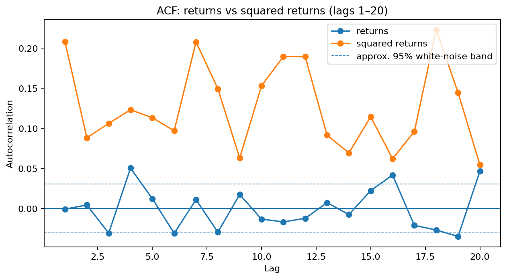
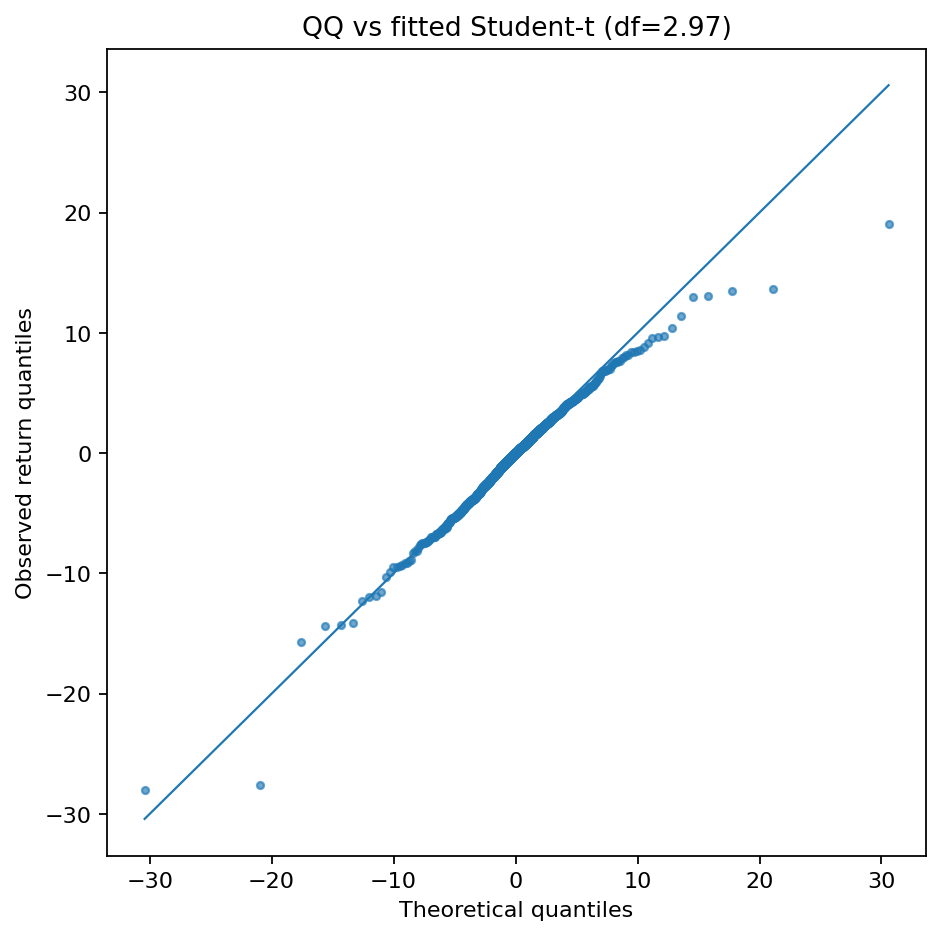
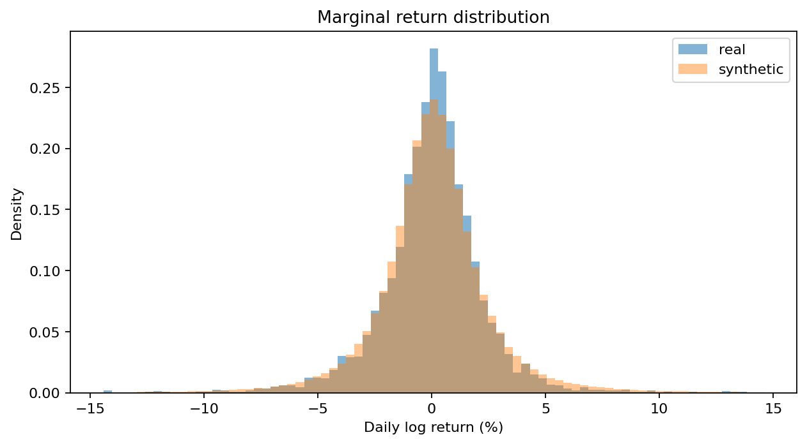
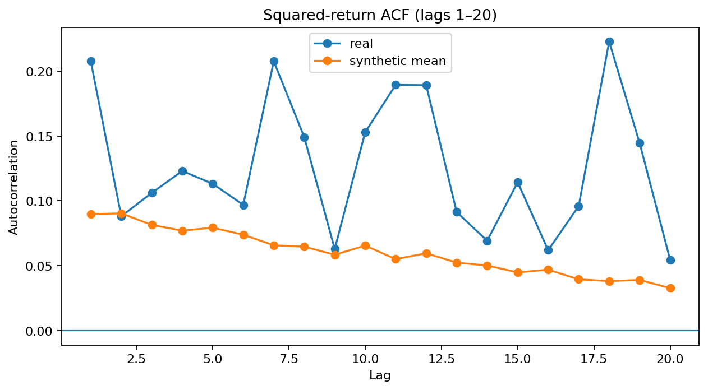
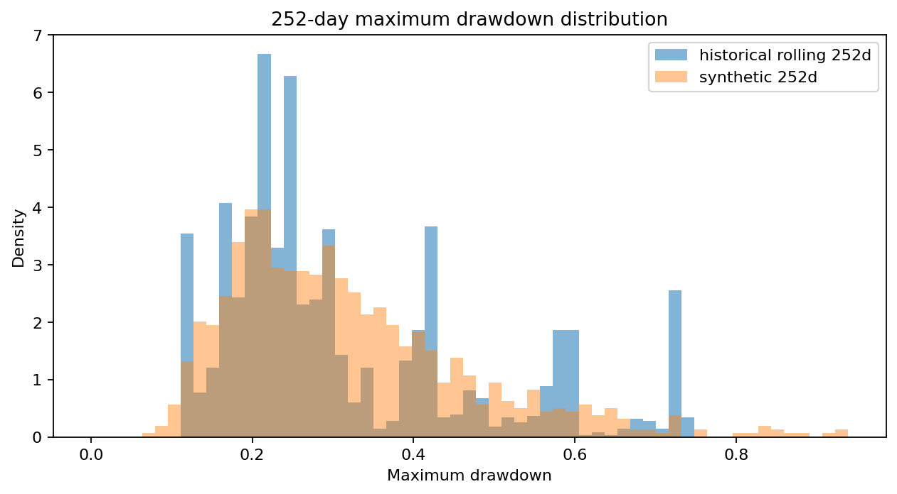

# Brent synthetic-scenario validation report

## Scope

Daily Brent crude `BZ=F` close prices are fetched in code from Yahoo Finance. The analysis uses percentage log returns and a fixed historical cut-off for reproducibility. The submitted generator is a **GJR-GARCH(1,1,1) with Hansen skewed-t innovations**.

## Statistical diagnostics and model choice

The sample contains **4,158** daily observations. Mean daily log return is 0.0029% with volatility 2.344%. The distribution is negatively skewed (-0.9584) and has excess kurtosis 14.691, which is inconsistent with a thin-tailed Gaussian description. A fitted Student-t reference has approximately **2.97 degrees of freedom**, providing a compact heavy-tailed benchmark for the QQ diagnostic.

Linear return dependence is comparatively limited: the maximum absolute return ACF over the inspected non-zero lags is 0.0503. In contrast, the mean absolute squared-return ACF is 0.1271, evidence of conditional heteroskedasticity / volatility clustering. That motivates a volatility-aware generator rather than iid Monte Carlo.

A parsimonious GARCH(1,1)-Student-t model was used first as a development baseline. Its validation exposed a material asymmetry miss: the historical returns are clearly negatively skewed, while a symmetric innovation model cannot reproduce that feature reliably. I therefore made one targeted refinement rather than escalating to a neural generator: **GJR-GARCH(1,1,1) with Hansen skewed-t innovations**. GJR allows negative and positive shocks to affect future volatility differently, while skewed-t innovations retain heavy tails and permit conditional asymmetry.





## Fitted generative model

**GJR-GARCH(1,1,1) + Hansen skewed-t innovations**

```text
r_t       = mu + eps_t
eps_t     = sigma_t z_t
sigma_t^2 = omega + alpha eps_(t-1)^2
            + gamma I(eps_(t-1) < 0) eps_(t-1)^2
            + beta sigma_(t-1)^2
z_t       ~ standardized Hansen skewed-t(eta, lambda)
```

| Parameter | Estimate |
|---|---:|
| mu | -0.0003 |
| omega | 0.0564 |
| alpha | 0.0653 |
| gamma (negative-shock leverage) | 0.0344 |
| beta | 0.9092 |
| effective variance persistence | 0.9935 |
| skew-t eta | 5.293 |
| skew-t lambda | -0.1215 |

For the asymmetric innovation law, persistence is computed as `alpha + beta + gamma * E[z^2 I(z<0)]`; I do not use the symmetric `gamma/2` shortcut. The fitted GJR process has `E[A(z)^2] = 1.0457` for `A(z)=beta + alpha*z^2 + gamma*z^2*I(z<0)`. Because this is >= 1, the usual finite unconditional fourth-moment condition is not satisfied, so sample kurtosis is intrinsically unstable.

The fit-then-simulate interface is explicit and every stochastic source is seed-controlled. Simulation starts each independent path from a sampled historical fitted residual/conditional-variance state, so the calibration check represents a mixture of empirically observed calm and stressed starting conditions rather than forcing all paths into one arbitrary initial volatility state. The full optimizer summary is saved to `reports/fit_summary.txt` and run metadata to `reports/run_manifest.json`.

The baseline and selected model are compared in `reports/model_comparison.md`. A separate 10-seed check in `reports/robustness_report.md` distinguishes structural behaviour from one favourable Monte Carlo realization. Model selection is therefore not based on a single seed or a raw count of green gates alone.

## Validation gates

These are pragmatic engineering acceptance gates, not formal hypothesis-test significance levels. Central-distribution and volatility targets have tighter tolerances; far-tail measures and drawdowns are looser because their effective sample sizes are smaller.

| Metric | Real | Synthetic | Error | Threshold | Status |
|---|---:|---:|---:|---:|:---:|
| mean return (pp) | 0.0029 | 0.0013 | 0.0016 | 0.1000 | PASS |
| volatility | 2.344 | 2.599 | 10.9% | 10% | FAIL |
| skewness | -0.9584 | -1.194 | 0.2357 | 0.5000 | PASS |
| excess kurtosis | 14.691 | 77.888 | 63.197 | 2.000 | FAIL |
| q01 | -6.707 | -7.364 | 9.8% | 20% | PASS |
| q05 | -3.639 | -3.639 | 0.0% | 15% | PASS |
| q95 | 3.244 | 3.358 | 3.5% | 15% | PASS |
| q99 | 5.955 | 6.592 | 10.7% | 20% | PASS |
| VaR 95% | 3.639 | 3.639 | 0.0% | 15% | PASS |
| ES 95% | 5.756 | 6.222 | 8.1% | 20% | PASS |
| VaR 99% | 6.707 | 7.364 | 9.8% | 20% | PASS |
| ES 99% | 9.939 | 11.465 | 15.4% | 25% | PASS |
| squared-return ACF MAE (lags 1-20) | 0.0000 | 0.0671 | 0.0671 | 0.0500 | FAIL |
| drawdown median | 0.2459 | 0.2892 | 17.6% | 25% | PASS |
| drawdown p95 | 0.6951 | 0.6314 | 9.2% | 30% | PASS |







The historical drawdown distribution uses overlapping rolling 252-day windows. It is therefore a descriptive like-for-like calibration target, not an iid sample for formal inferential testing.

## Honest failure mode

- **volatility** fails its declared gate; I retain the failure rather than retuning the threshold after seeing the result.
- **excess kurtosis** fails its declared gate; I retain the failure rather than retuning the threshold after seeing the result.
- **squared-return ACF MAE (lags 1-20)** fails its declared gate; I retain the failure rather than retuning the threshold after seeing the result.

The important remaining model-risk issue is the **ultra-tail / higher-moment behaviour**. The multi-seed report makes higher-moment instability visible rather than hiding it behind one realization. The model also leaves residual mismatch in squared-return autocorrelation, indicating that a single stationary volatility recursion does not capture every feature of the historical volatility process.

I would not address those failures by adding complexity indiscriminately. My next experiment would depend on the production objective: **GARCH-EVT** (POT/GPD on standardized residual tails) if conditional tail calibration is the priority, or a **regime-aware volatility model** if persistence and stress-state transitions remain the dominant failure. Either extension would be validated on regime/rolling holdouts before production use.

## What this validation does and does not establish

This is primarily a **generative calibration / posterior-predictive-style check**: after fitting the historical process, it asks whether simulated scenarios reproduce selected properties of that process. It does **not** establish out-of-sample forecasting skill, causal geopolitical understanding, or adequacy for genuinely unprecedented future regimes.

A production validation programme would add rolling-origin and regime holdouts, parameter-stability monitoring, explicit stress-period tests, sensitivity to the futures-series construction, and model-risk governance. `BZ=F` is a convenient front-month proxy, not a professionally engineered constant-maturity Brent series; roll and contract-construction effects are therefore a known data limitation.
