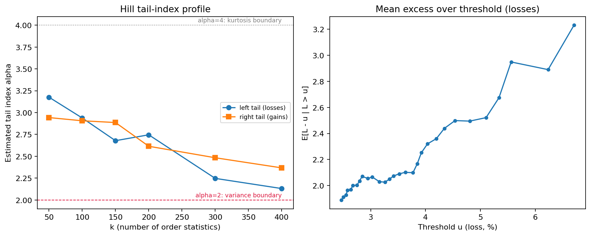
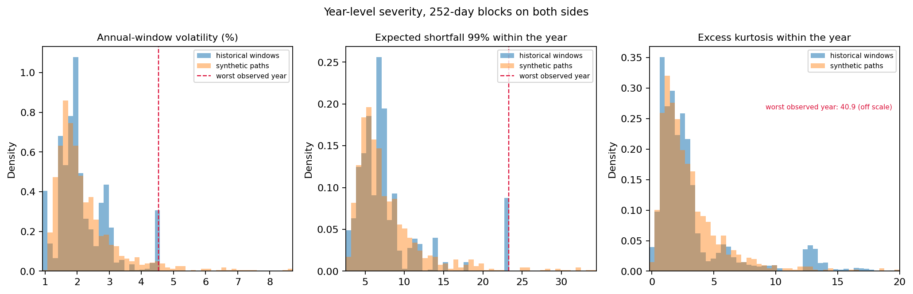

# Brent synthetic-scenario validation report

## Scope

Daily Brent crude `BZ=F` close prices are fetched in code from Yahoo Finance. The analysis uses percentage log returns and a fixed historical cut-off for reproducibility. The submitted generator is a **GJR-GARCH(1,1,1) with Hansen skewed-t innovations**.

## Statistical diagnostics and model choice

The sample contains **4,158** daily observations. Mean daily log return is 0.0029% with volatility 2.344%. The distribution is negatively skewed (-0.9584) and has excess kurtosis 14.691, which is inconsistent with a thin-tailed Gaussian description. A fitted Student-t reference has approximately **2.97 degrees of freedom**, providing a compact heavy-tailed benchmark for the QQ diagnostic.

Linear return dependence is comparatively limited: the maximum absolute return ACF over the inspected non-zero lags is 0.0503. In contrast, the mean absolute squared-return ACF is 0.1271, evidence of conditional heteroskedasticity and volatility clustering. That motivates a volatility-aware generator rather than iid Monte Carlo.

The tail diagnostics decide the innovation law. At k=100 order statistics the Hill estimator gives a tail index of **2.94** on the loss side and **2.91** on the gain side, both close to the fitted Student-t degrees of freedom. An index near three is consistent with a finite variance but a non-finite fourth moment, so sample kurtosis is not a stable estimation target for this series — a point that returns in the validation. The mean-excess function for losses rises with the threshold, the signature of a heavy rather than exponential tail. Note that the asymmetry visible in the skewness is *not* mirrored by a large gap between the two tail indices: the asymmetry lives in the body and in the volatility response, not in how fast the extremes decay.

Two facts then pin down the model family. First, the unconditional tail is much heavier than the conditional innovation, which has eta = 5.29 degrees of freedom. A GARCH-type recursion generates exactly that gap: volatility clustering makes the unconditional law heavier-tailed than the innovations that drive it. Second, the negative skew and the leverage effect require an asymmetric response. A parsimonious GARCH(1,1)-Student-t was fitted first as a development baseline; its validation exposed a material asymmetry miss, since a symmetric innovation model cannot reproduce negative skew. I therefore made one targeted refinement rather than escalating to a neural generator: **GJR-GARCH(1,1,1) with Hansen skewed-t innovations**.

The fitted recursion implies a stationary return tail index of **2.70**, against a Hill estimate of 2.92 taken directly from the returns. Those agree to within 8%, and the agreement is not circular: the tail index never entered the likelihood, which sees only the conditional density. A volatility model that reproduces an unconditional tail it was not fitted to is doing the specific job this data asks of it.




## Fitted generative model

**GJR-GARCH(1,1,1) + Hansen skewed-t innovations**

```text
r_t       = mu + eps_t
eps_t     = sigma_t z_t
sigma_t^2 = omega + alpha eps_(t-1)^2
            + gamma I(eps_(t-1) < 0) eps_(t-1)^2
            + beta sigma_(t-1)^2
z_t       ~ standardized Hansen skewed-t(eta, lambda)
```

| Parameter | Estimate |
|---|---:|
| mu | -0.0003 |
| omega | 0.0564 |
| alpha | 0.0653 |
| gamma (negative-shock leverage) | 0.0344 |
| beta | 0.9092 |
| effective variance persistence | 0.9935 |
| implied unconditional volatility (%/day) | 2.936 |
| sample volatility (%/day) | 2.344 |
| implied return tail index | 2.696 |
| skew-t eta | 5.293 |
| skew-t lambda | -0.1215 |

For the asymmetric innovation law, persistence is computed as `alpha + beta + gamma * E[z^2 I(z<0)]`; I do not use the symmetric `gamma/2` shortcut. The fitted process has `E[A(z)^2] = 1.0457` for `A(z) = beta + alpha*z^2 + gamma*z^2*I(z<0)`, which is at or above one, so the unconditional fourth moment does not exist. Both quantities are evaluated from the fitted skew-t law rather than approximated, and the quadrature used for the non-integer moment is checked against the closed-form values at powers one and two in the test suite.

Effective persistence is 0.9935, close enough to one that the variance recursion mean-reverts only slowly over a 252-day horizon, and the level it reverts toward implies an unconditional volatility of 2.936%/day against a sample volatility of 2.344%/day.

The fit-then-simulate interface is explicit and every stochastic source is seed-controlled, using two independent child streams from a single `SeedSequence` so that replications never share a generator stream. Simulation starts each independent path from a sampled historical fitted residual/conditional-variance state, so the calibration check represents a mixture of empirically observed calm and stressed starting conditions rather than forcing all paths into one arbitrary initial volatility state. The full optimizer summary is saved to `reports/fit_summary.txt` and run metadata to `reports/run_manifest.json`.

## How this is validated

Every metric is checked under two estimators. The tolerances are the same in both; what differs is only how the statistic is measured.

1. **Pooled marginal check.** All synthetic observations pooled against the pooled historical sample: 252,000 against 4,158. The right instrument for the unconditional marginal law, and the wrong one for any statistic that depends on sample size.
2. **Horizon-matched year-level check.** Every statistic estimated inside blocks of 252 trading days on *both* sides: 3,907 overlapping historical windows against 1,000 independent synthetic paths, compared at the median.

**Two tolerances cannot be constants, and treating them as constants was a real defect.** An audit of an earlier version of this report found that carrying the same *absolute* squared-return ACF tolerance across both estimators quietly relaxed the gate to the point where it could not fail: the historical mean absolute squared-return autocorrelation is 0.1271 on the full sample but only 0.0457 inside 252-day blocks, so a generator with no volatility clustering whatsoever scored 0.0498 against a 0.05 threshold and passed. The tolerance is now declared as a fraction of the historical scale *under the estimator in use*, fixed at the fraction the original absolute number implied on the pooled estimator. The strictness is unchanged; only the units travel. Likewise the mean-return tolerance is expressed in standard errors of the historical mean, since an absolute tolerance on a daily mean has no meaning without a scale.

Drawdowns are horizon-matched by construction, so they are computed once and reported once in the first table rather than duplicated into both.

These are pragmatic engineering acceptance gates, not hypothesis-test significance levels.

### Family 1: pooled marginal gates

| Metric | Real | Synthetic | Error | Threshold | Status |
|---|---:|---:|---:|---:|:---:|
| mean return (pp) | 0.0029 | -0.0043 | 0.0072 | 0.0727 | PASS |
| volatility | 2.344 | 2.827 | 20.6% | 10% | FAIL |
| skewness | -0.9584 | -4.876 | 3.918 | 0.5000 | FAIL |
| excess kurtosis | 14.691 | 389.49 | 374.80 | 2.000 | FAIL |
| q01 | -6.707 | -7.534 | 12.3% | 20% | PASS |
| q05 | -3.639 | -3.670 | 0.8% | 15% | PASS |
| q95 | 3.244 | 3.381 | 4.2% | 15% | PASS |
| q99 | 5.955 | 6.750 | 13.3% | 20% | PASS |
| VaR 95% | 3.639 | 3.670 | 0.8% | 15% | PASS |
| ES 95% | 5.756 | 6.504 | 13.0% | 20% | PASS |
| VaR 99% | 6.707 | 7.534 | 12.3% | 20% | PASS |
| ES 99% | 9.939 | 12.696 | 27.7% | 25% | FAIL |
| squared-return ACF MAE | - | 0.0649 | 0.0649 | 0.0500 | FAIL |
| drawdown median | 0.2459 | 0.2848 | 15.8% | 25% | PASS |

The mean gate is weak by construction and it is worth saying so: the historical daily mean is 0.0029 with a standard error of 0.0363, so no tolerance that respects the sampling error of the drift can be tight. It is reported for completeness, not as evidence.

### Family 2: horizon-matched year-level gates

Median of the statistic across 252-day blocks. The band column reports the 5th-95th percentile spread of the statistic across blocks on each side; it is shown for context and is deliberately **not** gated, for the reason given in the stressed-region section.

| Metric | Real median | Synthetic median | Error | Threshold | 5-95% band, real vs synthetic | Status |
|---|---:|---:|---:|---:|---|:---:|
| mean return (pp) | -0.0055 | 0.0124 | 0.0179 | 0.0727 | [-0.2385, 0.2085] vs [-0.2425, 0.2239] | PASS |
| volatility | 1.966 | 1.929 | 1.9% | 10% | [1.062, 4.404] vs [1.278, 4.432] | PASS |
| skewness | -0.4525 | -0.2696 | 0.1829 | 0.5000 | [-1.429, 0.3519] vs [-1.091, 0.4946] | PASS |
| excess kurtosis | 2.132 | 2.291 | 0.1591 | 2.000 | [0.5412, 12.947] vs [0.6455, 8.233] | PASS |
| q01 | -5.636 | -5.298 | 6.0% | 20% | [-13.123, -2.746] vs [-13.078, -3.219] | PASS |
| q05 | -3.341 | -3.147 | 5.8% | 15% | [-6.079, -1.779] vs [-7.280, -2.019] | PASS |
| q95 | 2.848 | 2.892 | 1.6% | 15% | [1.625, 5.117] vs [1.953, 6.564] | PASS |
| q99 | 4.274 | 4.742 | 11.0% | 20% | [2.478, 13.009] vs [2.909, 11.407] | PASS |
| VaR 95% | 3.341 | 3.147 | 5.8% | 15% | [1.779, 6.079] vs [2.019, 7.280] | PASS |
| ES 95% | 4.639 | 4.539 | 2.2% | 20% | [2.445, 11.729] vs [2.804, 10.929] | PASS |
| VaR 99% | 5.636 | 5.298 | 6.0% | 20% | [2.746, 13.123] vs [3.219, 13.078] | PASS |
| ES 99% | 6.889 | 6.516 | 5.4% | 25% | [3.288, 23.313] vs [3.679, 17.807] | PASS |
| squared-return ACF MAE | - | 0.0191 | 0.0191 | 0.0180 | - | FAIL |

### Reported, not gated

| Quantity | Real | Synthetic | Why it is not a gate |
|---|---:|---:|---|
| drawdown p95 | 0.6951 | 0.6189 | Upper quantile of overlapping historical windows: not identified, reported rather than gated. |





## Is the observed record a plausible draw from this model?

The pooled table above compares a statistic measured on 252,000 synthetic observations with the same statistic measured on 4,158 historical ones. That comparison cannot tell miscalibration from sampling noise. Simulating records of the *same length* as the historical one can, and it is the decisive check for the pooled moments.

| Statistic | Historical | Model median | Model 5-95% band | Historical percentile | Verdict |
|---|---:|---:|---:|---:|:---:|
| volatility | 2.344 | 2.427 | [1.958, 3.827] | 41 | inside |
| skewness | -0.9584 | -0.4911 | [-1.798, 0.2980] | 19 | inside |
| excess kurtosis | 14.691 | 9.860 | [4.026, 66.340] | 69 | inside |

Every historical value falls inside the model's own band for a record of this length.

## The stressed region

The obvious next step would be to gate the model against the 95th percentile of the historical year-severity distribution, or to compare the worst simulated year with the worst observed one. Both would be mistakes, and it is worth saying why rather than quietly reporting them.

The historical block distribution stops moving above roughly its 90th percentile. That is not a property of oil markets; it is window overlap. The 3,907 historical blocks are rolling windows over the same 4,158 returns, so the worst few per cent of them are the same episode counted many times: the 222 blocks above the 95% quantile of ES 99% all begin between 2019-04-23 and 2020-03-09, spanning 2019 and 2020 — one crisis, replicated. An upper quantile estimated from them is not identified.

Comparing maxima directly is the same error in a different disguise. The maximum of a heavy-tailed sample grows with the sample, so `max(1,000 simulated years)` against `max(16 observed years)` measures the simulation budget, not the model. The comparison below is therefore projected onto a record of the same length as the historical one: the model's per-year exceedance probability is taken from the simulation, and the question asked is how likely a record of 16 years is to contain nothing worse than what was observed. The historical maximum is taken over **non-overlapping** blocks, to match that framing.

| Statistic | Worst year in 16 observed | Model annual probability | P(record contains at least one) | P(model record max <= observed) | Verdict |
|---|---:|---:|---:|---:|:---:|
| volatility | 4.461 | 4.60% | 53% | 47% | plausible |
| VaR 99% | 13.123 | 4.80% | 54% | 46% | plausible |
| ES 99% | 23.313 | 2.30% | 31% | 69% | plausible |
| maximum drawdown | 0.6296 | 4.20% | 50% | 50% | plausible |

A value in the middle of the last column means the observed extreme is a typical draw for a record of this length. Values near 0% would mean the model almost always produces something worse; near 100%, that it cannot reach what was observed. Nothing here is a formal gate: with only 16 non-overlapping blocks — and those are not 16 independent observations, since consecutive years share regimes and volatility persistence — the data does not support a tight acceptance criterion in this region, and a narrow gate would be false precision.

## Honest failure mode

The pooled family fails **volatility**, **skewness**, **excess kurtosis**, **ES 99%** and **squared-return ACF MAE**. The horizon-matched family fails **squared-return ACF MAE**. Every failure is retained; no threshold was moved after seeing a result.

### The pooled moment failures are realization noise, not miscalibration

This is settled by simulating records of the *same length* as the historical one rather than by argument. Across those records the historical value of every pooled moment lands inside the model's own 5-95% band — volatility at percentile 41, skewness at percentile 19, excess kurtosis at percentile 69. A single 16-year record simply does not pin these quantities down: the model's own records disagree with each other by more than the model disagrees with history. Comparing 252,000 pooled synthetic observations against 4,158 historical ones cannot detect miscalibration in them, and the apparent failures are what that mismatch produces.

The kurtosis case has a structural explanation on top of the sampling one. With `E[A(z)^2] = 1.0457 >= 1` the fitted process has no finite unconditional fourth moment, so sample kurtosis does not converge to a population value at all; it becomes progressively more dominated by rare extremes as the sample grows. A pooled kurtosis comparison across unequal sample sizes is therefore not a well-posed test, whatever the model.

### The leave-out diagnostic, with the comparator that makes it honest

Dropping the most volatile block and recomputing the pooled moments shows how much of each estimate rests on one block. The historical rows are the point: heavy-tailed data behaves the same way, so this table does not convict the generator of anything. It measures the fragility of the *estimator*.

| Source | Blocks dropped | Pooled volatility | Pooled skewness | Pooled excess kurtosis |
|---|---|---:|---:|---:|
| synthetic | none | 2.827 | -4.876 | 389.49 |
| synthetic | 1 of 1000 | 2.576 | -1.164 | 37.975 |
| historical | none | 2.247 | -0.9291 | 16.523 |
| historical | 1 of 16 | 2.016 | -0.2827 | 3.835 |

Both sides collapse. Reporting the synthetic row alone — as an earlier draft of this report did — would have made a universal property of heavy-tailed samples look like a defect of the model.

The synthetic figures above are one seed. Because pooled kurtosis has no population value under this process, it varies by an order of magnitude across simulations of the identical model: `reports/robustness_report.md` gives the range across ten seeds. No single number from that column, including the one in this table, should be read as characteristic of the generator.

### What the model actually gets wrong

**The shape of volatility memory.** The horizon-matched squared-return ACF misses its gate at 0.0191 against a tolerance of 0.0180. This is not a sample-size artefact and it is not Monte Carlo noise: two independent simulations of this same model differ from each other by only 0.0032 on the identical statistic, so the discrepancy with history is roughly 6 times the irreducible simulation noise. The historical block ACF decays slowly and irregularly while the model's decays geometrically. A single stationary GJR recursion reproduces the average level of volatility persistence without reproducing its long-memory-like profile, and the figure shows this plainly.

**Severity beyond the historical record is extrapolation, and it is heavy.** This is the finding that matters for a stress engine, and it is a governance problem rather than a calibration failure. At the edge of the record the model is well calibrated: the stressed-region table above shows the worst observed year sitting in the middle of the model's predicted distribution for a record of this length. Beyond that edge there is nothing to calibrate against. Because the fitted recursion has no finite fourth moment, the extrapolation is unusually heavy: 4.4% of simulated years are more volatile than any year in the record, which is itself unremarkable for a record this short, but the severity of those years is set entirely by the fitted dynamics and cannot be checked against anything.

The practical consequence is that this generator should not be used to produce a capital number in the far tail without an explicitly governed cap, or without a specification whose stationary law has the moments the use case assumes. That is a statement about where the model may be trusted, not a defect in its fit: the same `E[A(z)^2] = 1.0457` that makes the extrapolation heavy is also what lets the model reproduce the unconditional tail index it was never fitted to.

My next experiment would depend on the production objective. **GARCH-EVT** (POT/GPD on the standardized residual tails, which the Hill and mean-excess diagnostics already suggest) if conditional tail calibration is the priority. A **regime-aware volatility model** if the ACF shape is the concern — that would test whether state-dependent persistence reproduces the slow, irregular decay a single recursion misses, though it is worth noting that regime switching does not by itself guarantee finite higher moments. Either extension would be validated on regime and rolling-origin holdouts before production use.

## What this validation does and does not establish

This is a **generative calibration / posterior-predictive-style check**: after fitting the historical process, it asks whether simulated scenarios reproduce selected properties of that process. It does **not** establish out-of-sample forecasting skill, causal geopolitical understanding, or adequacy for genuinely unprecedented regimes.

The horizon-matched family removes an estimator confound and the matched-length reference removes a sample-size confound, but neither removes the binding constraint: there is one historical realization, containing 16 non-overlapping years and one major crisis. Everything said about the stressed region rests on that.

A production validation programme would add rolling-origin and regime holdouts, parameter-stability monitoring, explicit stress-period tests, sensitivity to the futures-series construction, and model-risk governance. `BZ=F` is a convenient front-month proxy, not a professionally engineered constant-maturity Brent series; roll and contract-construction effects are therefore a known data limitation.
